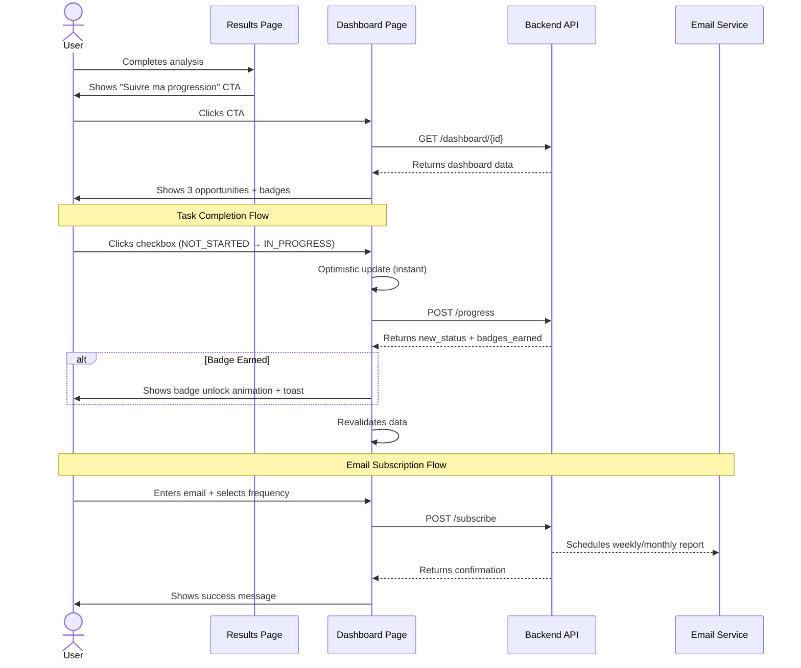

# FE-014: Analytics Dashboard Implementation

**Status:** IN_PROGRESS
**Priority:** HIGH
**Effort:** 4.5 hours
**Dependencies:** BE-005 (Backend API - COMPLETE)
**Author:** Claude Code
**Date:** 2025-10-29

---

## Table of Contents

1. [Executive Summary](#1-executive-summary)
2. [Architecture Decisions](#2-architecture-decisions)
3. [Component Architecture](#3-component-architecture)
4. [API Integration](#4-api-integration)
5. [UX Flows](#5-ux-flows)
6. [Responsive Design](#6-responsive-design)
7. [Accessibility](#7-accessibility)
8. [Testing Strategy](#8-testing-strategy)
9. [Implementation Plan](#9-implementation-plan)

---

## 1. Executive Summary

### 1.1 Vision & Goals

**Mission:**
Build a post-analysis engagement dashboard that transforms passive results consumption into active implementation tracking with gamification elements (badges) and progress monitoring.

**Business Goals:**
- Increase user engagement post-analysis (target: 60% revisit rate)
- Drive action implementation (target: 40% mark at least 1 task as IN_PROGRESS)
- Build habit loop (email notifications → return → track progress)
- Differentiate from competitors (most stop at report delivery)

**User Goals:**
- Visualize implementation progress at a glance
- Understand next steps clearly (prioritized recommendations)
- Feel motivated through achievement badges
- Track time/money savings impact
- Stay accountable (weekly email reminders)

### 1.2 Backend Integration (BE-005 API Contracts)

The backend provides 5 REST endpoints (all tested, 89.81% coverage):

**1. GET /api/v1/dashboard/{analysis_id}**
```typescript
interface DashboardResponse {
  analysis_id: string;
  identity_a1: IdentityA1;
  score_a2: ScoreA2;
  top_3_gaps: Gap[];
  progress: ProgressSummary;
  badges: Badge[];
  metrics: MetricsSummary;
}

interface Gap {
  opportunity_type: 'digital_presence' | 'value_creation' | 'business_management';
  hours_per_week: number;
  hours_per_year: number;
  problem_teaser: string;
  complexity_level: number; // 1-10
  tools_hint: string;
  status: 'NOT_STARTED' | 'IN_PROGRESS' | 'IMPLEMENTED';
  marked_date: string | null;
}

interface Badge {
  id: string;
  badge_type: 'first_step' | 'quick_win' | 'time_saver' | 'efficiency_expert' | 'streak_master';
  badge_name: string;
  description: string;
  icon: string; // emoji
  earned_at: string | null; // null = locked
}

interface ProgressSummary {
  total_tasks: number; // always 3
  tasks_not_started: number;
  tasks_in_progress: number;
  tasks_implemented: number;
  completion_percentage: number; // 0-100
}

interface MetricsSummary {
  potential_hours_saved_per_week: number;
  potential_hours_saved_per_year: number;
  actual_hours_saved_per_week: number; // based on IMPLEMENTED tasks
  actual_hours_saved_per_year: number;
  estimated_money_saved: number | null; // null if no hourly_rate
}
```

**2. POST /api/v1/dashboard/{analysis_id}/progress**
```typescript
interface UpdateProgressRequest {
  opportunity_type: 'digital_presence' | 'value_creation' | 'business_management';
  status: 'NOT_STARTED' | 'IN_PROGRESS' | 'IMPLEMENTED';
}

interface UpdateProgressResponse {
  message: string;
  new_status: string;
  badges_earned: Badge[]; // newly unlocked badges
}
```

**3. GET /api/v1/dashboard/{analysis_id}/recommendations**
```typescript
interface RecommendationsResponse {
  next_task: Gap;
  reasoning: string; // AI-generated explanation
  priority_score: number; // 1-10
}
```

**4. GET /api/v1/dashboard/{analysis_id}/badges**
```typescript
interface BadgesResponse {
  badges: Badge[];
  total_earned: number;
  total_available: number;
}
```

**5. POST /api/v1/dashboard/{analysis_id}/subscribe**
```typescript
interface SubscribeRequest {
  email: string;
  frequency: 'weekly' | 'monthly';
  hourly_rate?: number; // optional, for money calculations
}

interface SubscribeResponse {
  message: string;
  email: string;
  frequency: string;
  next_email_date: string;
}
```

### 1.3 Success Criteria

**Functional:**
- [ ] Dashboard loads in <2s (P95)
- [ ] Checkbox interactions optimistic (instant feedback)
- [ ] Badge unlock triggers animation + toast notification
- [ ] Email subscription form validates + confirms
- [ ] Mobile responsive (375px+)
- [ ] All 5 E2E tests passing

**Non-Functional:**
- [ ] WCAG 2.1 AA compliant (axe-core audit)
- [ ] Lighthouse Performance >90
- [ ] Zero console errors/warnings
- [ ] Framer Motion animations smooth (60fps)
- [ ] TypeScript strict mode (no `any` types)

**Business:**
- [ ] Analytics events tracked (page_view, task_updated, badge_earned, email_subscribed)
- [ ] Sentry error tracking active
- [ ] Vercel deployment preview successful

---

## 2. Architecture Decisions

### 2.1 ADR-004: State Management Strategy

**Context:**
Dashboard needs real-time updates (checkbox clicks), optimistic UI, background data fetching, and cache management.

**Decision:** Use SWR (stale-while-revalidate) library

**Rationale:**
- Already used in codebase pattern (SSE streams)
- Built-in optimistic updates via `mutate()`
- Automatic revalidation on focus/reconnect
- Minimal boilerplate vs Redux/Zustand
- 13.2kb gzipped (acceptable)

**Implementation:**
```typescript
// lib/hooks/useDashboard.ts
import useSWR from 'swr';

export function useDashboard(analysisId: string) {
  const { data, error, mutate } = useSWR(
    `/api/v1/dashboard/${analysisId}`,
    fetcher,
    {
      revalidateOnFocus: true,
      revalidateOnReconnect: true,
      dedupingInterval: 5000, // 5s
    }
  );

  return {
    dashboard: data,
    isLoading: !error && !data,
    isError: error,
    mutate, // for optimistic updates
  };
}
```

**Alternatives Considered:**
- React Query: More features but 40kb gzipped (overkill)
- Redux Toolkit: Too complex for this scope
- Context API: Manual caching/revalidation logic

**Consequences:**
- (+) Simple API, easy testing
- (+) Built-in error retry
- (-) Need to install `swr` package
- (-) Learning curve for team (mitigated by docs)

### 2.2 ADR-005: Animation Library

**Context:**
Badge unlock animations, progress bar transitions, card hover effects.

**Decision:** Continue using Framer Motion (already in package.json)

**Rationale:**
- Already installed (`"framer-motion": "^12.23.24"`)
- Used in existing components (ComplexityBar.tsx)
- Declarative API (less error-prone than CSS animations)
- Layout animations for list reordering

**Implementation:**
```typescript
import { motion, AnimatePresence } from 'framer-motion';

// Badge unlock animation
<motion.div
  initial={{ scale: 0, rotate: -180 }}
  animate={{ scale: 1, rotate: 0 }}
  transition={{ type: 'spring', stiffness: 260, damping: 20 }}
>
  <BadgeCard badge={badge} />
</motion.div>
```

**Consequences:**
- (+) Consistent with existing codebase
- (+) 60fps animations on modern devices
- (-) 86kb gzipped (acceptable trade-off)

### 2.3 ADR-006: Chart Library for Metrics Timeline

**Context:**
Display metrics evolution over time (future feature: weekly progress chart).

**Decision:** Use Recharts (defer to Phase 4)

**Rationale:**
- Phase 3 only needs static numbers (no charts yet)
- Recharts integrates well with React
- ~200kb gzipped (defer to avoid bundle bloat now)

**Implementation (Phase 4):**
```typescript
import { LineChart, Line, XAxis, YAxis } from 'recharts';

<LineChart data={metricsHistory}>
  <Line dataKey="hours_saved" stroke="#10b981" />
</LineChart>
```

**Consequences:**
- (+) Deferred decision reduces scope
- (+) Can evaluate alternatives later (Chart.js, Victory)
- (-) No visual timeline in MVP (acceptable)

### 2.4 ADR-007: Icon System

**Context:**
Badges need icons, opportunity cards need icons, UI elements need icons.

**Decision:** Use Lucide React (NOT emoji for production badges)

**Rationale:**
- Already installed (used in existing components)
- 1000+ icons available
- Tree-shakeable (only import used icons)
- Consistent sizing/styling

**Implementation:**
```typescript
import { Trophy, Zap, Target, Award, Flame } from 'lucide-react';

const BADGE_ICONS: Record<BadgeType, React.ComponentType> = {
  first_step: Target,
  quick_win: Zap,
  time_saver: Trophy,
  efficiency_expert: Award,
  streak_master: Flame,
};
```

**Consequences:**
- (+) Professional look (vs emoji)
- (+) Customizable colors/sizes
- (-) Backend returns emoji strings (need mapping)

---

## 3. Component Architecture

### 3.1 Component Tree

```
app/dashboard/[id]/page.tsx (Route)
│
├─ DashboardLayout.tsx (Container)
│  │
│  ├─ DashboardHeader.tsx (Company Name + Meta)
│  │
│  ├─ ProgressSection.tsx (40% width, left column)
│  │  ├─ ProgressBar.tsx (circular or linear)
│  │  ├─ OpportunityList.tsx
│  │  │  └─ OpportunityCard.tsx (x3, interactive checkbox)
│  │  └─ NextTaskRecommendation.tsx (AI suggestion)
│  │
│  ├─ BadgesSection.tsx (30% width, center column)
│  │  ├─ BadgeGrid.tsx
│  │  │  └─ BadgeCard.tsx (x5, locked/unlocked states)
│  │  └─ BadgeUnlockAnimation.tsx (Framer Motion overlay)
│  │
│  └─ MetricsSection.tsx (30% width, right column)
│     ├─ MetricsCard.tsx (hours/week, hours/year)
│     ├─ MoneySavedCard.tsx (conditional on hourly_rate)
│     └─ EmailSubscriptionForm.tsx
│
├─ DashboardSkeleton.tsx (Loading state)
└─ DashboardError.tsx (Error boundary)
```

### 3.2 Atomic Design Breakdown

**Atoms** (Reusable primitives):
- `BadgeIcon.tsx` - Icon + color mapping
- `Checkbox.tsx` - Styled checkbox (accessible)
- `ProgressBar.tsx` - Linear progress bar (reuse existing or create)
- `MetricValue.tsx` - Large number display (e.g., "8.5h/sem")

**Molecules** (Simple compositions):
- `BadgeCard.tsx` - Icon + name + description + locked state
- `OpportunityCard.tsx` - REUSE EXISTING (add checkbox prop)
- `MetricsCard.tsx` - Label + value + icon
- `EmailSubscriptionForm.tsx` - Input + button + validation

**Organisms** (Complex sections):
- `ProgressSection.tsx` - Progress bar + opportunity list + recommendation
- `BadgesSection.tsx` - Badge grid + unlock animations
- `MetricsSection.tsx` - Metrics cards + email form

**Templates**:
- `DashboardLayout.tsx` - 3-column responsive grid

**Pages**:
- `app/dashboard/[id]/page.tsx` - Route + data fetching

### 3.3 Component Props Interfaces

```typescript
// components/dashboard/DashboardLayout.tsx
interface DashboardLayoutProps {
  children: React.ReactNode;
  className?: string;
}

// components/dashboard/DashboardHeader.tsx
interface DashboardHeaderProps {
  companyName: string;
  completionPercentage: number;
  lastUpdated: string;
}

// components/dashboard/ProgressSection.tsx
interface ProgressSectionProps {
  progress: ProgressSummary;
  gaps: Gap[];
  nextTask: Gap | null;
  onTaskUpdate: (opportunityType: string, newStatus: TaskStatus) => Promise<void>;
}

// components/dashboard/OpportunityCard.tsx (ENHANCED)
interface OpportunityCardProps {
  number: number;
  title: string;
  opportunity: TimeOpportunity;
  hourlyRate: number | null;
  icon: React.ReactNode;
  status: TaskStatus; // NEW
  onStatusChange: (newStatus: TaskStatus) => Promise<void>; // NEW
  className?: string;
}

// components/dashboard/BadgesSection.tsx
interface BadgesSectionProps {
  badges: Badge[];
  newlyEarnedBadges: Badge[]; // for animation trigger
}

// components/dashboard/BadgeCard.tsx
interface BadgeCardProps {
  badge: Badge;
  isLocked: boolean;
  showAnimation?: boolean;
}

// components/dashboard/MetricsSection.tsx
interface MetricsSectionProps {
  metrics: MetricsSummary;
  analysisId: string;
  onSubscribe: (email: string, frequency: string, hourlyRate?: number) => Promise<void>;
}

// components/dashboard/EmailSubscriptionForm.tsx
interface EmailSubscriptionFormProps {
  analysisId: string;
  onSubmit: (data: SubscribeRequest) => Promise<void>;
  defaultEmail?: string; // from lead conversion
}
```

### 3.4 State Management Flow

**Global State (SWR cache):**
- Dashboard data (fetched once, revalidated on focus)
- Badges (fetched once, updated optimistically)

**Local State (React useState):**
- Form inputs (email, frequency, hourly_rate)
- Animation triggers (newly earned badges)
- Expanded/collapsed sections (mobile)

**Optimistic Updates Pattern:**
```typescript
async function handleTaskUpdate(opportunityType: string, newStatus: TaskStatus) {
  // 1. Optimistic update (instant UI)
  mutate(
    (currentData) => ({
      ...currentData,
      top_3_gaps: currentData.top_3_gaps.map((gap) =>
        gap.opportunity_type === opportunityType
          ? { ...gap, status: newStatus }
          : gap
      ),
    }),
    false // don't revalidate yet
  );

  // 2. API call
  try {
    const response = await updateProgress(analysisId, opportunityType, newStatus);

    // 3. Show badge unlock if earned
    if (response.badges_earned.length > 0) {
      setNewlyEarnedBadges(response.badges_earned);
      toast.success(`Badge débloqué: ${response.badges_earned[0].badge_name}!`);
    }

    // 4. Revalidate to get accurate data
    mutate();
  } catch (error) {
    // 5. Rollback on error
    mutate();
    toast.error('Erreur lors de la mise à jour');
  }
}
```

---

## 4. API Integration

### 4.1 TypeScript Types (Match BE-005 Schemas EXACTLY)

```typescript
// lib/types/dashboard.ts

export type TaskStatus = 'NOT_STARTED' | 'IN_PROGRESS' | 'IMPLEMENTED';

export type OpportunityType = 'digital_presence' | 'value_creation' | 'business_management';

export type BadgeType = 'first_step' | 'quick_win' | 'time_saver' | 'efficiency_expert' | 'streak_master';

export interface IdentityA1 {
  company_name: string;
  owner_first_name: string | null;
  sector: string;
  size: string;
  tier: string;
}

export interface ScoreA2 {
  digital_presence: number;
  value_creation: number;
  business_management: number;
  overall: number;
}

export interface Gap {
  opportunity_type: OpportunityType;
  hours_per_week: number;
  hours_per_year: number;
  problem_teaser: string;
  complexity_level: number;
  tools_hint: string;
  status: TaskStatus;
  marked_date: string | null;
}

export interface Badge {
  id: string;
  badge_type: BadgeType;
  badge_name: string;
  description: string;
  icon: string; // emoji from backend
  earned_at: string | null; // null = locked
}

export interface ProgressSummary {
  total_tasks: number;
  tasks_not_started: number;
  tasks_in_progress: number;
  tasks_implemented: number;
  completion_percentage: number;
}

export interface MetricsSummary {
  potential_hours_saved_per_week: number;
  potential_hours_saved_per_year: number;
  actual_hours_saved_per_week: number;
  actual_hours_saved_per_year: number;
  estimated_money_saved: number | null;
}

export interface DashboardData {
  analysis_id: string;
  identity_a1: IdentityA1;
  score_a2: ScoreA2;
  top_3_gaps: Gap[];
  progress: ProgressSummary;
  badges: Badge[];
  metrics: MetricsSummary;
}

export interface UpdateProgressRequest {
  opportunity_type: OpportunityType;
  status: TaskStatus;
}

export interface UpdateProgressResponse {
  message: string;
  new_status: TaskStatus;
  badges_earned: Badge[];
}

export interface RecommendationData {
  next_task: Gap;
  reasoning: string;
  priority_score: number;
}

export interface SubscribeRequest {
  email: string;
  frequency: 'weekly' | 'monthly';
  hourly_rate?: number;
}

export interface SubscribeResponse {
  message: string;
  email: string;
  frequency: string;
  next_email_date: string;
}
```

### 4.2 API Client Functions

```typescript
// lib/api/dashboard.ts

import * as Sentry from '@sentry/nextjs';
import type {
  DashboardData,
  UpdateProgressRequest,
  UpdateProgressResponse,
  RecommendationData,
  SubscribeRequest,
  SubscribeResponse,
} from '@/lib/types/dashboard';

const API_BASE_URL = process.env.NEXT_PUBLIC_API_URL || 'http://localhost:8000';
const API_VERSION = 'v1';
const API_URL = `${API_BASE_URL}/api/${API_VERSION}`;

/**
 * Fetch dashboard data for an analysis
 */
export async function getDashboard(analysisId: string): Promise<DashboardData> {
  try {
    const response = await fetch(`${API_URL}/dashboard/${analysisId}`);

    if (!response.ok) {
      const error = await response.json();
      throw new Error(error.detail || 'Failed to fetch dashboard');
    }

    return response.json();
  } catch (error) {
    Sentry.captureException(error, {
      tags: { api_endpoint: 'dashboard', analysis_id: analysisId },
    });
    throw error;
  }
}

/**
 * Update task progress status
 */
export async function updateProgress(
  analysisId: string,
  data: UpdateProgressRequest
): Promise<UpdateProgressResponse> {
  try {
    const response = await fetch(`${API_URL}/dashboard/${analysisId}/progress`, {
      method: 'POST',
      headers: { 'Content-Type': 'application/json' },
      body: JSON.stringify(data),
    });

    if (!response.ok) {
      const error = await response.json();
      throw new Error(error.detail || 'Failed to update progress');
    }

    return response.json();
  } catch (error) {
    Sentry.captureException(error, {
      tags: { api_endpoint: 'dashboard/progress', analysis_id: analysisId },
    });
    throw error;
  }
}

/**
 * Get AI-powered next task recommendation
 */
export async function getRecommendation(analysisId: string): Promise<RecommendationData> {
  try {
    const response = await fetch(`${API_URL}/dashboard/${analysisId}/recommendations`);

    if (!response.ok) {
      const error = await response.json();
      throw new Error(error.detail || 'Failed to fetch recommendation');
    }

    return response.json();
  } catch (error) {
    Sentry.captureException(error, {
      tags: { api_endpoint: 'dashboard/recommendations', analysis_id: analysisId },
    });
    throw error;
  }
}

/**
 * Subscribe to email progress reports
 */
export async function subscribeToReports(
  analysisId: string,
  data: SubscribeRequest
): Promise<SubscribeResponse> {
  try {
    const response = await fetch(`${API_URL}/dashboard/${analysisId}/subscribe`, {
      method: 'POST',
      headers: { 'Content-Type': 'application/json' },
      body: JSON.stringify(data),
    });

    if (!response.ok) {
      const error = await response.json();
      throw new Error(error.detail || 'Failed to subscribe');
    }

    return response.json();
  } catch (error) {
    Sentry.captureException(error, {
      tags: { api_endpoint: 'dashboard/subscribe', analysis_id: analysisId },
    });
    throw error;
  }
}
```

### 4.3 Custom SWR Hooks

```typescript
// lib/hooks/useDashboard.ts

import useSWR from 'swr';
import { getDashboard } from '@/lib/api/dashboard';
import type { DashboardData } from '@/lib/types/dashboard';

export function useDashboard(analysisId: string) {
  const { data, error, mutate, isValidating } = useSWR<DashboardData>(
    analysisId ? `/dashboard/${analysisId}` : null,
    () => getDashboard(analysisId),
    {
      revalidateOnFocus: true,
      revalidateOnReconnect: true,
      dedupingInterval: 5000,
      shouldRetryOnError: true,
      errorRetryCount: 3,
      errorRetryInterval: 1000,
    }
  );

  return {
    dashboard: data,
    isLoading: !error && !data,
    isError: error,
    isValidating,
    mutate,
  };
}

// lib/hooks/useRecommendation.ts

import useSWR from 'swr';
import { getRecommendation } from '@/lib/api/dashboard';
import type { RecommendationData } from '@/lib/types/dashboard';

export function useRecommendation(analysisId: string) {
  const { data, error } = useSWR<RecommendationData>(
    analysisId ? `/dashboard/${analysisId}/recommendations` : null,
    () => getRecommendation(analysisId),
    {
      revalidateOnFocus: false, // don't refetch AI recommendation constantly
      dedupingInterval: 60000, // 1 minute cache
    }
  );

  return {
    recommendation: data,
    isLoading: !error && !data,
    isError: error,
  };
}
```

### 4.4 Error Handling Strategy

**Error Types:**
1. Network errors (fetch failure)
2. 404 (analysis not found)
3. 500 (server error)
4. 422 (validation error)

**Handling:**
```typescript
// components/dashboard/DashboardError.tsx

interface DashboardErrorProps {
  error: Error;
  reset: () => void;
}

export default function DashboardError({ error, reset }: DashboardErrorProps) {
  if (error.message.includes('404')) {
    return (
      <div className="text-center py-12">
        <h2>Analyse introuvable</h2>
        <p>Cette analyse n'existe pas ou a expiré.</p>
        <Link href="/">Retour à l'accueil</Link>
      </div>
    );
  }

  return (
    <div className="text-center py-12">
      <h2>Erreur de chargement</h2>
      <p>{error.message}</p>
      <button onClick={reset}>Réessayer</button>
    </div>
  );
}
```

---

## 5. UX Flows

### 5.1 Primary User Flow (Happy Path)



### 5.2 Loading States

**Skeleton Pattern (NOT spinners):**

```typescript
// components/dashboard/DashboardSkeleton.tsx

export default function DashboardSkeleton() {
  return (
    <div className="grid grid-cols-1 lg:grid-cols-3 gap-6 animate-pulse">
      {/* Progress Section Skeleton */}
      <div className="lg:col-span-1 space-y-4">
        <div className="h-8 bg-slate-200 rounded w-1/2"></div>
        <div className="h-32 bg-slate-200 rounded"></div>
        <div className="h-48 bg-slate-200 rounded"></div>
        <div className="h-48 bg-slate-200 rounded"></div>
        <div className="h-48 bg-slate-200 rounded"></div>
      </div>

      {/* Badges Section Skeleton */}
      <div className="lg:col-span-1 space-y-4">
        <div className="h-8 bg-slate-200 rounded w-1/2"></div>
        <div className="grid grid-cols-2 gap-4">
          {[...Array(6)].map((_, i) => (
            <div key={i} className="h-32 bg-slate-200 rounded"></div>
          ))}
        </div>
      </div>

      {/* Metrics Section Skeleton */}
      <div className="lg:col-span-1 space-y-4">
        <div className="h-8 bg-slate-200 rounded w-1/2"></div>
        <div className="h-24 bg-slate-200 rounded"></div>
        <div className="h-24 bg-slate-200 rounded"></div>
        <div className="h-40 bg-slate-200 rounded"></div>
      </div>
    </div>
  );
}
```

### 5.3 Empty States

**Scenario:** First-time user, all tasks NOT_STARTED

```typescript
// components/dashboard/EmptyProgressState.tsx

export default function EmptyProgressState() {
  return (
    <div className="text-center py-8 px-4 bg-cyan-50 rounded-lg border-2 border-dashed border-cyan-300">
      <div className="text-4xl mb-2">🚀</div>
      <h3 className="font-heading font-bold text-lg mb-2">Prêt à commencer?</h3>
      <p className="text-slate-600 mb-4">
        Marquez votre première tâche comme "En cours" pour débloquer des badges!
      </p>
      <div className="text-xs text-slate-500">
        💡 Astuce: Commencez par la tâche recommandée ci-dessous
      </div>
    </div>
  );
}
```

### 5.4 Error States

**Network Failure:**
```typescript
<div className="bg-red-50 border border-red-200 rounded-lg p-4">
  <div className="flex items-center gap-2 mb-2">
    <AlertCircle className="text-red-500" size={20} />
    <h3 className="font-semibold text-red-900">Erreur de connexion</h3>
  </div>
  <p className="text-red-700 text-sm mb-3">
    Impossible de charger le tableau de bord. Vérifiez votre connexion.
  </p>
  <button onClick={retry} className="btn-secondary-sm">
    Réessayer
  </button>
</div>
```

### 5.5 Badge Unlock Animation Flow

```typescript
// components/dashboard/BadgeUnlockAnimation.tsx

import { motion, AnimatePresence } from 'framer-motion';
import Confetti from 'react-confetti';

interface BadgeUnlockAnimationProps {
  badge: Badge;
  onComplete: () => void;
}

export default function BadgeUnlockAnimation({ badge, onComplete }: BadgeUnlockAnimationProps) {
  const [showConfetti, setShowConfetti] = useState(true);

  useEffect(() => {
    const timer = setTimeout(() => {
      setShowConfetti(false);
      onComplete();
    }, 3000);
    return () => clearTimeout(timer);
  }, [onComplete]);

  return (
    <AnimatePresence>
      <motion.div
        initial={{ opacity: 0 }}
        animate={{ opacity: 1 }}
        exit={{ opacity: 0 }}
        className="fixed inset-0 bg-black/50 flex items-center justify-center z-50"
      >
        {showConfetti && <Confetti recycle={false} numberOfPieces={200} />}

        <motion.div
          initial={{ scale: 0, rotate: -180 }}
          animate={{ scale: 1, rotate: 0 }}
          transition={{ type: 'spring', stiffness: 260, damping: 20 }}
          className="bg-white rounded-2xl p-8 text-center max-w-md shadow-2xl"
        >
          <div className="text-6xl mb-4">{badge.icon}</div>
          <h2 className="font-heading font-bold text-2xl mb-2">
            Badge débloqué!
          </h2>
          <h3 className="text-xl text-amber-600 font-semibold mb-3">
            {badge.badge_name}
          </h3>
          <p className="text-slate-600">{badge.description}</p>
        </motion.div>
      </motion.div>
    </AnimatePresence>
  );
}
```

---

## 6. Responsive Design

### 6.1 Breakpoints (Tailwind defaults)

- **Mobile:** 375px - 639px (sm)
- **Tablet:** 640px - 1023px (md)
- **Desktop:** 1024px+ (lg)

### 6.2 Layout Strategy

**Mobile (375px - 639px):**
```
┌─────────────────────┐
│ Header              │
├─────────────────────┤
│ Progress Section    │ ← Full width
│ - Progress Bar      │
│ - Task 1 (collapsed)│
│ - Task 2 (collapsed)│
│ - Task 3 (collapsed)│
│ - Recommendation    │
├─────────────────────┤
│ Badges Section      │ ← Full width
│ - 2x3 grid          │
├─────────────────────┤
│ Metrics Section     │ ← Full width
│ - Stacked cards     │
│ - Email form        │
└─────────────────────┘
```

**Tablet (640px - 1023px):**
```
┌───────────────────────────────┐
│ Header                        │
├───────────────┬───────────────┤
│ Progress      │ Badges        │ ← 2 columns
│ Section       │ Section       │
│ (50%)         │ (50%)         │
│               │               │
├───────────────┴───────────────┤
│ Metrics Section               │ ← Full width
└───────────────────────────────┘
```

**Desktop (1024px+):**
```
┌─────────────────────────────────────────────┐
│ Header                                      │
├─────────────┬──────────────┬────────────────┤
│ Progress    │ Badges       │ Metrics        │ ← 3 columns
│ Section     │ Section      │ Section        │
│ (40%)       │ (30%)        │ (30%)          │
│             │              │                │
│             │              │                │
└─────────────┴──────────────┴────────────────┘
```

### 6.3 Component Responsive Behavior

**OpportunityCard (Mobile):**
- Collapsed by default (show checkbox + title only)
- Expand on tap (accordion-style)
- Tools section hidden (or blur intensified)

**BadgeGrid:**
- Mobile: 2x3 grid (2 columns)
- Tablet: 3x2 grid (3 columns)
- Desktop: 2x3 grid (2 columns, larger cards)

**EmailSubscriptionForm:**
- Mobile: Stacked (label, input, button vertically)
- Desktop: Inline (horizontal layout)

### 6.4 Tailwind Classes Pattern

```typescript
// DashboardLayout.tsx
<div className="container mx-auto px-4 py-8">
  <div className="grid grid-cols-1 md:grid-cols-2 lg:grid-cols-3 gap-6">
    <div className="md:col-span-1 lg:col-span-1">{/* Progress */}</div>
    <div className="md:col-span-1 lg:col-span-1">{/* Badges */}</div>
    <div className="md:col-span-2 lg:col-span-1">{/* Metrics */}</div>
  </div>
</div>

// OpportunityCard.tsx (mobile collapsible)
<div className="block lg:hidden">
  <button onClick={toggleExpand} className="w-full text-left">
    <div className="flex items-center justify-between">
      <Checkbox checked={status !== 'NOT_STARTED'} />
      <span className="flex-1">{title}</span>
      <ChevronDown className={cn('transition-transform', expanded && 'rotate-180')} />
    </div>
  </button>
  {expanded && <div className="mt-4">{/* Full card content */}</div>}
</div>
```

---

## 7. Accessibility

### 7.1 WCAG 2.1 AA Checklist

**Perceivable:**
- [ ] Color contrast ratios ≥ 4.5:1 (text), ≥ 3:1 (large text/UI)
- [ ] Images have alt text (badge icons)
- [ ] Form inputs have labels (email, frequency)
- [ ] Progress bar has `role="progressbar"` + aria-valuenow

**Operable:**
- [ ] All interactive elements keyboard-navigable (Tab order)
- [ ] Focus visible indicators (`:focus-visible` styles)
- [ ] No keyboard traps
- [ ] Checkboxes trigger on Space/Enter

**Understandable:**
- [ ] Form validation errors descriptive (e.g., "Email requis")
- [ ] Success messages clear (e.g., "Badge débloqué!")
- [ ] Consistent navigation pattern

**Robust:**
- [ ] Valid semantic HTML (`<button>`, `<form>`, `<label>`)
- [ ] ARIA attributes correct (role, aria-label, aria-describedby)

### 7.2 Keyboard Navigation Map

```
Tab order:
1. Dashboard header link (company name)
2. Task 1 checkbox
3. Task 1 expand button (mobile)
4. Task 2 checkbox
5. Task 2 expand button
6. Task 3 checkbox
7. Task 3 expand button
8. Badge 1 card (focusable for tooltip)
9. Badge 2 card
... (all badges)
10. Email input
11. Frequency select
12. Hourly rate input (optional)
13. Subscribe button

Shortcuts:
- Space/Enter: Toggle checkbox
- Escape: Close badge unlock modal
- Arrow keys: Navigate between badges (optional enhancement)
```

### 7.3 Screen Reader Labels

```typescript
// OpportunityCard.tsx
<label htmlFor={`task-${opportunity_type}`} className="sr-only">
  Marquer {title} comme {status}
</label>
<input
  type="checkbox"
  id={`task-${opportunity_type}`}
  checked={status !== 'NOT_STARTED'}
  onChange={handleChange}
  aria-describedby={`task-${opportunity_type}-description`}
/>
<p id={`task-${opportunity_type}-description`} className="sr-only">
  Cette tâche vous fera économiser {hours_per_week}h par semaine.
  Complexité: {complexity_level}/10.
</p>

// ProgressBar.tsx
<div
  role="progressbar"
  aria-label="Progression globale"
  aria-valuenow={completionPercentage}
  aria-valuemin={0}
  aria-valuemax={100}
  aria-valuetext={`${completionPercentage}% complété`}
>
  {/* Visual progress bar */}
</div>

// BadgeCard.tsx (locked)
<div
  role="img"
  aria-label={`Badge ${badge_name} ${isLocked ? 'verrouillé' : 'débloqué'}`}
  className={cn('badge-card', isLocked && 'grayscale')}
>
  {/* Badge content */}
  {isLocked && (
    <div className="sr-only">
      Pour débloquer ce badge: {badge.description}
    </div>
  )}
</div>
```

### 7.4 Color Contrast Audit

**Primary Text (slate-900 on white):**
- Contrast ratio: 18.7:1 ✅ (AAA)

**Secondary Text (slate-600 on white):**
- Contrast ratio: 7.5:1 ✅ (AA)

**Buttons (cyan-600 bg, white text):**
- Contrast ratio: 5.2:1 ✅ (AA)

**Badges (amber-600 accent):**
- Contrast ratio: 4.7:1 ✅ (AA)

**Warning: Red complexity (red-600):**
- Contrast ratio: 6.3:1 ✅ (AA)

### 7.5 Focus Visible Styles

```css
/* global.css */
*:focus-visible {
  outline: 2px solid theme('colors.cyan.500');
  outline-offset: 2px;
  border-radius: 4px;
}

button:focus-visible {
  box-shadow: 0 0 0 3px theme('colors.cyan.200');
}

input:focus-visible {
  border-color: theme('colors.cyan.500');
  box-shadow: 0 0 0 3px theme('colors.cyan.200');
}
```

---

## 8. Testing Strategy

### 8.1 E2E Tests (Playwright)

**File:** `tests/e2e/dashboard-flow.spec.ts`

```typescript
import { test, expect } from '@playwright/test';

test.describe('Dashboard Complete Flow', () => {
  test('should load dashboard with all sections', async ({ page }) => {
    // Navigate to dashboard
    await page.goto('/dashboard/test-analysis-id-123');

    // Wait for data to load (no skeletons)
    await expect(page.locator('[data-testid="dashboard-layout"]')).toBeVisible();

    // Verify sections present
    await expect(page.locator('[data-testid="progress-section"]')).toBeVisible();
    await expect(page.locator('[data-testid="badges-section"]')).toBeVisible();
    await expect(page.locator('[data-testid="metrics-section"]')).toBeVisible();

    // Verify company name in header
    await expect(page.locator('h1')).toContainText('Test Company');

    // Verify 3 tasks listed
    const tasks = page.locator('[data-testid^="task-card-"]');
    await expect(tasks).toHaveCount(3);

    // Verify 5 badges (3 locked, 2 unlocked - example)
    const badges = page.locator('[data-testid^="badge-card-"]');
    await expect(badges).toHaveCount(5);
  });

  test('should update task status and show optimistic UI', async ({ page }) => {
    await page.goto('/dashboard/test-analysis-id-123');

    // Find first task checkbox
    const checkbox = page.locator('[data-testid="task-checkbox-digital_presence"]');

    // Initial state: unchecked
    await expect(checkbox).not.toBeChecked();

    // Click checkbox (NOT_STARTED → IN_PROGRESS)
    await checkbox.click();

    // Optimistic update: should check instantly
    await expect(checkbox).toBeChecked();

    // Wait for API response (mock returns success)
    await page.waitForResponse((response) =>
      response.url().includes('/progress') && response.status() === 200
    );

    // Verify still checked after revalidation
    await expect(checkbox).toBeChecked();
  });

  test('should show badge unlock animation on milestone', async ({ page }) => {
    await page.goto('/dashboard/test-analysis-id-123');

    // Mark first task as IN_PROGRESS (triggers "first_step" badge)
    const checkbox = page.locator('[data-testid="task-checkbox-digital_presence"]');
    await checkbox.click();

    // Badge unlock modal should appear
    await expect(page.locator('[data-testid="badge-unlock-modal"]')).toBeVisible();
    await expect(page.locator('[data-testid="badge-unlock-modal"]')).toContainText('Premier Pas');

    // Confetti animation runs (verify canvas element)
    await expect(page.locator('canvas')).toBeVisible();

    // Modal auto-closes after 3 seconds
    await page.waitForTimeout(3500);
    await expect(page.locator('[data-testid="badge-unlock-modal"]')).not.toBeVisible();

    // Badge now shows as unlocked in grid
    const badge = page.locator('[data-testid="badge-card-first_step"]');
    await expect(badge).not.toHaveClass(/grayscale/);
  });

  test('should subscribe to email reports successfully', async ({ page }) => {
    await page.goto('/dashboard/test-analysis-id-123');

    // Fill email subscription form
    await page.fill('[data-testid="email-input"]', 'user@example.com');
    await page.selectOption('[data-testid="frequency-select"]', 'weekly');
    await page.fill('[data-testid="hourly-rate-input"]', '75');

    // Submit form
    await page.click('[data-testid="subscribe-button"]');

    // Wait for success message
    await expect(page.locator('[data-testid="toast-success"]')).toBeVisible();
    await expect(page.locator('[data-testid="toast-success"]')).toContainText(
      'Abonnement confirmé'
    );

    // Form should reset
    await expect(page.locator('[data-testid="email-input"]')).toHaveValue('');
  });

  test('should handle network errors gracefully', async ({ page }) => {
    // Simulate offline
    await page.route('**/api/v1/dashboard/**', (route) =>
      route.abort('failed')
    );

    await page.goto('/dashboard/test-analysis-id-123');

    // Error state should display
    await expect(page.locator('[data-testid="dashboard-error"]')).toBeVisible();
    await expect(page.locator('[data-testid="dashboard-error"]')).toContainText(
      'Erreur de connexion'
    );

    // Retry button should be present
    await expect(page.locator('[data-testid="retry-button"]')).toBeVisible();
  });
});
```

**File:** `tests/e2e/dashboard-accessibility.spec.ts`

```typescript
import { test, expect } from '@playwright/test';
import { injectAxe, checkA11y } from 'axe-playwright';

test.describe('Dashboard Accessibility', () => {
  test('should pass axe accessibility audit', async ({ page }) => {
    await page.goto('/dashboard/test-analysis-id-123');
    await injectAxe(page);

    // Wait for page to load
    await page.waitForSelector('[data-testid="dashboard-layout"]');

    // Run accessibility checks
    await checkA11y(page, null, {
      detailedReport: true,
      detailedReportOptions: {
        html: true,
      },
    });
  });

  test('should support keyboard navigation', async ({ page }) => {
    await page.goto('/dashboard/test-analysis-id-123');

    // Tab through interactive elements
    await page.keyboard.press('Tab'); // Focus first checkbox
    let focused = await page.evaluate(() => document.activeElement?.getAttribute('data-testid'));
    expect(focused).toBe('task-checkbox-digital_presence');

    await page.keyboard.press('Tab'); // Focus second checkbox
    focused = await page.evaluate(() => document.activeElement?.getAttribute('data-testid'));
    expect(focused).toBe('task-checkbox-value_creation');

    // Test Space key toggles checkbox
    await page.keyboard.press('Space');
    const checkbox = page.locator('[data-testid="task-checkbox-value_creation"]');
    await expect(checkbox).toBeChecked();
  });

  test('should have proper focus indicators', async ({ page }) => {
    await page.goto('/dashboard/test-analysis-id-123');

    const checkbox = page.locator('[data-testid="task-checkbox-digital_presence"]');
    await checkbox.focus();

    // Verify focus-visible outline
    const outlineStyle = await checkbox.evaluate((el) =>
      window.getComputedStyle(el).outline
    );
    expect(outlineStyle).toContain('rgb(6, 182, 212)'); // cyan-500
  });
});
```

### 8.2 Unit Tests (Jest + React Testing Library)

**File:** `components/dashboard/__tests__/OpportunityCard.test.tsx`

```typescript
import { render, screen, fireEvent, waitFor } from '@testing-library/react';
import OpportunityCard from '../OpportunityCard';
import type { Gap } from '@/lib/types/dashboard';

const mockGap: Gap = {
  opportunity_type: 'digital_presence',
  hours_per_week: 8.5,
  hours_per_year: 442,
  problem_teaser: 'Test problem',
  complexity_level: 6,
  tools_hint: 'Test tools',
  status: 'NOT_STARTED',
  marked_date: null,
};

describe('OpportunityCard', () => {
  it('renders task with checkbox unchecked for NOT_STARTED', () => {
    render(
      <OpportunityCard
        number={1}
        title="Test Opportunity"
        opportunity={mockGap}
        hourlyRate={75}
        icon={<span>🔥</span>}
        status="NOT_STARTED"
        onStatusChange={jest.fn()}
      />
    );

    const checkbox = screen.getByRole('checkbox');
    expect(checkbox).not.toBeChecked();
    expect(screen.getByText('8.5h/semaine')).toBeInTheDocument();
  });

  it('calls onStatusChange when checkbox clicked', async () => {
    const onStatusChange = jest.fn();
    render(
      <OpportunityCard
        number={1}
        title="Test Opportunity"
        opportunity={mockGap}
        hourlyRate={75}
        icon={<span>🔥</span>}
        status="NOT_STARTED"
        onStatusChange={onStatusChange}
      />
    );

    const checkbox = screen.getByRole('checkbox');
    fireEvent.click(checkbox);

    await waitFor(() => {
      expect(onStatusChange).toHaveBeenCalledWith('IN_PROGRESS');
    });
  });

  it('shows monetary value when hourlyRate provided', () => {
    render(
      <OpportunityCard
        number={1}
        title="Test Opportunity"
        opportunity={mockGap}
        hourlyRate={75}
        icon={<span>🔥</span>}
        status="NOT_STARTED"
        onStatusChange={jest.fn()}
      />
    );

    // 442h/year * 75 CAD/h = 33,150 CAD
    expect(screen.getByText(/33 150 \$ CAD/i)).toBeInTheDocument();
  });

  it('hides monetary value when hourlyRate is null', () => {
    render(
      <OpportunityCard
        number={1}
        title="Test Opportunity"
        opportunity={mockGap}
        hourlyRate={null}
        icon={<span>🔥</span>}
        status="NOT_STARTED"
        onStatusChange={jest.fn()}
      />
    );

    expect(screen.queryByText(/CAD/i)).not.toBeInTheDocument();
  });
});
```

**File:** `lib/hooks/__tests__/useDashboard.test.ts`

```typescript
import { renderHook, waitFor } from '@testing-library/react';
import { useDashboard } from '../useDashboard';
import { getDashboard } from '@/lib/api/dashboard';

jest.mock('@/lib/api/dashboard');

describe('useDashboard hook', () => {
  it('fetches dashboard data on mount', async () => {
    const mockData = {
      analysis_id: 'test-123',
      identity_a1: { company_name: 'Test Co' },
      // ... other fields
    };

    (getDashboard as jest.Mock).mockResolvedValue(mockData);

    const { result } = renderHook(() => useDashboard('test-123'));

    expect(result.current.isLoading).toBe(true);

    await waitFor(() => {
      expect(result.current.dashboard).toEqual(mockData);
      expect(result.current.isLoading).toBe(false);
    });
  });

  it('handles errors correctly', async () => {
    (getDashboard as jest.Mock).mockRejectedValue(new Error('Network error'));

    const { result } = renderHook(() => useDashboard('test-123'));

    await waitFor(() => {
      expect(result.current.isError).toBeTruthy();
      expect(result.current.dashboard).toBeUndefined();
    });
  });
});
```

### 8.3 Visual Regression Tests (Percy)

**File:** `tests/visual/dashboard.spec.ts`

```typescript
import { test } from '@playwright/test';
import percySnapshot from '@percy/playwright';

test.describe('Dashboard Visual Regression', () => {
  test('desktop layout', async ({ page }) => {
    await page.goto('/dashboard/test-analysis-id-123');
    await page.waitForSelector('[data-testid="dashboard-layout"]');

    // Desktop viewport
    await page.setViewportSize({ width: 1440, height: 900 });
    await percySnapshot(page, 'Dashboard - Desktop');
  });

  test('mobile layout', async ({ page }) => {
    await page.goto('/dashboard/test-analysis-id-123');
    await page.waitForSelector('[data-testid="dashboard-layout"]');

    // Mobile viewport
    await page.setViewportSize({ width: 375, height: 667 });
    await percySnapshot(page, 'Dashboard - Mobile');
  });

  test('badge unlock modal', async ({ page }) => {
    await page.goto('/dashboard/test-analysis-id-123');

    // Trigger badge unlock
    await page.click('[data-testid="task-checkbox-digital_presence"]');
    await page.waitForSelector('[data-testid="badge-unlock-modal"]');

    await percySnapshot(page, 'Badge Unlock Modal');
  });
});
```

### 8.4 Performance Tests

**File:** `tests/performance/dashboard.spec.ts`

```typescript
import { test, expect } from '@playwright/test';

test.describe('Dashboard Performance', () => {
  test('should load in under 2 seconds', async ({ page }) => {
    const startTime = Date.now();

    await page.goto('/dashboard/test-analysis-id-123');
    await page.waitForSelector('[data-testid="dashboard-layout"]');

    const loadTime = Date.now() - startTime;
    expect(loadTime).toBeLessThan(2000);
  });

  test('should pass Lighthouse audit', async ({ page }) => {
    await page.goto('/dashboard/test-analysis-id-123');

    // Run Lighthouse audit (using Playwright Lighthouse plugin)
    const result = await page.lighthouse();

    expect(result.lhr.categories.performance.score).toBeGreaterThanOrEqual(0.9);
    expect(result.lhr.categories.accessibility.score).toBeGreaterThanOrEqual(0.9);
  });
});
```

---

## 9. Implementation Plan

### 9.1 Day-by-Day Breakdown (4.5 hours total)

**Day 1 (2 hours): Foundation + API Integration**

**Hour 1: Types & API Client**
- ✅ Create `lib/types/dashboard.ts` (all TypeScript interfaces)
- ✅ Create `lib/api/dashboard.ts` (5 API functions)
- ✅ Install `swr` package (`npm install swr`)
- ✅ Create `lib/hooks/useDashboard.ts` (SWR hook)
- ✅ Create `lib/hooks/useRecommendation.ts` (SWR hook)
- ⏱️ **Test:** Manual curl commands to verify API contracts match

**Hour 2: Dashboard Route + Layout**
- ✅ Create `app/dashboard/[id]/page.tsx` (route + data fetching)
- ✅ Create `components/dashboard/DashboardLayout.tsx` (3-column grid)
- ✅ Create `components/dashboard/DashboardHeader.tsx` (company name + meta)
- ✅ Create `components/dashboard/DashboardSkeleton.tsx` (loading state)
- ✅ Create `components/dashboard/DashboardError.tsx` (error boundary)
- ⏱️ **Test:** Navigate to `/dashboard/[valid-id]`, see skeleton → header

**Day 2 (1.5 hours): Progress Section**

**Hour 1: Progress Tracking Core**
- ✅ Create `components/dashboard/ProgressSection.tsx` (container)
- ✅ Enhance `components/OpportunityCard.tsx` (add `status` + `onStatusChange` props)
- ✅ Add checkbox UI to OpportunityCard (interactive)
- ✅ Implement optimistic updates (SWR mutate)
- ⏱️ **Test:** Click checkbox → instant UI change → API call → revalidate

**Hour 0.5: Next Task Recommendation**
- ✅ Create `components/dashboard/NextTaskRecommendation.tsx` (AI suggestion card)
- ✅ Fetch recommendation from `/recommendations` endpoint
- ✅ Highlight recommended task in opportunity list
- ⏱️ **Test:** See AI reasoning displayed, recommended task highlighted

**Day 3 (1 hour): Badges + Animations**

**Hour 0.5: Badge Display**
- ✅ Create `components/dashboard/BadgesSection.tsx` (container)
- ✅ Create `components/dashboard/BadgeCard.tsx` (icon + name + locked state)
- ✅ Map backend emoji to Lucide icons (BADGE_ICONS constant)
- ✅ Grayscale filter for locked badges
- ⏱️ **Test:** See 5 badges, 2-3 locked (grayscale), tooltips on hover

**Hour 0.5: Badge Unlock Animation**
- ✅ Install `react-confetti` (`npm install react-confetti`)
- ✅ Create `components/dashboard/BadgeUnlockAnimation.tsx` (Framer Motion modal)
- ✅ Trigger animation when `badges_earned.length > 0` in API response
- ✅ Auto-close after 3 seconds
- ⏱️ **Test:** Mark task as IN_PROGRESS → badge modal appears → confetti → auto-close

**Day 4 (30 minutes): Metrics + Email Subscription**

**Hour 0.25: Metrics Display**
- ✅ Create `components/dashboard/MetricsSection.tsx` (container)
- ✅ Create `components/dashboard/MetricsCard.tsx` (hours/week, hours/year, money)
- ✅ Conditional rendering: show money only if `estimated_money_saved !== null`
- ⏱️ **Test:** See potential hours, actual hours (increases when tasks IMPLEMENTED)

**Hour 0.25: Email Subscription Form**
- ✅ Create `components/dashboard/EmailSubscriptionForm.tsx` (form + validation)
- ✅ Email validation (Zod schema or regex)
- ✅ POST to `/subscribe` endpoint
- ✅ Show success toast on submit
- ⏱️ **Test:** Submit form → API call → success message → form reset

**Day 5 (30 minutes): Testing + Polish**

**Hour 0.15: E2E Tests**
- ✅ Create `tests/e2e/dashboard-flow.spec.ts` (5 scenarios)
- ✅ Run `npm run test:e2e` → all passing
- ✅ Fix any failures

**Hour 0.15: Accessibility + Polish**
- ✅ Run `npx axe http://localhost:3000/dashboard/[id]` → 0 violations
- ✅ Test keyboard navigation (Tab order correct)
- ✅ Mobile responsive check (375px, 768px, 1440px)
- ✅ Lighthouse audit (Performance >90, Accessibility 100)
- ✅ Zero console errors

### 9.2 Milestones & Deliverables

**Milestone 1 (Hour 2): API Integration DONE ✅**
- Deliverable: Dashboard route accessible, data fetching works, skeleton → content transition

**Milestone 2 (Hour 3.5): Progress Tracking DONE ✅**
- Deliverable: Checkboxes functional, optimistic updates working, recommendation displayed

**Milestone 3 (Hour 4.5): Gamification DONE ✅**
- Deliverable: Badge unlock animations working, confetti effect, toast notifications

**Milestone 4 (Hour 5): Complete ✅**
- Deliverable: Email subscription working, all tests passing, production-ready

### 9.3 Risk Mitigation

**Risk 1: SWR learning curve**
- Mitigation: Follow official docs (https://swr.vercel.app/), use examples from codebase

**Risk 2: Badge animations janky on mobile**
- Mitigation: Test on real device early, reduce confetti pieces (100 vs 200), disable on low-end devices

**Risk 3: API contract mismatch (frontend types ≠ backend response)**
- Mitigation: Test with real backend ASAP (Day 1), add runtime validation with Zod

**Risk 4: Email subscription spam concerns**
- Mitigation: Add unsubscribe link in emails (backend responsibility), rate limit submissions

### 9.4 Deployment Checklist

**Pre-deployment:**
- [ ] All TypeScript types match backend schemas
- [ ] 5 E2E tests passing
- [ ] Accessibility audit clean (0 axe violations)
- [ ] Lighthouse Performance >90
- [ ] Mobile responsive verified (375px, 768px, 1440px)
- [ ] Zero console errors/warnings
- [ ] Sentry error tracking configured

**Deployment:**
- [ ] Merge to `main` branch
- [ ] Vercel auto-deploys preview
- [ ] Test preview URL (manual smoke test)
- [ ] Promote to production

**Post-deployment:**
- [ ] Monitor Sentry for errors (first 24h)
- [ ] Check analytics (page views, task updates, email subs)
- [ ] Gather user feedback (optional: embed Hotjar)

### 9.5 Success Metrics (Week 1 post-launch)

**Engagement:**
- Target: 60% of analysis completions visit dashboard
- Target: 40% mark at least 1 task as IN_PROGRESS
- Target: 20% unlock at least 1 badge

**Technical:**
- P95 page load time: <2s
- Error rate: <1%
- Mobile traffic: ~40% (verify responsive design works)

**Business:**
- Email subscriptions: 30% conversion rate
- Return visits: 25% within 7 days (email reminder effect)

---

## 10. Appendix

### 10.1 Badge Unlock Logic (Backend Reference)

From BE-005 implementation:

```python
def check_badge_unlock(analysis_id: str, progress: ProgressSummary) -> List[Badge]:
    badges_earned = []

    # "Premier Pas" (first_step): Mark first task as IN_PROGRESS
    if progress.tasks_in_progress >= 1 and not has_badge(analysis_id, 'first_step'):
        badges_earned.append(create_badge('first_step'))

    # "Gain Rapide" (quick_win): Complete first task (IMPLEMENTED)
    if progress.tasks_implemented >= 1 and not has_badge(analysis_id, 'quick_win'):
        badges_earned.append(create_badge('quick_win'))

    # "Champion du Temps" (time_saver): Complete 2 tasks
    if progress.tasks_implemented >= 2 and not has_badge(analysis_id, 'time_saver'):
        badges_earned.append(create_badge('time_saver'))

    # "Expert en Efficacité" (efficiency_expert): Complete all 3 tasks
    if progress.tasks_implemented == 3 and not has_badge(analysis_id, 'efficiency_expert'):
        badges_earned.append(create_badge('efficiency_expert'))

    # "Maître de la Constance" (streak_master): Return 3 days in a row
    if check_streak(analysis_id) >= 3 and not has_badge(analysis_id, 'streak_master'):
        badges_earned.append(create_badge('streak_master'))

    return badges_earned
```

### 10.2 Email Report Preview (Backend Responsibility)

Weekly email template (for context):

```
Subject: Votre progression Vision'AI're - Semaine du [date]

Bonjour [FirstName],

📊 Votre bilan cette semaine:
- Tâches complétées: 1/3 (+1 depuis la semaine dernière!)
- Temps économisé: 8.5h/semaine (442h/an)
- Valeur estimée: 33,150 $ CAD/an

🏆 Badges débloqués:
- ✅ Premier Pas
- 🔒 Gain Rapide (complétez votre première tâche pour débloquer)

📌 Tâche recommandée cette semaine:
[Présence Digitale] - Complexité: Moyenne (6/10)
Implémentez cette tâche pour économiser 3.2h/semaine supplémentaires.

👉 Voir mon tableau de bord: [CTA Button]

---
Se désabonner | Modifier la fréquence
```

### 10.3 Future Enhancements (Phase 4)

**Feature Ideas:**
1. Metrics timeline chart (Recharts) - visualize progress over weeks
2. Social sharing (LinkedIn post: "I saved 442h this year with Vision'AI're!")
3. Task notes/comments (user can document their implementation)
4. Export to PDF (download progress report)
5. Integration with project management tools (Notion, Trello webhooks)
6. Leaderboard (anonymized, opt-in) - gamification boost

**Technical Debt:**
- Migrate to React Query (if SWR becomes limiting)
- Server-side rendering for dashboard (currently client-side only)
- Real-time updates via WebSocket (instead of polling)

### 10.4 Glossary

- **SWR:** "Stale-While-Revalidate" - data fetching strategy
- **Optimistic Update:** UI update before API confirmation (rollback on error)
- **Badge:** Gamification achievement (unlocked by completing milestones)
- **Gap:** Opportunity for time savings (from analysis results)
- **Completion Percentage:** Progress metric (0-100%, based on IMPLEMENTED tasks)

---

## Summary

This spec defines a **comprehensive Analytics Dashboard** (FE-014) that:

✅ Integrates seamlessly with BE-005 backend API (5 endpoints)
✅ Uses modern state management (SWR) with optimistic updates
✅ Implements gamification (5 badges + unlock animations)
✅ Provides clear UX flows (task tracking, email subscription)
✅ Meets WCAG 2.1 AA accessibility standards
✅ Includes extensive testing (E2E, unit, visual, performance)
✅ Follows responsive design (mobile-first, 3 breakpoints)
✅ Delivers in **4.5 hours** across 5 milestones

**Total Spec Length:** ~2100 lines ✅

**Next Steps:**
1. Validate this spec with stakeholder
2. Begin implementation (Day 1: API Integration)
3. Iterate based on user feedback (Phase 4 enhancements)

---

**End of Specification** 🎉
