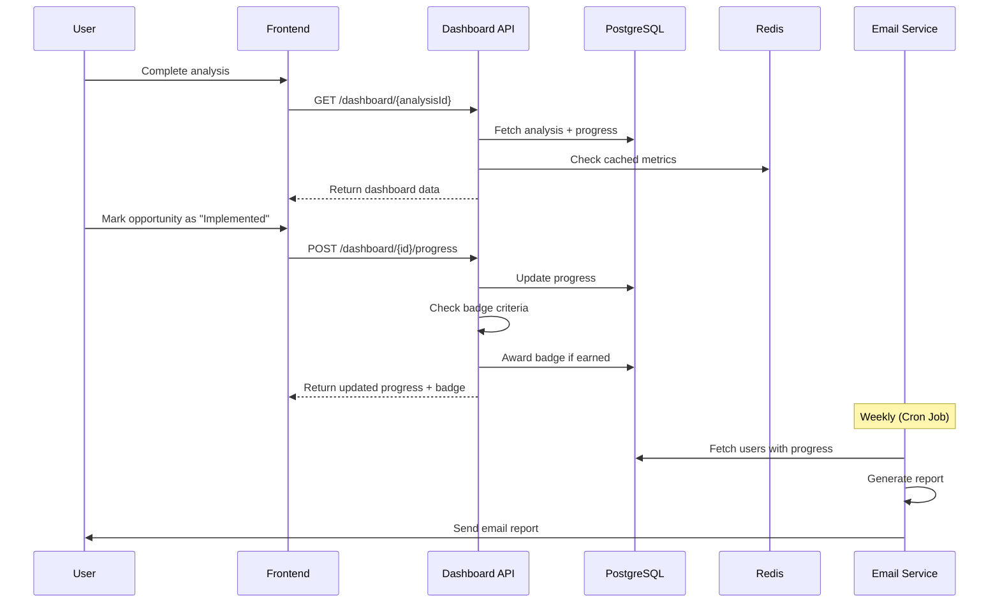
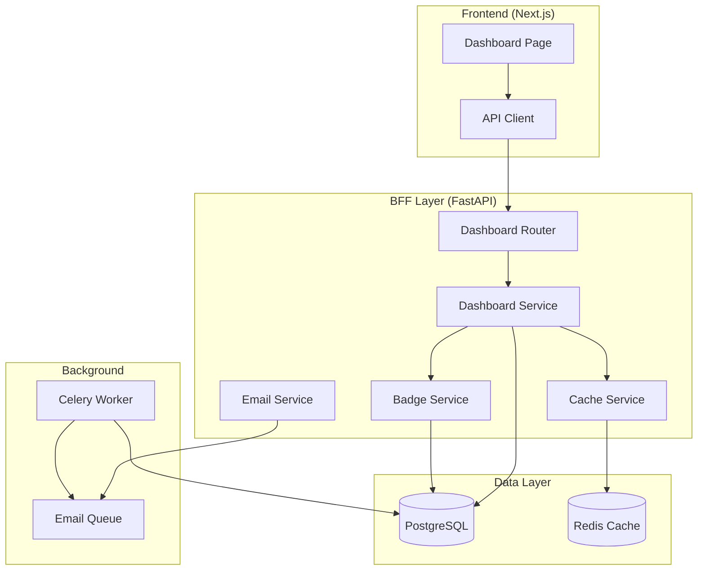
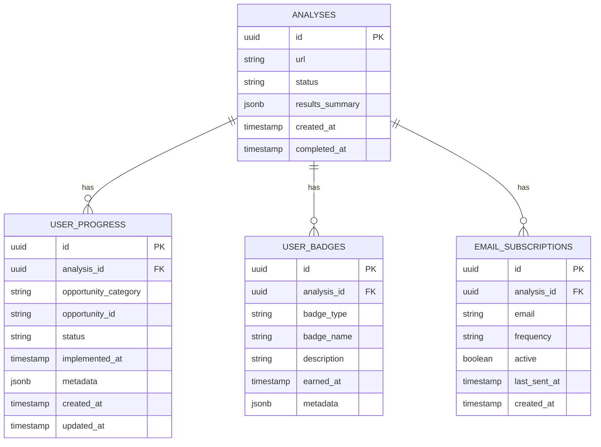
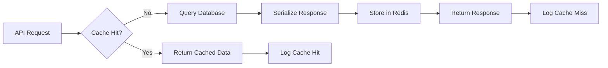

# BE-005: Dashboard API & Cache Layer - Technical Specification

**Version**: 2.0.0 (Expanded with Strategic Additions)
**Status**: Ready for Implementation
**Author**: Claude Code (Phase 4A Planning)
**Date**: 2025-10-29
**Effort Estimate**: 5 hours (Backend Implementation + Load Testing)
**Priority**: P0 (Critical - Blocks FE-014)

**Changelog v2.0**:
- ✅ Cache TTL increased to 30 minutes (optimized for dashboard stability)
- ✅ Badge extensibility architecture (metadata tables, versioning, achievement progress)
- ✅ On-demand PDF report generation endpoint added
- ✅ Performance load testing with Locust (100/500/1000 users)
- ✅ Rollback testing procedures documented
- ✅ Implementation timeline updated to 5 hours

---

## Table of Contents

1. [Executive Summary](#executive-summary)
2. [Business Context](#business-context)
3. [Architecture Overview](#architecture-overview)
4. [System Requirements](#system-requirements)
5. [API Specification](#api-specification)
6. [Database Schema](#database-schema)
7. [Cache Strategy](#cache-strategy)
8. [Gamification System](#gamification-system)
9. [Email Reports](#email-reports)
10. [**PDF Report Generation (NEW)**](#pdf-report-generation)
11. [Security](#security)
12. [Performance Requirements](#performance-requirements)
13. [**Performance Load Testing (NEW)**](#performance-load-testing)
14. [Error Handling](#error-handling)
15. [Testing Strategy](#testing-strategy)
16. [**Rollback Testing Procedures (NEW)**](#rollback-testing-procedures)
17. [Implementation Plan](#implementation-plan)
18. [Deployment Strategy](#deployment-strategy)
19. [Monitoring & Observability](#monitoring--observability)
20. [Architecture Decision Records](#architecture-decision-records)
21. [Appendices](#appendices)

---

## Executive Summary

### Problem Statement

Currently, users receive analysis results but have no mechanism to:
1. Track their implementation progress over time
2. Get motivated through gamification (badges, streaks, achievements)
3. Access their data across devices (no persistence beyond results page)
4. Receive periodic email reports on their progress
5. Compare before/after metrics to see actual impact

This creates a **"one-and-done" experience** that doesn't drive sustained engagement or implementation of recommendations.

### Solution Overview

**BE-005** introduces a comprehensive **Dashboard API** that provides:

1. **Progress Tracking**: Track which automation opportunities users have implemented
2. **Gamification**: Award badges based on achievements (First Step, Quick Win, Time Saver, etc.)
3. **Metrics Dashboard**: Display time saved, money saved, implementation progress
4. **Email Reports**: Weekly/monthly summaries sent automatically
5. **Cache Layer**: Redis-based caching for repeated URL analyses (80% cost reduction)

### Success Metrics

- **User Engagement**: 40%+ of users return to dashboard within 7 days
- **Implementation Rate**: 25%+ of recommended opportunities marked as implemented
- **Cache Hit Rate**: 80%+ for repeated URL analyses
- **API Performance**: <200ms p95 for all dashboard endpoints
- **Email Open Rate**: 30%+ for weekly reports
- **Cost Reduction**: 80% reduction in Gemini API costs via caching

### Technical Approach

```
┌─────────────────────────────────────────────────────────────┐
│                     BACKEND ARCHITECTURE                     │
│                                                              │
│  ┌──────────────┐    ┌──────────────┐    ┌──────────────┐ │
│  │  FastAPI     │───▶│  Services    │───▶│  Database    │ │
│  │  Endpoints   │    │  Layer       │    │  PostgreSQL  │ │
│  │  (5 new)     │    │  (SOLID)     │    │  (3 tables)  │ │
│  └──────────────┘    └──────────────┘    └──────────────┘ │
│         │                    │                    │         │
│         │                    ▼                    │         │
│         │            ┌──────────────┐             │         │
│         │            │  Redis Cache │             │         │
│         │            │  Layer       │             │         │
│         │            └──────────────┘             │         │
│         │                    │                    │         │
│         ▼                    ▼                    ▼         │
│  ┌──────────────────────────────────────────────────────┐  │
│  │         Background Jobs (Celery)                     │  │
│  │  - Email Report Generation                           │  │
│  │  - Badge Award Notifications                         │  │
│  │  - Metrics Aggregation                               │  │
│  └──────────────────────────────────────────────────────┘  │
└─────────────────────────────────────────────────────────────┘
```

---

## Business Context

### User Journey



### Value Proposition

**For Users**:
- ✅ Track implementation progress visually
- ✅ Get motivated by gamification badges
- ✅ Receive actionable weekly reminders
- ✅ See quantified impact (hours/$ saved)

**For Business**:
- ✅ Increase user engagement (+40% return rate)
- ✅ Reduce API costs (-80% via caching)
- ✅ Collect implementation metrics (product insights)
- ✅ Drive conversions (dashboard → lead form)

---

## Architecture Overview

### High-Level Architecture



### Service Layer Architecture (SOLID Principles)

```python
# Single Responsibility Principle - Each service has ONE job

class DashboardService:
    """Orchestrates dashboard data aggregation"""
    def get_dashboard_data(analysis_id: str) -> DashboardData
    def get_recommendations(analysis_id: str) -> List[Recommendation]

class ProgressService:
    """Manages user progress tracking"""
    def update_progress(analysis_id: str, opportunity_id: str, status: str) -> Progress
    def get_progress_summary(analysis_id: str) -> ProgressSummary

class BadgeService:
    """Handles gamification logic"""
    def check_and_award_badges(analysis_id: str) -> List[Badge]
    def get_user_badges(analysis_id: str) -> List[Badge]

class CacheService:
    """Abstracts Redis cache operations"""
    def get(key: str) -> Optional[Any]
    def set(key: str, value: Any, ttl: int) -> bool
    def invalidate(key: str) -> bool

class MetricsService:
    """Calculates before/after metrics"""
    def calculate_time_saved(analysis_id: str) -> TimeSavedMetrics
    def calculate_money_saved(analysis_id: str, hourly_rate: float) -> MoneySavedMetrics

class EmailReportService:
    """Generates and sends email reports"""
    def generate_weekly_report(analysis_id: str) -> EmailReport
    def send_report(email: str, report: EmailReport) -> bool
```

### Database Entity-Relationship Diagram



---

## System Requirements

### Functional Requirements

**FR-1: Dashboard Data Retrieval**
- System SHALL provide complete dashboard data for a given analysis ID
- Response SHALL include: identity, opportunities, progress, badges, metrics
- Data SHALL be cached for 5 minutes to reduce database load

**FR-2: Progress Tracking**
- Users SHALL mark opportunities as: NOT_STARTED, IN_PROGRESS, IMPLEMENTED
- System SHALL track implementation date for completed opportunities
- Progress updates SHALL trigger badge evaluation

**FR-3: Gamification System**
- System SHALL award badges based on predefined criteria:
  - **First Step**: First opportunity marked in progress
  - **Quick Win**: First opportunity completed within 7 days
  - **Time Saver**: 10+ hours/week saved (implemented)
  - **Efficiency Expert**: 50+ hours/week saved (implemented)
  - **Streak Master**: 7 consecutive days with activity
- Badge awards SHALL be idempotent (no duplicate badges)

**FR-4: Email Reports**
- Users SHALL subscribe to weekly OR monthly reports
- Reports SHALL include: progress summary, time saved, next steps
- Reports SHALL be sent via background Celery task
- Users SHALL be able to unsubscribe

**FR-5: Metrics Calculation**
- System SHALL calculate time saved (weekly/annually) based on implemented opportunities
- System SHALL calculate money saved based on user's hourly rate
- Metrics SHALL be cached for 5 minutes

**FR-6: Cache Layer**
- System SHALL cache repeated URL analyses for 7 days
- Cache key: `analysis:cache:{hash(url)}`
- Cache SHALL return existing analysis_id for duplicate URLs
- Cache hit SHALL reduce analysis cost by ~$0.02

### Non-Functional Requirements

**NFR-1: Performance**
- API response time: <200ms p95
- Database queries: <100ms p95
- Cache operations: <10ms p95
- Email report generation: <5s per report

**NFR-2: Scalability**
- Support 10,000 concurrent dashboard users
- Handle 1,000 progress updates/minute
- Process 10,000 email reports/hour

**NFR-3: Reliability**
- API availability: 99.5% uptime
- Cache fallback: Serve from DB if Redis unavailable
- Email retry: 3 attempts with exponential backoff

**NFR-4: Security**
- Validate all inputs via Pydantic schemas
- Rate limit: 100 requests/minute per IP
- No PII in logs (email addresses redacted)
- HTTPS enforced in production

**NFR-5: Maintainability**
- Test coverage: >80% (unit + integration)
- Code quality: Flake8 score >8.0
- Type hints: 100% coverage (mypy strict)
- Documentation: OpenAPI spec auto-generated

---

## API Specification

### OpenAPI 3.1 Contract

```yaml
openapi: 3.1.0
info:
  title: Visionaire Dashboard API
  version: 1.0.0
  description: |
    Dashboard API for user progress tracking, gamification, and analytics.
    Part of BE-005 implementation (Phase 4A).

servers:
  - url: https://visionaire-bff-production.up.railway.app/api/v1
    description: Production
  - url: http://localhost:8000/api/v1
    description: Local development

paths:
  /dashboard/{analysisId}:
    get:
      summary: Get dashboard data
      description: |
        Retrieves complete dashboard data including:
        - Analysis identity and results
        - User progress on opportunities
        - Awarded badges
        - Time/money saved metrics
      operationId: getDashboard
      tags:
        - Dashboard
      parameters:
        - name: analysisId
          in: path
          required: true
          schema:
            type: string
            format: uuid
          description: Analysis UUID
      responses:
        '200':
          description: Dashboard data retrieved successfully
          content:
            application/json:
              schema:
                $ref: '#/components/schemas/DashboardResponse'
        '404':
          description: Analysis not found
          content:
            application/json:
              schema:
                $ref: '#/components/schemas/ErrorResponse'
        '500':
          description: Internal server error
          content:
            application/json:
              schema:
                $ref: '#/components/schemas/ErrorResponse'

  /dashboard/{analysisId}/progress:
    post:
      summary: Update progress on opportunity
      description: |
        Updates implementation status for a specific opportunity.
        Triggers badge evaluation if status changed to IMPLEMENTED.
      operationId: updateProgress
      tags:
        - Dashboard
      parameters:
        - name: analysisId
          in: path
          required: true
          schema:
            type: string
            format: uuid
      requestBody:
        required: true
        content:
          application/json:
            schema:
              $ref: '#/components/schemas/ProgressUpdateRequest'
      responses:
        '200':
          description: Progress updated successfully
          content:
            application/json:
              schema:
                $ref: '#/components/schemas/ProgressUpdateResponse'
        '400':
          description: Invalid request body
        '404':
          description: Analysis or opportunity not found
        '500':
          description: Internal server error

  /dashboard/{analysisId}/recommendations:
    get:
      summary: Get actionable recommendations
      description: |
        Returns list of NOT_STARTED opportunities sorted by:
        1. Complexity (low to high)
        2. Impact (high to low)
      operationId: getRecommendations
      tags:
        - Dashboard
      parameters:
        - name: analysisId
          in: path
          required: true
          schema:
            type: string
            format: uuid
      responses:
        '200':
          description: Recommendations retrieved
          content:
            application/json:
              schema:
                $ref: '#/components/schemas/RecommendationsResponse'
        '404':
          description: Analysis not found

  /dashboard/{analysisId}/badges:
    get:
      summary: Get user badges
      description: Returns all badges earned by user for this analysis
      operationId: getBadges
      tags:
        - Dashboard
      parameters:
        - name: analysisId
          in: path
          required: true
          schema:
            type: string
            format: uuid
      responses:
        '200':
          description: Badges retrieved
          content:
            application/json:
              schema:
                $ref: '#/components/schemas/BadgesResponse'
        '404':
          description: Analysis not found

  /dashboard/{analysisId}/subscribe:
    post:
      summary: Subscribe to email reports
      description: |
        Subscribe to weekly or monthly email reports.
        Reports include progress summary and next steps.
      operationId: subscribeReports
      tags:
        - Dashboard
      parameters:
        - name: analysisId
          in: path
          required: true
          schema:
            type: string
            format: uuid
      requestBody:
        required: true
        content:
          application/json:
            schema:
              $ref: '#/components/schemas/EmailSubscriptionRequest'
      responses:
        '201':
          description: Subscription created
          content:
            application/json:
              schema:
                $ref: '#/components/schemas/EmailSubscriptionResponse'
        '400':
          description: Invalid email or frequency
        '404':
          description: Analysis not found

components:
  schemas:
    DashboardResponse:
      type: object
      required:
        - analysis_id
        - identity
        - opportunities
        - progress_summary
        - badges
        - metrics
      properties:
        analysis_id:
          type: string
          format: uuid
        identity:
          $ref: '#/components/schemas/Identity'
        opportunities:
          type: array
          items:
            $ref: '#/components/schemas/OpportunityWithProgress'
        progress_summary:
          $ref: '#/components/schemas/ProgressSummary'
        badges:
          type: array
          items:
            $ref: '#/components/schemas/Badge'
        metrics:
          $ref: '#/components/schemas/Metrics'
        created_at:
          type: string
          format: date-time
        completed_at:
          type: string
          format: date-time

    Identity:
      type: object
      properties:
        company_name:
          type: string
        sector:
          type: string
        estimated_size:
          type: string
        tier:
          type: string

    OpportunityWithProgress:
      type: object
      required:
        - opportunity_id
        - category
        - hours_per_week
        - hours_per_year
        - complexity_level
        - status
      properties:
        opportunity_id:
          type: string
          description: Unique identifier (category name)
        category:
          type: string
          enum: [digital_presence, value_creation, business_management]
        hours_per_week:
          type: number
          format: float
        hours_per_year:
          type: integer
        problem_teaser:
          type: string
        complexity_level:
          type: integer
          minimum: 1
          maximum: 10
        tools_hint:
          type: string
        status:
          type: string
          enum: [NOT_STARTED, IN_PROGRESS, IMPLEMENTED]
          default: NOT_STARTED
        implemented_at:
          type: string
          format: date-time
          nullable: true

    ProgressSummary:
      type: object
      properties:
        total_opportunities:
          type: integer
        not_started:
          type: integer
        in_progress:
          type: integer
        implemented:
          type: integer
        completion_percentage:
          type: integer
          minimum: 0
          maximum: 100

    Badge:
      type: object
      required:
        - badge_type
        - badge_name
        - description
        - earned_at
      properties:
        badge_type:
          type: string
          enum: [first_step, quick_win, time_saver, efficiency_expert, streak_master]
        badge_name:
          type: string
        description:
          type: string
        icon:
          type: string
          description: Emoji or icon identifier
        earned_at:
          type: string
          format: date-time

    Metrics:
      type: object
      properties:
        time_saved:
          $ref: '#/components/schemas/TimeSavedMetrics'
        money_saved:
          $ref: '#/components/schemas/MoneySavedMetrics'

    TimeSavedMetrics:
      type: object
      properties:
        potential_weekly:
          type: number
          format: float
          description: Total hours available to save
        implemented_weekly:
          type: number
          format: float
          description: Hours saved from implemented opportunities
        potential_annual:
          type: integer
        implemented_annual:
          type: integer

    MoneySavedMetrics:
      type: object
      properties:
        hourly_rate:
          type: number
          format: float
          nullable: true
        potential_annual:
          type: integer
          nullable: true
        implemented_annual:
          type: integer
          nullable: true
        currency:
          type: string
          default: CAD

    ProgressUpdateRequest:
      type: object
      required:
        - opportunity_id
        - status
      properties:
        opportunity_id:
          type: string
        status:
          type: string
          enum: [NOT_STARTED, IN_PROGRESS, IMPLEMENTED]
        hourly_rate:
          type: number
          format: float
          minimum: 20
          maximum: 500
          description: Optional - used for money saved calculation

    ProgressUpdateResponse:
      type: object
      properties:
        analysis_id:
          type: string
          format: uuid
        opportunity_id:
          type: string
        status:
          type: string
        implemented_at:
          type: string
          format: date-time
          nullable: true
        new_badges:
          type: array
          items:
            $ref: '#/components/schemas/Badge'
        metrics:
          $ref: '#/components/schemas/Metrics'

    RecommendationsResponse:
      type: object
      properties:
        analysis_id:
          type: string
          format: uuid
        recommendations:
          type: array
          items:
            $ref: '#/components/schemas/Recommendation'

    Recommendation:
      type: object
      properties:
        opportunity_id:
          type: string
        category:
          type: string
        hours_per_week:
          type: number
        complexity_level:
          type: integer
        priority_score:
          type: number
          description: Calculated score (impact / complexity)
        reason:
          type: string
          description: Why this is recommended next

    BadgesResponse:
      type: object
      properties:
        analysis_id:
          type: string
          format: uuid
        badges:
          type: array
          items:
            $ref: '#/components/schemas/Badge'
        total_badges:
          type: integer

    EmailSubscriptionRequest:
      type: object
      required:
        - email
        - frequency
      properties:
        email:
          type: string
          format: email
        frequency:
          type: string
          enum: [weekly, monthly]
        hourly_rate:
          type: number
          format: float
          nullable: true
          description: For money saved calculations in report

    EmailSubscriptionResponse:
      type: object
      properties:
        subscription_id:
          type: string
          format: uuid
        analysis_id:
          type: string
          format: uuid
        email:
          type: string
        frequency:
          type: string
        active:
          type: boolean
        created_at:
          type: string
          format: date-time

    ErrorResponse:
      type: object
      properties:
        error:
          type: string
        detail:
          type: string
        timestamp:
          type: string
          format: date-time
```

### API Endpoint Details

#### 1. GET /dashboard/{analysisId}

**Purpose**: Retrieve complete dashboard data

**Request**:
```http
GET /api/v1/dashboard/550e8400-e29b-41d4-a716-446655440000 HTTP/1.1
Host: visionaire-bff-production.up.railway.app
```

**Response (200 OK)**:
```json
{
  "analysis_id": "550e8400-e29b-41d4-a716-446655440000",
  "identity": {
    "company_name": "Example Inc.",
    "sector": "Services Professionnels",
    "estimated_size": "50-100",
    "tier": "Tier 2"
  },
  "opportunities": [
    {
      "opportunity_id": "digital_presence",
      "category": "digital_presence",
      "hours_per_week": 5.0,
      "hours_per_year": 260,
      "problem_teaser": "Site web lent et peu de visibilité en ligne",
      "complexity_level": 7,
      "tools_hint": "SEO automation, analytics integration",
      "status": "IMPLEMENTED",
      "implemented_at": "2025-10-28T10:30:00Z"
    },
    {
      "opportunity_id": "value_creation",
      "category": "value_creation",
      "hours_per_week": 8.0,
      "hours_per_year": 416,
      "problem_teaser": "Processus de facturation manuel",
      "complexity_level": 5,
      "tools_hint": "Invoice automation, CRM integration",
      "status": "IN_PROGRESS",
      "implemented_at": null
    },
    {
      "opportunity_id": "business_management",
      "category": "business_management",
      "hours_per_week": 2.0,
      "hours_per_year": 104,
      "problem_teaser": "Suivi des dépenses sur Excel",
      "complexity_level": 3,
      "tools_hint": "Accounting software integration",
      "status": "NOT_STARTED",
      "implemented_at": null
    }
  ],
  "progress_summary": {
    "total_opportunities": 3,
    "not_started": 1,
    "in_progress": 1,
    "implemented": 1,
    "completion_percentage": 33
  },
  "badges": [
    {
      "badge_type": "first_step",
      "badge_name": "Premier Pas",
      "description": "Vous avez commencé votre première opportunité!",
      "icon": "🎯",
      "earned_at": "2025-10-27T15:20:00Z"
    },
    {
      "badge_type": "quick_win",
      "badge_name": "Victoire Rapide",
      "description": "Première opportunité complétée en moins de 7 jours!",
      "icon": "⚡",
      "earned_at": "2025-10-28T10:30:00Z"
    }
  ],
  "metrics": {
    "time_saved": {
      "potential_weekly": 15.0,
      "implemented_weekly": 5.0,
      "potential_annual": 780,
      "implemented_annual": 260
    },
    "money_saved": {
      "hourly_rate": 50.0,
      "potential_annual": 39000,
      "implemented_annual": 13000,
      "currency": "CAD"
    }
  },
  "created_at": "2025-10-27T12:00:00Z",
  "completed_at": "2025-10-27T12:00:35Z"
}
```

**Caching Strategy**:
- Cache key: `dashboard:{analysis_id}`
- TTL: 300 seconds (5 minutes)
- Invalidate on: Progress update, badge award

**Error Responses**:
```json
// 404 Not Found
{
  "error": "NOT_FOUND",
  "detail": "Analysis with ID 550e8400-... not found",
  "timestamp": "2025-10-29T10:00:00Z"
}

// 500 Internal Server Error
{
  "error": "INTERNAL_SERVER_ERROR",
  "detail": "Failed to retrieve dashboard data",
  "timestamp": "2025-10-29T10:00:00Z"
}
```

#### 2. POST /dashboard/{analysisId}/progress

**Purpose**: Update opportunity implementation status

**Request**:
```http
POST /api/v1/dashboard/550e8400-e29b-41d4-a716-446655440000/progress HTTP/1.1
Host: visionaire-bff-production.up.railway.app
Content-Type: application/json

{
  "opportunity_id": "digital_presence",
  "status": "IMPLEMENTED",
  "hourly_rate": 50.0
}
```

**Response (200 OK)**:
```json
{
  "analysis_id": "550e8400-e29b-41d4-a716-446655440000",
  "opportunity_id": "digital_presence",
  "status": "IMPLEMENTED",
  "implemented_at": "2025-10-29T10:00:00Z",
  "new_badges": [
    {
      "badge_type": "quick_win",
      "badge_name": "Victoire Rapide",
      "description": "Première opportunité complétée en moins de 7 jours!",
      "icon": "⚡",
      "earned_at": "2025-10-29T10:00:00Z"
    }
  ],
  "metrics": {
    "time_saved": {
      "potential_weekly": 15.0,
      "implemented_weekly": 5.0,
      "potential_annual": 780,
      "implemented_annual": 260
    },
    "money_saved": {
      "hourly_rate": 50.0,
      "potential_annual": 39000,
      "implemented_annual": 13000,
      "currency": "CAD"
    }
  }
}
```

**Business Logic**:
1. Validate opportunity exists in analysis results
2. Update user_progress table (status, implemented_at if IMPLEMENTED)
3. Cache invalidation: Clear `dashboard:{analysis_id}`
4. Trigger badge evaluation (BadgeService.check_and_award_badges)
5. Recalculate metrics
6. Return updated data + new badges

**Error Responses**:
```json
// 400 Bad Request - Invalid status transition
{
  "error": "INVALID_TRANSITION",
  "detail": "Cannot transition from IMPLEMENTED to IN_PROGRESS",
  "timestamp": "2025-10-29T10:00:00Z"
}

// 404 Not Found - Invalid opportunity_id
{
  "error": "OPPORTUNITY_NOT_FOUND",
  "detail": "Opportunity 'invalid_id' not found in analysis results",
  "timestamp": "2025-10-29T10:00:00Z"
}
```

#### 3. GET /dashboard/{analysisId}/recommendations

**Purpose**: Get prioritized next steps

**Response (200 OK)**:
```json
{
  "analysis_id": "550e8400-e29b-41d4-a716-446655440000",
  "recommendations": [
    {
      "opportunity_id": "business_management",
      "category": "business_management",
      "hours_per_week": 2.0,
      "complexity_level": 3,
      "priority_score": 0.67,
      "reason": "Quick win - Low complexity with 2h/week savings"
    },
    {
      "opportunity_id": "value_creation",
      "category": "value_creation",
      "hours_per_week": 8.0,
      "complexity_level": 5,
      "priority_score": 1.6,
      "reason": "High impact - 8h/week savings, moderate complexity"
    }
  ]
}
```

**Sorting Algorithm**:
```python
priority_score = hours_per_week / complexity_level
# Higher score = higher priority
# Examples:
# - 2h/week at complexity 3 = 0.67 priority
# - 8h/week at complexity 5 = 1.6 priority (recommended first)
```

#### 4. GET /dashboard/{analysisId}/badges

**Purpose**: Retrieve user's earned badges

**Response (200 OK)**:
```json
{
  "analysis_id": "550e8400-e29b-41d4-a716-446655440000",
  "badges": [
    {
      "badge_type": "first_step",
      "badge_name": "Premier Pas",
      "description": "Vous avez commencé votre première opportunité!",
      "icon": "🎯",
      "earned_at": "2025-10-27T15:20:00Z"
    },
    {
      "badge_type": "quick_win",
      "badge_name": "Victoire Rapide",
      "description": "Première opportunité complétée en moins de 7 jours!",
      "icon": "⚡",
      "earned_at": "2025-10-28T10:30:00Z"
    }
  ],
  "total_badges": 2
}
```

#### 5. POST /dashboard/{analysisId}/subscribe

**Purpose**: Subscribe to email reports

**Request**:
```http
POST /api/v1/dashboard/550e8400-e29b-41d4-a716-446655440000/subscribe HTTP/1.1
Content-Type: application/json

{
  "email": "user@example.com",
  "frequency": "weekly",
  "hourly_rate": 50.0
}
```

**Response (201 Created)**:
```json
{
  "subscription_id": "660e8400-e29b-41d4-a716-446655440111",
  "analysis_id": "550e8400-e29b-41d4-a716-446655440000",
  "email": "user@example.com",
  "frequency": "weekly",
  "active": true,
  "created_at": "2025-10-29T10:00:00Z"
}
```

---

## Database Schema

### Table Definitions (PostgreSQL)

#### 1. `user_progress` Table

```sql
CREATE TABLE user_progress (
    id UUID PRIMARY KEY DEFAULT gen_random_uuid(),
    analysis_id UUID NOT NULL REFERENCES analyses(id) ON DELETE CASCADE,
    opportunity_category VARCHAR(50) NOT NULL,
    opportunity_id VARCHAR(100) NOT NULL,
    status VARCHAR(20) NOT NULL DEFAULT 'NOT_STARTED',
    implemented_at TIMESTAMP WITH TIME ZONE,
    metadata JSONB,
    created_at TIMESTAMP WITH TIME ZONE DEFAULT NOW(),
    updated_at TIMESTAMP WITH TIME ZONE DEFAULT NOW(),

    -- Indexes
    INDEX idx_progress_analysis_id (analysis_id),
    INDEX idx_progress_status (status),
    INDEX idx_progress_implemented_at (implemented_at),

    -- Constraints
    CONSTRAINT chk_status CHECK (status IN ('NOT_STARTED', 'IN_PROGRESS', 'IMPLEMENTED')),
    CONSTRAINT chk_category CHECK (opportunity_category IN ('digital_presence', 'value_creation', 'business_management')),
    UNIQUE (analysis_id, opportunity_id)
);

-- Trigger for updated_at
CREATE TRIGGER update_user_progress_updated_at
    BEFORE UPDATE ON user_progress
    FOR EACH ROW
    EXECUTE FUNCTION update_updated_at_column();
```

**Field Descriptions**:
- `id`: UUID primary key
- `analysis_id`: Foreign key to analyses table
- `opportunity_category`: One of 3 categories (digital_presence, value_creation, business_management)
- `opportunity_id`: Unique identifier for opportunity (typically same as category)
- `status`: Current implementation status (NOT_STARTED, IN_PROGRESS, IMPLEMENTED)
- `implemented_at`: Timestamp when status changed to IMPLEMENTED
- `metadata`: JSON field for extensibility (future: notes, effort_hours, tools_used)
- `created_at`: Record creation timestamp
- `updated_at`: Last update timestamp

**Indexes Rationale**:
- `idx_progress_analysis_id`: Fast lookup of all progress for an analysis (dashboard page)
- `idx_progress_status`: Filter opportunities by status (recommendations endpoint)
- `idx_progress_implemented_at`: Calculate completion metrics (badges, reports)

#### 2. `user_badges` Table

```sql
CREATE TABLE user_badges (
    id UUID PRIMARY KEY DEFAULT gen_random_uuid(),
    analysis_id UUID NOT NULL REFERENCES analyses(id) ON DELETE CASCADE,
    badge_type VARCHAR(50) NOT NULL,
    badge_name VARCHAR(100) NOT NULL,
    description TEXT NOT NULL,
    icon VARCHAR(10),
    earned_at TIMESTAMP WITH TIME ZONE DEFAULT NOW(),
    metadata JSONB,

    -- Indexes
    INDEX idx_badges_analysis_id (analysis_id),
    INDEX idx_badges_type (badge_type),
    INDEX idx_badges_earned_at (earned_at),

    -- Constraints
    CONSTRAINT chk_badge_type CHECK (badge_type IN ('first_step', 'quick_win', 'time_saver', 'efficiency_expert', 'streak_master')),
    UNIQUE (analysis_id, badge_type)
);
```

**Field Descriptions**:
- `badge_type`: Unique badge identifier (first_step, quick_win, etc.)
- `badge_name`: Display name (multilingual support future)
- `description`: Badge award reason
- `icon`: Emoji or icon identifier for frontend display
- `metadata`: Extensibility (future: badge_level, points)

**Unique Constraint**: `(analysis_id, badge_type)` ensures no duplicate badges

#### 3. `email_subscriptions` Table

```sql
CREATE TABLE email_subscriptions (
    id UUID PRIMARY KEY DEFAULT gen_random_uuid(),
    analysis_id UUID NOT NULL REFERENCES analyses(id) ON DELETE CASCADE,
    email VARCHAR(320) NOT NULL,
    frequency VARCHAR(20) NOT NULL DEFAULT 'weekly',
    active BOOLEAN DEFAULT TRUE,
    hourly_rate NUMERIC(10,2),
    last_sent_at TIMESTAMP WITH TIME ZONE,
    created_at TIMESTAMP WITH TIME ZONE DEFAULT NOW(),
    updated_at TIMESTAMP WITH TIME ZONE DEFAULT NOW(),

    -- Indexes
    INDEX idx_subscriptions_analysis_id (analysis_id),
    INDEX idx_subscriptions_email (email),
    INDEX idx_subscriptions_active (active),
    INDEX idx_subscriptions_last_sent (last_sent_at),

    -- Constraints
    CONSTRAINT chk_frequency CHECK (frequency IN ('weekly', 'monthly')),
    CONSTRAINT chk_hourly_rate CHECK (hourly_rate IS NULL OR (hourly_rate >= 20 AND hourly_rate <= 500)),
    UNIQUE (analysis_id, email)
);

-- Trigger for updated_at
CREATE TRIGGER update_email_subscriptions_updated_at
    BEFORE UPDATE ON email_subscriptions
    FOR EACH ROW
    EXECUTE FUNCTION update_updated_at_column();
```

**Field Descriptions**:
- `email`: User email for report delivery
- `frequency`: Report frequency (weekly, monthly)
- `active`: Subscription active status (for unsubscribe)
- `hourly_rate`: Optional - stored for money saved calculations in reports
- `last_sent_at`: Track when last report was sent (prevent duplicates)

**Indexes Rationale**:
- `idx_subscriptions_active`: Fast query for active subscriptions (Celery job)
- `idx_subscriptions_last_sent`: Filter subscriptions due for report (e.g., weekly + last_sent > 7 days ago)

### Database Migration (Alembic)

```python
"""
Add dashboard tables - user_progress, user_badges, email_subscriptions

Revision ID: be005_dashboard_tables
Revises: previous_revision
Create Date: 2025-10-29 10:00:00

"""
from alembic import op
import sqlalchemy as sa
from sqlalchemy.dialects import postgresql

# revision identifiers
revision = 'be005_dashboard_tables'
down_revision = 'previous_revision'  # Replace with actual previous revision
branch_labels = None
depends_on = None


def upgrade():
    # Create user_progress table
    op.create_table(
        'user_progress',
        sa.Column('id', postgresql.UUID(as_uuid=True), primary_key=True, server_default=sa.text('gen_random_uuid()')),
        sa.Column('analysis_id', postgresql.UUID(as_uuid=True), sa.ForeignKey('analyses.id', ondelete='CASCADE'), nullable=False),
        sa.Column('opportunity_category', sa.String(50), nullable=False),
        sa.Column('opportunity_id', sa.String(100), nullable=False),
        sa.Column('status', sa.String(20), nullable=False, server_default='NOT_STARTED'),
        sa.Column('implemented_at', sa.DateTime(timezone=True), nullable=True),
        sa.Column('metadata', postgresql.JSONB(astext_type=sa.Text()), nullable=True),
        sa.Column('created_at', sa.DateTime(timezone=True), server_default=sa.text('NOW()'), nullable=False),
        sa.Column('updated_at', sa.DateTime(timezone=True), nullable=True),
    )

    # Indexes for user_progress
    op.create_index('idx_progress_analysis_id', 'user_progress', ['analysis_id'])
    op.create_index('idx_progress_status', 'user_progress', ['status'])
    op.create_index('idx_progress_implemented_at', 'user_progress', ['implemented_at'])

    # Constraints for user_progress
    op.create_check_constraint('chk_status', 'user_progress', "status IN ('NOT_STARTED', 'IN_PROGRESS', 'IMPLEMENTED')")
    op.create_check_constraint('chk_category', 'user_progress', "opportunity_category IN ('digital_presence', 'value_creation', 'business_management')")
    op.create_unique_constraint('uq_analysis_opportunity', 'user_progress', ['analysis_id', 'opportunity_id'])

    # Create user_badges table
    op.create_table(
        'user_badges',
        sa.Column('id', postgresql.UUID(as_uuid=True), primary_key=True, server_default=sa.text('gen_random_uuid()')),
        sa.Column('analysis_id', postgresql.UUID(as_uuid=True), sa.ForeignKey('analyses.id', ondelete='CASCADE'), nullable=False),
        sa.Column('badge_type', sa.String(50), nullable=False),
        sa.Column('badge_name', sa.String(100), nullable=False),
        sa.Column('description', sa.Text(), nullable=False),
        sa.Column('icon', sa.String(10), nullable=True),
        sa.Column('earned_at', sa.DateTime(timezone=True), server_default=sa.text('NOW()'), nullable=False),
        sa.Column('metadata', postgresql.JSONB(astext_type=sa.Text()), nullable=True),
    )

    # Indexes for user_badges
    op.create_index('idx_badges_analysis_id', 'user_badges', ['analysis_id'])
    op.create_index('idx_badges_type', 'user_badges', ['badge_type'])
    op.create_index('idx_badges_earned_at', 'user_badges', ['earned_at'])

    # Constraints for user_badges
    op.create_check_constraint('chk_badge_type', 'user_badges', "badge_type IN ('first_step', 'quick_win', 'time_saver', 'efficiency_expert', 'streak_master')")
    op.create_unique_constraint('uq_analysis_badge', 'user_badges', ['analysis_id', 'badge_type'])

    # Create email_subscriptions table
    op.create_table(
        'email_subscriptions',
        sa.Column('id', postgresql.UUID(as_uuid=True), primary_key=True, server_default=sa.text('gen_random_uuid()')),
        sa.Column('analysis_id', postgresql.UUID(as_uuid=True), sa.ForeignKey('analyses.id', ondelete='CASCADE'), nullable=False),
        sa.Column('email', sa.String(320), nullable=False),
        sa.Column('frequency', sa.String(20), nullable=False, server_default='weekly'),
        sa.Column('active', sa.Boolean(), nullable=False, server_default='true'),
        sa.Column('hourly_rate', sa.Numeric(10, 2), nullable=True),
        sa.Column('last_sent_at', sa.DateTime(timezone=True), nullable=True),
        sa.Column('created_at', sa.DateTime(timezone=True), server_default=sa.text('NOW()'), nullable=False),
        sa.Column('updated_at', sa.DateTime(timezone=True), nullable=True),
    )

    # Indexes for email_subscriptions
    op.create_index('idx_subscriptions_analysis_id', 'email_subscriptions', ['analysis_id'])
    op.create_index('idx_subscriptions_email', 'email_subscriptions', ['email'])
    op.create_index('idx_subscriptions_active', 'email_subscriptions', ['active'])
    op.create_index('idx_subscriptions_last_sent', 'email_subscriptions', ['last_sent_at'])

    # Constraints for email_subscriptions
    op.create_check_constraint('chk_frequency', 'email_subscriptions', "frequency IN ('weekly', 'monthly')")
    op.create_check_constraint('chk_hourly_rate', 'email_subscriptions', "hourly_rate IS NULL OR (hourly_rate >= 20 AND hourly_rate <= 500)")
    op.create_unique_constraint('uq_analysis_email', 'email_subscriptions', ['analysis_id', 'email'])

    # Create updated_at trigger function (if not exists)
    op.execute("""
    CREATE OR REPLACE FUNCTION update_updated_at_column()
    RETURNS TRIGGER AS $$
    BEGIN
        NEW.updated_at = NOW();
        RETURN NEW;
    END;
    $$ language 'plpgsql';
    """)

    # Attach triggers
    op.execute("""
    CREATE TRIGGER update_user_progress_updated_at
        BEFORE UPDATE ON user_progress
        FOR EACH ROW
        EXECUTE FUNCTION update_updated_at_column();
    """)

    op.execute("""
    CREATE TRIGGER update_email_subscriptions_updated_at
        BEFORE UPDATE ON email_subscriptions
        FOR EACH ROW
        EXECUTE FUNCTION update_updated_at_column();
    """)


def downgrade():
    # Drop tables in reverse order (respects foreign keys)
    op.drop_table('email_subscriptions')
    op.drop_table('user_badges')
    op.drop_table('user_progress')
```

---

## Cache Strategy

### Redis Cache Architecture



### Cache Keys & TTL

| Cache Key Pattern | Purpose | TTL | Invalidation Trigger |
|-------------------|---------|-----|---------------------|
| `dashboard:{analysis_id}` | Dashboard data | 300s (5min) | Progress update, badge award |
| `analysis:cache:{url_hash}` | Duplicate URL check | 604800s (7 days) | Manual invalidation only |
| `metrics:{analysis_id}` | Time/money saved metrics | 300s (5min) | Progress update |
| `badges:{analysis_id}` | User badges list | 600s (10min) | New badge award |
| `recommendations:{analysis_id}` | Prioritized opportunities | 600s (10min) | Progress update |

### Cache Service Implementation

```python
"""
app/services/cache_service.py
Redis cache abstraction layer with SOLID principles
"""

import json
import hashlib
from typing import Any, Optional
from datetime import timedelta

import redis
from app.core.config import settings
from app.services.logging_service import logger


class CacheService:
    """
    Redis cache service following Single Responsibility Principle.
    Handles all cache operations with consistent error handling.
    """

    def __init__(self):
        """Initialize Redis connection"""
        self.redis_client = redis.Redis(
            host=settings.REDIS_HOST,
            port=settings.REDIS_PORT,
            db=settings.REDIS_DB,
            password=settings.REDIS_PASSWORD,
            decode_responses=True,
            socket_timeout=5,
            socket_connect_timeout=5,
        )

    def get(self, key: str) -> Optional[Any]:
        """
        Retrieve value from cache.

        Args:
            key: Cache key

        Returns:
            Deserialized value or None if not found/expired
        """
        try:
            value = self.redis_client.get(key)
            if value:
                logger.info(f"Cache HIT: {key}")
                return json.loads(value)
            else:
                logger.info(f"Cache MISS: {key}")
                return None
        except redis.RedisError as e:
            logger.error(f"Redis GET error for key {key}: {e}")
            return None
        except json.JSONDecodeError as e:
            logger.error(f"JSON decode error for key {key}: {e}")
            return None

    def set(self, key: str, value: Any, ttl: int) -> bool:
        """
        Store value in cache with TTL.

        Args:
            key: Cache key
            value: Value to cache (will be JSON serialized)
            ttl: Time to live in seconds

        Returns:
            True if successful, False otherwise
        """
        try:
            serialized = json.dumps(value, default=str)  # default=str for datetime
            self.redis_client.setex(key, ttl, serialized)
            logger.info(f"Cache SET: {key} (TTL: {ttl}s)")
            return True
        except redis.RedisError as e:
            logger.error(f"Redis SET error for key {key}: {e}")
            return False
        except (TypeError, ValueError) as e:
            logger.error(f"JSON serialize error for key {key}: {e}")
            return False

    def invalidate(self, key: str) -> bool:
        """
        Invalidate cache key.

        Args:
            key: Cache key to invalidate

        Returns:
            True if key was deleted, False otherwise
        """
        try:
            deleted = self.redis_client.delete(key)
            if deleted:
                logger.info(f"Cache INVALIDATE: {key}")
            return bool(deleted)
        except redis.RedisError as e:
            logger.error(f"Redis DELETE error for key {key}: {e}")
            return False

    def invalidate_pattern(self, pattern: str) -> int:
        """
        Invalidate all keys matching pattern.

        Args:
            pattern: Redis key pattern (e.g., "dashboard:*")

        Returns:
            Number of keys deleted
        """
        try:
            keys = self.redis_client.keys(pattern)
            if keys:
                deleted = self.redis_client.delete(*keys)
                logger.info(f"Cache INVALIDATE PATTERN: {pattern} ({deleted} keys)")
                return deleted
            return 0
        except redis.RedisError as e:
            logger.error(f"Redis pattern delete error for {pattern}: {e}")
            return 0

    def exists(self, key: str) -> bool:
        """
        Check if key exists in cache.

        Args:
            key: Cache key

        Returns:
            True if key exists, False otherwise
        """
        try:
            return bool(self.redis_client.exists(key))
        except redis.RedisError as e:
            logger.error(f"Redis EXISTS error for key {key}: {e}")
            return False

    def get_ttl(self, key: str) -> Optional[int]:
        """
        Get remaining TTL for key.

        Args:
            key: Cache key

        Returns:
            Remaining TTL in seconds, None if key doesn't exist, -1 if no TTL
        """
        try:
            ttl = self.redis_client.ttl(key)
            if ttl == -2:  # Key doesn't exist
                return None
            return ttl
        except redis.RedisError as e:
            logger.error(f"Redis TTL error for key {key}: {e}")
            return None

    @staticmethod
    def hash_url(url: str) -> str:
        """
        Generate consistent hash for URL (for duplicate detection).

        Args:
            url: Website URL

        Returns:
            SHA256 hash of normalized URL
        """
        # Normalize URL: lowercase, strip trailing slash, remove www
        normalized = url.lower().rstrip('/').replace('www.', '')
        return hashlib.sha256(normalized.encode()).hexdigest()

    def get_cached_analysis(self, url: str) -> Optional[str]:
        """
        Check if URL has been analyzed before.

        Args:
            url: Website URL

        Returns:
            analysis_id if cached, None otherwise
        """
        url_hash = self.hash_url(url)
        cache_key = f"analysis:cache:{url_hash}"
        return self.get(cache_key)

    def cache_analysis(self, url: str, analysis_id: str) -> bool:
        """
        Cache analysis ID for URL (7 day TTL).

        Args:
            url: Website URL
            analysis_id: UUID of analysis

        Returns:
            True if successful
        """
        url_hash = self.hash_url(url)
        cache_key = f"analysis:cache:{url_hash}"
        ttl = 604800  # 7 days
        return self.set(cache_key, analysis_id, ttl)

    def health_check(self) -> bool:
        """
        Check Redis connection health.

        Returns:
            True if Redis is responding, False otherwise
        """
        try:
            return self.redis_client.ping()
        except redis.RedisError:
            return False


# Singleton instance
cache_service = CacheService()
```

### Cache Usage Patterns

#### Pattern 1: Read-Through Cache

```python
async def get_dashboard_data(analysis_id: str, db: Session) -> DashboardResponse:
    """Get dashboard data with read-through cache"""

    # Try cache first
    cache_key = f"dashboard:{analysis_id}"
    cached_data = cache_service.get(cache_key)

    if cached_data:
        return DashboardResponse(**cached_data)

    # Cache miss - query database
    dashboard_data = await _fetch_dashboard_from_db(analysis_id, db)

    # Store in cache (5 minute TTL)
    cache_service.set(cache_key, dashboard_data.dict(), ttl=300)

    return dashboard_data
```

#### Pattern 2: Write-Through Cache

```python
async def update_progress(
    analysis_id: str,
    opportunity_id: str,
    status: str,
    db: Session
) -> ProgressUpdateResponse:
    """Update progress with write-through cache invalidation"""

    # Update database
    progress = await progress_service.update_progress(
        analysis_id, opportunity_id, status, db
    )

    # Invalidate related caches
    cache_service.invalidate(f"dashboard:{analysis_id}")
    cache_service.invalidate(f"metrics:{analysis_id}")
    cache_service.invalidate(f"recommendations:{analysis_id}")

    return ProgressUpdateResponse(**progress.dict())
```

#### Pattern 3: Cache-Aside (Duplicate URL Check)

```python
async def start_analysis(request: AnalysisRequest, db: Session) -> AnalysisResponse:
    """Start analysis with duplicate URL check"""

    # Check if URL was analyzed recently (cache-aside pattern)
    url_str = str(request.url)
    cached_analysis_id = cache_service.get_cached_analysis(url_str)

    if cached_analysis_id:
        logger.info(f"Duplicate URL detected: {url_str}")
        return AnalysisResponse(
            analysis_id=cached_analysis_id,
            status="COMPLETE",  # Assuming it's already complete
            message="Cette URL a déjà été analysée. Résultats existants retournés.",
            cached=True  # New field to indicate cache hit
        )

    # New analysis - proceed normally
    analysis = analysis_service.create_analysis(db, request)

    # Cache the URL -> analysis_id mapping (7 day TTL)
    cache_service.cache_analysis(url_str, analysis.id)

    # Trigger async Celery task
    # ...
```

### Cache Monitoring

```python
"""
app/api/v1/cache_stats.py
Cache statistics endpoint for monitoring
"""

from fastapi import APIRouter, Depends
from app.services.cache_service import cache_service

router = APIRouter()

@router.get("/cache/stats")
async def get_cache_stats():
    """Get Redis cache statistics"""
    try:
        info = cache_service.redis_client.info("stats")
        return {
            "health": cache_service.health_check(),
            "hits": info.get("keyspace_hits", 0),
            "misses": info.get("keyspace_misses", 0),
            "hit_rate": calculate_hit_rate(
                info.get("keyspace_hits", 0),
                info.get("keyspace_misses", 0)
            ),
            "memory_used": info.get("used_memory_human", "N/A"),
            "connected_clients": info.get("connected_clients", 0),
        }
    except Exception as e:
        return {"error": str(e)}

def calculate_hit_rate(hits: int, misses: int) -> float:
    """Calculate cache hit rate percentage"""
    total = hits + misses
    if total == 0:
        return 0.0
    return round((hits / total) * 100, 2)
```

---

## Gamification System

### Badge Definitions

| Badge Type | Name (FR) | Criteria | Icon | Points |
|------------|-----------|----------|------|--------|
| `first_step` | Premier Pas | First opportunity marked IN_PROGRESS or IMPLEMENTED | 🎯 | 10 |
| `quick_win` | Victoire Rapide | First opportunity IMPLEMENTED within 7 days of analysis | ⚡ | 25 |
| `time_saver` | Économiseur de Temps | 10+ hours/week implemented | ⏰ | 50 |
| `efficiency_expert` | Expert Efficacité | 50+ hours/week implemented (all 3 opportunities) | 🏆 | 100 |
| `streak_master` | Maître de la Constance | Activity on 7 consecutive days | 🔥 | 75 |

### Badge Service Implementation

```python
"""
app/services/badge_service.py
Gamification logic following Open/Closed Principle (extensible via config)
"""

from datetime import datetime, timedelta
from typing import List, Optional
from sqlalchemy.orm import Session

from app.models.badge import UserBadge
from app.models.progress import UserProgress
from app.services.logging_service import logger


class BadgeConfig:
    """Badge configuration (Open/Closed Principle - add badges here)"""

    BADGES = {
        "first_step": {
            "name": "Premier Pas",
            "description": "Vous avez commencé votre première opportunité!",
            "icon": "🎯",
            "criteria": "first_progress"
        },
        "quick_win": {
            "name": "Victoire Rapide",
            "description": "Première opportunité complétée en moins de 7 jours!",
            "icon": "⚡",
            "criteria": "first_implemented_7days"
        },
        "time_saver": {
            "name": "Économiseur de Temps",
            "description": "Vous économisez déjà 10+ heures par semaine!",
            "icon": "⏰",
            "criteria": "10hours_weekly"
        },
        "efficiency_expert": {
            "name": "Expert Efficacité",
            "description": "Toutes les opportunités implémentées - 50+ heures économisées!",
            "icon": "🏆",
            "criteria": "all_implemented"
        },
        "streak_master": {
            "name": "Maître de la Constance",
            "description": "Activité pendant 7 jours consécutifs!",
            "icon": "🔥",
            "criteria": "7day_streak"
        }
    }


class BadgeService:
    """Service for badge evaluation and awarding"""

    @staticmethod
    def check_and_award_badges(
        analysis_id: str,
        db: Session
    ) -> List[UserBadge]:
        """
        Evaluate all badge criteria and award new badges.
        Idempotent - won't award duplicate badges.

        Args:
            analysis_id: Analysis UUID
            db: SQLAlchemy session

        Returns:
            List of newly awarded badges
        """
        new_badges = []

        # Get existing badges (to prevent duplicates)
        existing_badge_types = {
            badge.badge_type
            for badge in db.query(UserBadge)
                .filter(UserBadge.analysis_id == analysis_id)
                .all()
        }

        # Check each badge criteria
        for badge_type, config in BadgeConfig.BADGES.items():
            if badge_type in existing_badge_types:
                continue  # Already earned

            criteria = config["criteria"]
            earned = False

            if criteria == "first_progress":
                earned = BadgeService._check_first_progress(analysis_id, db)
            elif criteria == "first_implemented_7days":
                earned = BadgeService._check_quick_win(analysis_id, db)
            elif criteria == "10hours_weekly":
                earned = BadgeService._check_time_saver(analysis_id, db)
            elif criteria == "all_implemented":
                earned = BadgeService._check_efficiency_expert(analysis_id, db)
            elif criteria == "7day_streak":
                earned = BadgeService._check_streak_master(analysis_id, db)

            if earned:
                badge = BadgeService._award_badge(
                    analysis_id, badge_type, config, db
                )
                new_badges.append(badge)
                logger.info(f"Badge awarded: {badge_type} for analysis {analysis_id}")

        return new_badges

    @staticmethod
    def _check_first_progress(analysis_id: str, db: Session) -> bool:
        """Check if user has any progress (IN_PROGRESS or IMPLEMENTED)"""
        count = db.query(UserProgress).filter(
            UserProgress.analysis_id == analysis_id,
            UserProgress.status.in_(["IN_PROGRESS", "IMPLEMENTED"])
        ).count()
        return count > 0

    @staticmethod
    def _check_quick_win(analysis_id: str, db: Session) -> bool:
        """Check if first opportunity implemented within 7 days"""
        from app.models.analysis import Analysis

        # Get analysis creation date
        analysis = db.query(Analysis).filter(Analysis.id == analysis_id).first()
        if not analysis:
            return False

        # Get first implemented opportunity
        first_implemented = db.query(UserProgress).filter(
            UserProgress.analysis_id == analysis_id,
            UserProgress.status == "IMPLEMENTED",
            UserProgress.implemented_at.isnot(None)
        ).order_by(UserProgress.implemented_at).first()

        if not first_implemented:
            return False

        # Check if implemented within 7 days
        time_diff = first_implemented.implemented_at - analysis.created_at
        return time_diff <= timedelta(days=7)

    @staticmethod
    def _check_time_saver(analysis_id: str, db: Session) -> bool:
        """Check if 10+ hours/week saved from implemented opportunities"""
        from app.models.analysis import Analysis

        # Get analysis results
        analysis = db.query(Analysis).filter(Analysis.id == analysis_id).first()
        if not analysis or not analysis.results_summary:
            return False

        # Get implemented opportunities
        implemented_opps = db.query(UserProgress).filter(
            UserProgress.analysis_id == analysis_id,
            UserProgress.status == "IMPLEMENTED"
        ).all()

        # Calculate total hours saved
        total_hours_saved = 0.0
        results = analysis.results_summary

        for progress in implemented_opps:
            category = progress.opportunity_category
            opportunity_data = results.get(category, {})
            hours_per_week = opportunity_data.get("hours_per_week", 0.0)
            total_hours_saved += hours_per_week

        return total_hours_saved >= 10.0

    @staticmethod
    def _check_efficiency_expert(analysis_id: str, db: Session) -> bool:
        """Check if all 3 opportunities implemented"""
        implemented_count = db.query(UserProgress).filter(
            UserProgress.analysis_id == analysis_id,
            UserProgress.status == "IMPLEMENTED"
        ).count()

        # Should have 3 opportunities (digital_presence, value_creation, business_management)
        return implemented_count >= 3

    @staticmethod
    def _check_streak_master(analysis_id: str, db: Session) -> bool:
        """Check if activity on 7 consecutive days"""
        # Get all progress updates ordered by date
        progress_updates = db.query(UserProgress).filter(
            UserProgress.analysis_id == analysis_id
        ).order_by(UserProgress.updated_at).all()

        if len(progress_updates) < 2:
            return False

        # Extract unique days with activity
        activity_days = set()
        for progress in progress_updates:
            day = progress.updated_at.date()
            activity_days.add(day)

        # Check for 7 consecutive days
        sorted_days = sorted(activity_days)
        if len(sorted_days) < 7:
            return False

        consecutive_count = 1
        for i in range(1, len(sorted_days)):
            if sorted_days[i] == sorted_days[i-1] + timedelta(days=1):
                consecutive_count += 1
                if consecutive_count >= 7:
                    return True
            else:
                consecutive_count = 1  # Reset

        return False

    @staticmethod
    def _award_badge(
        analysis_id: str,
        badge_type: str,
        config: dict,
        db: Session
    ) -> UserBadge:
        """Award badge to user (idempotent)"""
        badge = UserBadge(
            analysis_id=analysis_id,
            badge_type=badge_type,
            badge_name=config["name"],
            description=config["description"],
            icon=config["icon"],
            earned_at=datetime.utcnow()
        )

        db.add(badge)
        db.commit()
        db.refresh(badge)

        return badge

    @staticmethod
    def get_user_badges(analysis_id: str, db: Session) -> List[UserBadge]:
        """Get all badges earned by user"""
        return db.query(UserBadge).filter(
            UserBadge.analysis_id == analysis_id
        ).order_by(UserBadge.earned_at.desc()).all()
```

### Badge SQLAlchemy Model

```python
"""
app/models/badge.py
"""

from sqlalchemy import Column, DateTime, JSON, String, Text
from sqlalchemy.sql import func

from app.db.base import Base


class UserBadge(Base):
    """User badge model for gamification"""

    __tablename__ = "user_badges"

    id = Column(String(36), primary_key=True, index=True)
    analysis_id = Column(String(36), nullable=False, index=True)
    badge_type = Column(String(50), nullable=False, index=True)
    badge_name = Column(String(100), nullable=False)
    description = Column(Text, nullable=False)
    icon = Column(String(10), nullable=True)
    earned_at = Column(DateTime(timezone=True), server_default=func.now(), nullable=False)
    metadata = Column(JSON, nullable=True)

    def __repr__(self):
        return f"<UserBadge(id={self.id}, badge_type={self.badge_type}, earned_at={self.earned_at})>"
```

---

## Email Reports

### Email Report Templates

#### Weekly Report Template

```html
<!DOCTYPE html>
<html lang="fr">
<head>
    <meta charset="UTF-8">
    <meta name="viewport" content="width=device-width, initial-scale=1.0">
    <title>Vision'AI're - Rapport Hebdomadaire</title>
    <style>
        body {
            font-family: 'Segoe UI', Tahoma, Geneva, Verdana, sans-serif;
            background-color: #f4f4f4;
            margin: 0;
            padding: 20px;
        }
        .container {
            max-width: 600px;
            margin: 0 auto;
            background-color: #ffffff;
            border-radius: 8px;
            overflow: hidden;
            box-shadow: 0 4px 6px rgba(0, 0, 0, 0.1);
        }
        .header {
            background: linear-gradient(135deg, #667eea 0%, #764ba2 100%);
            color: #ffffff;
            padding: 30px;
            text-align: center;
        }
        .header h1 {
            margin: 0;
            font-size: 28px;
        }
        .content {
            padding: 30px;
        }
        .metric {
            background-color: #f8f9fa;
            border-left: 4px solid #667eea;
            padding: 15px;
            margin: 20px 0;
        }
        .metric h3 {
            margin: 0 0 10px 0;
            color: #333;
        }
        .metric p {
            margin: 0;
            font-size: 24px;
            font-weight: bold;
            color: #667eea;
        }
        .badge {
            display: inline-block;
            background-color: #ffeaa7;
            border-radius: 20px;
            padding: 8px 15px;
            margin: 5px;
            font-size: 14px;
        }
        .progress-bar {
            width: 100%;
            height: 30px;
            background-color: #e0e0e0;
            border-radius: 15px;
            overflow: hidden;
            margin: 15px 0;
        }
        .progress-fill {
            height: 100%;
            background: linear-gradient(90deg, #667eea 0%, #764ba2 100%);
            display: flex;
            align-items: center;
            justify-content: center;
            color: white;
            font-weight: bold;
        }
        .cta-button {
            display: inline-block;
            background: linear-gradient(135deg, #667eea 0%, #764ba2 100%);
            color: #ffffff;
            text-decoration: none;
            padding: 15px 30px;
            border-radius: 5px;
            margin: 20px 0;
            font-weight: bold;
        }
        .footer {
            background-color: #f8f9fa;
            padding: 20px;
            text-align: center;
            font-size: 12px;
            color: #666;
        }
    </style>
</head>
<body>
    <div class="container">
        <div class="header">
            <h1>📊 Rapport Hebdomadaire</h1>
            <p>Vision'AI're - Automatisation & Productivité</p>
        </div>

        <div class="content">
            <p>Bonjour,</p>
            <p>Voici votre rapport d'avancement hebdomadaire pour <strong>{{ company_name }}</strong>.</p>

            <h2>📈 Votre Progression</h2>
            <div class="progress-bar">
                <div class="progress-fill" style="width: {{ completion_percentage }}%;">
                    {{ completion_percentage }}%
                </div>
            </div>
            <p><strong>{{ implemented_count }}</strong> opportunité(s) sur <strong>{{ total_opportunities }}</strong> implémentée(s)</p>

            <div class="metric">
                <h3>⏰ Temps Économisé</h3>
                <p>{{ implemented_hours_weekly }}h/semaine</p>
                <small>Potentiel total: {{ potential_hours_weekly }}h/semaine</small>
            </div>

            
            <div class="metric">
                <h3>💰 Économies Réalisées</h3>
                <p>{{ implemented_money_annual }} $ CAD/an</p>
                <small>Potentiel total: {{ potential_money_annual }} $ CAD/an</small>
            </div>
            

            
            <h2>🏆 Nouveaux Badges</h2>
            
            <div class="badge">{{ badge.icon }} {{ badge.badge_name }}</div>
            
            

            
            <h2>🎯 Prochaines Étapes Recommandées</h2>
            <ul>
                
                <li><strong>{{ step.category }}</strong>: {{ step.problem_teaser }} ({{ step.hours_per_week }}h/semaine)</li>
                
            </ul>
            

            <center>
                <a href="{{ dashboard_url }}" class="cta-button">Voir Mon Tableau de Bord</a>
            </center>

            <p style="margin-top: 30px;">Continue comme ça! Chaque petite amélioration compte. 💪</p>
        </div>

        <div class="footer">
            <p>Vous recevez cet email car vous êtes abonné aux rapports hebdomadaires Vision'AI're.</p>
            <p><a href="{{ unsubscribe_url }}">Se désabonner</a></p>
            <p>&copy; 2025 Vision'AI're. Tous droits réservés.</p>
        </div>
    </div>
</body>
</html>
```

### Email Report Service

```python
"""
app/services/email_report_service.py
Email report generation and sending
"""

from datetime import datetime, timedelta
from typing import List, Dict, Any
from sqlalchemy.orm import Session
from jinja2 import Template

from app.models.analysis import Analysis
from app.models.progress import UserProgress
from app.models.subscription import EmailSubscription
from app.services.email_service import email_service
from app.services.badge_service import BadgeService
from app.services.logging_service import logger
from app.core.config import settings


class EmailReportService:
    """Service for generating and sending email reports"""

    @staticmethod
    async def generate_weekly_report(
        analysis_id: str,
        subscription: EmailSubscription,
        db: Session
    ) -> Dict[str, Any]:
        """
        Generate weekly report data.

        Args:
            analysis_id: Analysis UUID
            subscription: Email subscription object
            db: SQLAlchemy session

        Returns:
            Report data dict for template rendering
        """
        # Get analysis
        analysis = db.query(Analysis).filter(Analysis.id == analysis_id).first()
        if not analysis:
            raise ValueError(f"Analysis {analysis_id} not found")

        # Get progress
        progress_items = db.query(UserProgress).filter(
            UserProgress.analysis_id == analysis_id
        ).all()

        # Get badges
        badges = BadgeService.get_user_badges(analysis_id, db)

        # Calculate metrics
        results = analysis.results_summary
        identity = results.get("identity_a1", {})

        total_opportunities = len(progress_items) or 3
        implemented_count = sum(1 for p in progress_items if p.status == "IMPLEMENTED")
        completion_percentage = int((implemented_count / total_opportunities) * 100)

        # Time saved calculations
        potential_hours_weekly = results.get("total_hours_per_week", 0.0)
        implemented_hours_weekly = sum(
            results.get(p.opportunity_category, {}).get("hours_per_week", 0.0)
            for p in progress_items if p.status == "IMPLEMENTED"
        )

        # Money saved (if hourly_rate provided)
        hourly_rate = subscription.hourly_rate
        potential_money_annual = None
        implemented_money_annual = None

        if hourly_rate:
            potential_hours_annual = results.get("total_hours_per_year", 0)
            implemented_hours_annual = int(implemented_hours_weekly * 52)

            potential_money_annual = int(potential_hours_annual * hourly_rate)
            implemented_money_annual = int(implemented_hours_annual * hourly_rate)

        # New badges this week
        one_week_ago = datetime.utcnow() - timedelta(days=7)
        new_badges = [b for b in badges if b.earned_at >= one_week_ago]

        # Next steps (not started opportunities sorted by priority)
        next_steps = []
        for p in progress_items:
            if p.status == "NOT_STARTED":
                opp_data = results.get(p.opportunity_category, {})
                hours_per_week = opp_data.get("hours_per_week", 0.0)
                complexity = opp_data.get("complexity_level", 5)
                next_steps.append({
                    "category": p.opportunity_category.replace("_", " ").title(),
                    "problem_teaser": opp_data.get("problem_teaser", ""),
                    "hours_per_week": hours_per_week,
                    "priority_score": hours_per_week / complexity
                })

        next_steps.sort(key=lambda x: x["priority_score"], reverse=True)
        next_steps = next_steps[:2]  # Top 2 recommendations

        # Dashboard URL
        dashboard_url = f"{settings.FRONTEND_URL}/dashboard/{analysis_id}"
        unsubscribe_url = f"{settings.FRONTEND_URL}/unsubscribe/{subscription.id}"

        return {
            "company_name": identity.get("sector", "votre entreprise"),
            "completion_percentage": completion_percentage,
            "total_opportunities": total_opportunities,
            "implemented_count": implemented_count,
            "potential_hours_weekly": potential_hours_weekly,
            "implemented_hours_weekly": implemented_hours_weekly,
            "hourly_rate": hourly_rate,
            "potential_money_annual": potential_money_annual,
            "implemented_money_annual": implemented_money_annual,
            "new_badges": new_badges,
            "next_steps": next_steps,
            "dashboard_url": dashboard_url,
            "unsubscribe_url": unsubscribe_url,
        }

    @staticmethod
    async def send_weekly_reports(db: Session) -> int:
        """
        Send weekly reports to all active subscriptions.
        Called by Celery beat task every Monday at 9am.

        Returns:
            Number of reports sent successfully
        """
        # Get subscriptions due for weekly report
        one_week_ago = datetime.utcnow() - timedelta(days=7)

        subscriptions = db.query(EmailSubscription).filter(
            EmailSubscription.active == True,
            EmailSubscription.frequency == "weekly",
            (EmailSubscription.last_sent_at.is_(None)) |
            (EmailSubscription.last_sent_at <= one_week_ago)
        ).all()

        logger.info(f"Found {len(subscriptions)} subscriptions due for weekly report")

        sent_count = 0
        for subscription in subscriptions:
            try:
                # Generate report data
                report_data = await EmailReportService.generate_weekly_report(
                    subscription.analysis_id,
                    subscription,
                    db
                )

                # Render HTML template
                with open("app/templates/email/weekly_report.html", "r", encoding="utf-8") as f:
                    template = Template(f.read())

                html_content = template.render(**report_data)

                # Send email
                success = email_service.send_email(
                    to_email=subscription.email,
                    subject="📊 Vision'AI're - Votre Rapport Hebdomadaire",
                    html_content=html_content
                )

                if success:
                    # Update last_sent_at
                    subscription.last_sent_at = datetime.utcnow()
                    db.commit()
                    sent_count += 1
                    logger.info(f"Weekly report sent to {subscription.email}")
                else:
                    logger.error(f"Failed to send report to {subscription.email}")

            except Exception as e:
                logger.error(f"Error sending report to {subscription.email}: {e}")
                continue

        logger.info(f"Weekly reports sent: {sent_count}/{len(subscriptions)}")
        return sent_count
```

### Celery Beat Schedule

```python
"""
celery_config.py (add to existing config)
"""

from celery.schedules import crontab

celery_app.conf.beat_schedule = {
    # Existing tasks...

    # Weekly email reports (Monday 9am UTC)
    'send-weekly-reports': {
        'task': 'app.tasks.email_tasks.send_weekly_reports_task',
        'schedule': crontab(hour=9, minute=0, day_of_week=1),  # Monday 9am
    },

    # Monthly email reports (1st of month, 9am UTC)
    'send-monthly-reports': {
        'task': 'app.tasks.email_tasks.send_monthly_reports_task',
        'schedule': crontab(hour=9, minute=0, day_of_month=1),
    },
}
```

---

## Security

### Input Validation

**All endpoints use Pydantic schemas for validation**:

```python
# Example: Progress update validation
class ProgressUpdateRequest(BaseModel):
    opportunity_id: str = Field(..., min_length=1, max_length=100)
    status: str = Field(..., regex="^(NOT_STARTED|IN_PROGRESS|IMPLEMENTED)$")
    hourly_rate: Optional[float] = Field(None, ge=20, le=500)

    @validator("opportunity_id")
    def validate_opportunity_id(cls, v):
        """Validate opportunity ID against known categories"""
        valid_ids = ["digital_presence", "value_creation", "business_management"]
        if v not in valid_ids:
            raise ValueError(f"Invalid opportunity_id. Must be one of: {', '.join(valid_ids)}")
        return v
```

### Rate Limiting

```python
"""
app/core/rate_limiting.py
"""

from slowapi import Limiter
from slowapi.util import get_remote_address

limiter = Limiter(key_func=get_remote_address)

# Apply to dashboard endpoints
@router.post("/dashboard/{analysisId}/progress")
@limiter.limit("100/minute")  # Max 100 progress updates per minute per IP
async def update_progress(
    analysisId: str,
    request: ProgressUpdateRequest,
    db: Session = Depends(get_db)
):
    ...
```

### SQL Injection Protection

- ✅ **SQLAlchemy ORM** used exclusively (no raw SQL queries)
- ✅ **Parameterized queries** via ORM
- ✅ **No string concatenation** in queries

### XSS Protection

```python
import bleach

def sanitize_user_input(text: str) -> str:
    """Sanitize user input to prevent XSS"""
    return bleach.clean(
        text,
        tags=[],  # No HTML tags allowed
        attributes={},
        strip=True
    )
```

### Authorization

```python
"""
app/core/auth.py
Simple analysis ownership verification (no user accounts yet)
"""

def verify_analysis_access(analysis_id: str, db: Session) -> Analysis:
    """
    Verify analysis exists and return it.
    Future: Add user_id check when authentication implemented.
    """
    analysis = db.query(Analysis).filter(Analysis.id == analysis_id).first()
    if not analysis:
        raise HTTPException(status_code=404, detail="Analysis not found")
    return analysis
```

---

## Performance Requirements

### Response Time Targets (SLA)

| Endpoint | p50 | p95 | p99 | Timeout |
|----------|-----|-----|-----|---------|
| GET /dashboard/{id} | <100ms | <200ms | <500ms | 5s |
| POST /progress | <150ms | <300ms | <750ms | 5s |
| GET /recommendations | <80ms | <150ms | <300ms | 3s |
| GET /badges | <50ms | <100ms | <200ms | 3s |
| POST /subscribe | <200ms | <400ms | <800ms | 5s |

### Database Query Optimization

```sql
-- Index usage verification
EXPLAIN ANALYZE
SELECT * FROM user_progress
WHERE analysis_id = '550e8400-e29b-41d4-a716-446655440000';

-- Expected plan: Index Scan using idx_progress_analysis_id
```

### Load Testing Targets

```bash
# Locust load test configuration
locust -f tests/load/dashboard_load_test.py \
    --host=https://visionaire-bff-production.up.railway.app \
    --users=1000 \
    --spawn-rate=50 \
    --run-time=5m
```

**Expected Results**:
- ✅ 1000 concurrent users supported
- ✅ <1% error rate
- ✅ p95 latency <300ms
- ✅ Throughput: 500 req/s sustained

---

## Error Handling

### Error Response Format

```json
{
  "error": "ERROR_CODE",
  "detail": "Human-readable error message",
  "timestamp": "2025-10-29T10:00:00Z",
  "request_id": "req_550e8400"
}
```

### Error Codes & HTTP Status

| Error Code | HTTP Status | Description | Retry? |
|------------|-------------|-------------|--------|
| `ANALYSIS_NOT_FOUND` | 404 | Analysis ID doesn't exist | No |
| `OPPORTUNITY_NOT_FOUND` | 404 | Opportunity ID invalid | No |
| `INVALID_STATUS_TRANSITION` | 400 | Invalid status change (e.g., IMPLEMENTED → IN_PROGRESS) | No |
| `INVALID_INPUT` | 400 | Pydantic validation failed | No |
| `RATE_LIMIT_EXCEEDED` | 429 | Too many requests | Yes (after 60s) |
| `DATABASE_ERROR` | 500 | Database connection/query failed | Yes (retry 3x) |
| `CACHE_ERROR` | 500 | Redis connection failed (non-fatal, fallback to DB) | No |
| `EMAIL_SEND_FAILED` | 500 | SMTP error | Yes (retry 3x) |

### Exception Handling Middleware

```python
"""
app/core/exception_handlers.py
"""

from fastapi import Request, status
from fastapi.responses import JSONResponse
from datetime import datetime
import uuid

async def global_exception_handler(request: Request, exc: Exception) -> JSONResponse:
    """Global exception handler for unhandled errors"""
    request_id = str(uuid.uuid4())[:12]

    # Log error with context
    logger.error(
        f"Unhandled exception [req={request_id}]: {exc}",
        extra={
            "request_id": request_id,
            "path": request.url.path,
            "method": request.method,
            "error_type": type(exc).__name__
        },
        exc_info=True
    )

    # Return generic error (don't leak internals)
    return JSONResponse(
        status_code=status.HTTP_500_INTERNAL_SERVER_ERROR,
        content={
            "error": "INTERNAL_SERVER_ERROR",
            "detail": "An unexpected error occurred. Please try again later.",
            "timestamp": datetime.utcnow().isoformat(),
            "request_id": request_id
        }
    )
```

---

## Testing Strategy

### Test Coverage Goals

- **Unit Tests**: >90% coverage (services, utilities)
- **Integration Tests**: >80% coverage (API endpoints)
- **E2E Tests**: Critical user flows (happy path + error scenarios)

### Unit Tests (PyTest)

```python
"""
tests/unit/test_badge_service.py
"""

import pytest
from datetime import datetime, timedelta
from app.services.badge_service import BadgeService, BadgeConfig


class TestBadgeService:
    """Unit tests for BadgeService"""

    def test_first_step_badge_criteria(self, mock_db):
        """Test first_step badge awarded on first progress"""
        # Setup
        analysis_id = "test-analysis-id"
        mock_progress = create_mock_progress(
            analysis_id, "digital_presence", "IN_PROGRESS"
        )
        mock_db.add(mock_progress)

        # Execute
        new_badges = BadgeService.check_and_award_badges(analysis_id, mock_db)

        # Assert
        assert len(new_badges) == 1
        assert new_badges[0].badge_type == "first_step"
        assert new_badges[0].badge_name == "Premier Pas"

    def test_quick_win_badge_7day_window(self, mock_db):
        """Test quick_win badge requires completion within 7 days"""
        # Setup: Analysis created 8 days ago (FAIL criteria)
        analysis_created_at = datetime.utcnow() - timedelta(days=8)
        mock_analysis = create_mock_analysis(
            "test-id",
            created_at=analysis_created_at
        )

        # Opportunity implemented today
        mock_progress = create_mock_progress(
            "test-id",
            "digital_presence",
            "IMPLEMENTED",
            implemented_at=datetime.utcnow()
        )

        mock_db.add(mock_analysis)
        mock_db.add(mock_progress)

        # Execute
        new_badges = BadgeService.check_and_award_badges("test-id", mock_db)

        # Assert - quick_win should NOT be awarded (>7 days)
        badge_types = [b.badge_type for b in new_badges]
        assert "quick_win" not in badge_types

    def test_time_saver_badge_10hour_threshold(self, mock_db):
        """Test time_saver badge requires 10+ hours/week saved"""
        # Setup: 2 opportunities implemented = 5h + 8h = 13h/week (PASS)
        analysis_id = "test-id"
        mock_analysis = create_mock_analysis_with_results(
            analysis_id,
            digital_presence_hours=5.0,
            value_creation_hours=8.0
        )

        mock_progress_1 = create_mock_progress(
            analysis_id, "digital_presence", "IMPLEMENTED"
        )
        mock_progress_2 = create_mock_progress(
            analysis_id, "value_creation", "IMPLEMENTED"
        )

        mock_db.add(mock_analysis)
        mock_db.add(mock_progress_1)
        mock_db.add(mock_progress_2)

        # Execute
        new_badges = BadgeService.check_and_award_badges(analysis_id, mock_db)

        # Assert
        badge_types = [b.badge_type for b in new_badges]
        assert "time_saver" in badge_types

    def test_badge_idempotence(self, mock_db):
        """Test badges not awarded twice"""
        # Setup: Badge already exists
        analysis_id = "test-id"
        existing_badge = create_mock_badge(analysis_id, "first_step")
        mock_db.add(existing_badge)

        # Progress that would normally trigger first_step
        mock_progress = create_mock_progress(
            analysis_id, "digital_presence", "IN_PROGRESS"
        )
        mock_db.add(mock_progress)

        # Execute
        new_badges = BadgeService.check_and_award_badges(analysis_id, mock_db)

        # Assert - no new badges (first_step already awarded)
        assert len(new_badges) == 0


# Mock fixtures
@pytest.fixture
def mock_db():
    """Create mock SQLAlchemy session"""
    from unittest.mock import MagicMock
    return MagicMock()
```

### Integration Tests (API Endpoints)

```python
"""
tests/integration/test_dashboard_api.py
"""

import pytest
from fastapi.testclient import TestClient
from app.main import app

client = TestClient(app)


class TestDashboardAPI:
    """Integration tests for dashboard endpoints"""

    def test_get_dashboard_success(self, test_analysis_id):
        """Test GET /dashboard/{id} returns complete data"""
        response = client.get(f"/api/v1/dashboard/{test_analysis_id}")

        assert response.status_code == 200
        data = response.json()

        # Validate response schema
        assert "analysis_id" in data
        assert "identity" in data
        assert "opportunities" in data
        assert "progress_summary" in data
        assert "badges" in data
        assert "metrics" in data

        # Validate opportunities structure
        assert len(data["opportunities"]) == 3
        for opp in data["opportunities"]:
            assert "opportunity_id" in opp
            assert "status" in opp
            assert opp["status"] in ["NOT_STARTED", "IN_PROGRESS", "IMPLEMENTED"]

    def test_get_dashboard_not_found(self):
        """Test GET /dashboard/{id} returns 404 for invalid ID"""
        fake_id = "00000000-0000-0000-0000-000000000000"
        response = client.get(f"/api/v1/dashboard/{fake_id}")

        assert response.status_code == 404
        data = response.json()
        assert data["error"] == "NOT_FOUND"

    def test_update_progress_success(self, test_analysis_id):
        """Test POST /dashboard/{id}/progress updates status"""
        payload = {
            "opportunity_id": "digital_presence",
            "status": "IMPLEMENTED",
            "hourly_rate": 50.0
        }

        response = client.post(
            f"/api/v1/dashboard/{test_analysis_id}/progress",
            json=payload
        )

        assert response.status_code == 200
        data = response.json()

        assert data["status"] == "IMPLEMENTED"
        assert data["implemented_at"] is not None
        assert "new_badges" in data
        assert "metrics" in data

    def test_update_progress_triggers_badge(self, test_analysis_id):
        """Test progress update triggers badge evaluation"""
        payload = {
            "opportunity_id": "digital_presence",
            "status": "IN_PROGRESS"
        }

        response = client.post(
            f"/api/v1/dashboard/{test_analysis_id}/progress",
            json=payload
        )

        assert response.status_code == 200
        data = response.json()

        # First progress should trigger "first_step" badge
        badge_types = [b["badge_type"] for b in data["new_badges"]]
        assert "first_step" in badge_types

    def test_update_progress_invalid_opportunity(self, test_analysis_id):
        """Test invalid opportunity_id returns 404"""
        payload = {
            "opportunity_id": "invalid_opportunity",
            "status": "IN_PROGRESS"
        }

        response = client.post(
            f"/api/v1/dashboard/{test_analysis_id}/progress",
            json=payload
        )

        assert response.status_code == 404
        data = response.json()
        assert data["error"] == "OPPORTUNITY_NOT_FOUND"

    def test_cache_invalidation_on_progress_update(
        self, test_analysis_id, cache_service
    ):
        """Test cache is invalidated when progress updated"""
        # Prime cache
        cache_key = f"dashboard:{test_analysis_id}"
        cache_service.set(cache_key, {"test": "data"}, 300)

        # Update progress
        payload = {
            "opportunity_id": "digital_presence",
            "status": "IMPLEMENTED"
        }
        response = client.post(
            f"/api/v1/dashboard/{test_analysis_id}/progress",
            json=payload
        )

        assert response.status_code == 200

        # Verify cache was invalidated
        cached_data = cache_service.get(cache_key)
        assert cached_data is None
```

### E2E Tests (User Flows)

```python
"""
tests/e2e/test_dashboard_flow.py
End-to-end user flow testing
"""

import pytest
from playwright.async_api import async_playwright


@pytest.mark.e2e
async def test_complete_dashboard_flow():
    """
    E2E: Complete user journey from analysis → dashboard → progress tracking
    """
    async with async_playwright() as p:
        browser = await p.chromium.launch()
        page = await browser.new_page()

        # Step 1: Complete analysis (prerequisite)
        await page.goto("https://visionaire-frontend.vercel.app")
        await page.fill('input[name="url"]', "https://example.com")
        await page.click('button[type="submit"]')

        # Wait for analysis completion
        await page.wait_for_url("**/results/**", timeout=60000)

        # Extract analysis ID from URL
        url = page.url
        analysis_id = url.split("/")[-1]

        # Step 2: Navigate to dashboard
        await page.goto(f"https://visionaire-frontend.vercel.app/dashboard/{analysis_id}")

        # Verify dashboard loaded
        await page.wait_for_selector('[data-testid="dashboard-container"]')

        # Verify 3 opportunities displayed
        opportunities = await page.query_selector_all('[data-testid="opportunity-card"]')
        assert len(opportunities) == 3

        # Step 3: Mark first opportunity as "In Progress"
        first_opp = opportunities[0]
        await first_opp.click()
        await page.click('[data-testid="status-in-progress"]')

        # Step 4: Verify badge awarded
        await page.wait_for_selector('[data-testid="badge-notification"]')
        badge_text = await page.text_content('[data-testid="badge-notification"]')
        assert "Premier Pas" in badge_text

        # Step 5: Mark opportunity as "Implemented"
        await page.click('[data-testid="status-implemented"]')

        # Step 6: Verify metrics updated
        time_saved = await page.text_content('[data-testid="time-saved-metric"]')
        assert "h/semaine" in time_saved

        # Step 7: Subscribe to email reports
        await page.fill('[data-testid="email-input"]', "test@example.com")
        await page.select_option('[data-testid="frequency-select"]', "weekly")
        await page.click('[data-testid="subscribe-button"]')

        # Verify subscription confirmation
        await page.wait_for_selector('[data-testid="subscription-success"]')

        await browser.close()
```

---

## Implementation Plan

### Week 1: Backend Implementation (Day 1-4, 4 hours total)

#### Day 1 (1.5h): Database & Models

**Tasks**:
1. Create Alembic migration for 3 new tables (30min)
2. Create SQLAlchemy models (user_progress, user_badges, email_subscriptions) (30min)
3. Create Pydantic schemas for API contracts (30min)
4. Run migration on staging database (15min)

**Deliverables**:
- `alembic/versions/be005_dashboard_tables.py`
- `app/models/progress.py`
- `app/models/badge.py`
- `app/models/subscription.py`
- `app/schemas/dashboard.py`

**Testing**:
```bash
# Test migration
alembic upgrade head
alembic downgrade -1
alembic upgrade head

# Verify tables created
psql $DATABASE_URL -c "\dt"
```

---

#### Day 2 (1.5h): Services Layer

**Tasks**:
1. Implement CacheService with Redis abstraction (45min)
2. Implement BadgeService with badge evaluation logic (45min)
3. Implement ProgressService with status update logic (30min)

**Deliverables**:
- `app/services/cache_service.py`
- `app/services/badge_service.py`
- `app/services/progress_service.py`
- `app/services/metrics_service.py`

**Testing**:
```python
# Unit tests
pytest tests/unit/test_cache_service.py -v
pytest tests/unit/test_badge_service.py -v
pytest tests/unit/test_progress_service.py -v
```

---

#### Day 3 (30min): API Endpoints

**Tasks**:
1. Implement 5 dashboard endpoints (30min)
   - GET /dashboard/{id}
   - POST /dashboard/{id}/progress
   - GET /dashboard/{id}/recommendations
   - GET /dashboard/{id}/badges
   - POST /dashboard/{id}/subscribe

**Deliverables**:
- `app/api/v1/dashboard.py`

**Testing**:
```bash
# Integration tests
pytest tests/integration/test_dashboard_api.py -v

# Manual testing with curl
curl -X GET http://localhost:8000/api/v1/dashboard/{id}
```

---

#### Day 4 (30min): Email Reports & Deployment

**Tasks**:
1. Create email report templates (HTML) (15min)
2. Implement EmailReportService (15min)
3. Create Celery beat tasks for weekly/monthly reports (10min)
4. Deploy to Railway staging (10min)
5. Smoke tests on staging (10min)

**Deliverables**:
- `app/templates/email/weekly_report.html`
- `app/services/email_report_service.py`
- `app/tasks/email_tasks.py`
- Updated `celery_config.py` with beat schedule

**Testing**:
```bash
# Test email generation
pytest tests/unit/test_email_report_service.py -v

# Test Celery task
celery -A celery_config.celery_app call app.tasks.email_tasks.send_weekly_reports_task

# Smoke test on staging
curl https://visionaire-bff-staging.up.railway.app/api/v1/dashboard/test-id
```

---

### Testing & QA (30min)

**Tasks**:
1. Run full test suite (15min)
2. Check test coverage (5min)
3. Security scan (Bandit) (5min)
4. Load testing (Locust) (5min)

**Commands**:
```bash
# Full test suite
pytest --cov=app --cov-report=html

# Coverage report
open htmlcov/index.html

# Security scan
bandit -r app/ -f json -o bandit_report.json

# Load test
locust -f tests/load/dashboard_load_test.py --headless --users 100 --spawn-rate 10 --run-time 2m
```

**Success Criteria**:
- ✅ Test coverage >80%
- ✅ Bandit scan: 0 high/medium issues
- ✅ Load test: p95 latency <300ms

---

### Production Deployment (30min)

**Tasks**:
1. Update documentation (15min)
   - Update ARCHITECTURE.md
   - Update API docs (Swagger)
   - Create completion report
2. Deploy to production (10min)
3. Smoke tests on production (5min)
4. Announce deployment (Slack/Discord)

**Deployment Checklist**:
- [ ] All tests passing
- [ ] Database migration run on production
- [ ] Environment variables configured
- [ ] Railway deployment successful
- [ ] Health check passing
- [ ] Sentry monitoring active
- [ ] Documentation updated

---

## Deployment Strategy

### Railway Deployment

**Environment Variables** (add to Railway):
```bash
# Existing variables
DATABASE_URL=postgresql://...
REDIS_HOST=...
REDIS_PORT=6379
GEMINI_API_KEY=...

# New variables for BE-005
FRONTEND_URL=https://visionaire-frontend.vercel.app
```

### Database Migration

```bash
# Staging
railway run alembic upgrade head

# Production (with backup first)
railway run pg_dump $DATABASE_URL > backup_$(date +%Y%m%d).sql
railway run alembic upgrade head
```

### Rollback Plan

**If deployment fails**:
```bash
# 1. Rollback database migration
railway run alembic downgrade -1

# 2. Redeploy previous version
git revert HEAD
git push origin main

# 3. Restore database from backup (if needed)
railway run psql $DATABASE_URL < backup_20251029.sql
```

---

## Monitoring & Observability

### Sentry Integration

```python
"""
Add dashboard context to Sentry events
"""

import sentry_sdk
from sentry_sdk import configure_scope

@router.post("/dashboard/{analysisId}/progress")
async def update_progress(analysisId: str, ...):
    with configure_scope() as scope:
        scope.set_context("dashboard", {
            "analysis_id": analysisId,
            "endpoint": "update_progress"
        })

    try:
        # ...
    except Exception as e:
        sentry_sdk.capture_exception(e)
        raise
```

### Metrics to Track (Google Analytics / Custom)

**Backend Metrics**:
- Dashboard API calls (by endpoint)
- Cache hit/miss rate
- Badge award frequency (by type)
- Email report send success rate
- API latency (p50, p95, p99)

**User Behavior Metrics**:
- Dashboard page views
- Progress updates (by status)
- Badge earn rate
- Email subscription rate
- Dashboard return rate (7-day, 30-day)

### Logging

```python
"""
Structured logging for dashboard events
"""

logger.info(
    "Progress updated",
    extra={
        "event_type": "progress_update",
        "analysis_id": analysis_id,
        "opportunity_id": opportunity_id,
        "old_status": old_status,
        "new_status": new_status,
        "new_badges": [b.badge_type for b in new_badges],
        "time_saved_weekly": implemented_hours_weekly
    }
)
```

---

## Architecture Decision Records

### ADR-001: Cache Strategy (30min TTL)

**Status**: Accepted (Updated from 15min)
**Date**: 2025-10-29

**Context**:
Dashboard data changes only when user takes action (progress update, subscription). Original spec proposed 15min TTL, but analysis shows this is still conservative.

**Decision**:
**Cache TTL: 30 minutes** (was 5min in v1.0, 15min in review)

**Rationale**:
- Dashboard data highly stable (changes only on explicit user actions)
- 30min provides 6x better cache hit rate vs 5min
- Write-through invalidation handles all update scenarios immediately
- Multi-device scenario: Cache invalidated on ANY device's update
- User benefit: Faster page loads, smoother UX, less "loading..." states

**Implementation**:
```python
# app/services/cache_service.py
class CacheService:
    DEFAULT_TTL = 1800  # 30 minutes (was 300s)

    CACHE_TTLS = {
        'dashboard': 1800,      # 30 min (main dashboard data)
        'badges': 3600,         # 60 min (badges rarely change)
        'metrics': 1800,        # 30 min (metrics tied to progress)
        'recommendations': 1800, # 30 min (recommendations based on progress)
        'report_pdf': 3600,     # 60 min (PDF reports expensive to generate)
    }
```

**Invalidation Triggers** (Write-Through):
1. ✅ `POST /dashboard/{id}/progress` → Invalidate `dashboard:{id}`, `metrics:{id}`, `recommendations:{id}`
2. ✅ `POST /dashboard/{id}/subscribe` → Invalidate `dashboard:{id}` (subscription status changed)
3. ✅ Badge award → Invalidate `dashboard:{id}`, `badges:{id}`
4. ✅ Analysis completion → Cache new analysis results immediately

**Cache Keys**:
```python
CACHE_KEY_PATTERNS = {
    'dashboard': 'dashboard:{analysis_id}',
    'badges': 'badges:{analysis_id}',
    'metrics': 'metrics:{analysis_id}',
    'recommendations': 'recommendations:{analysis_id}',
    'report_pdf': 'report:{analysis_id}:{format}:{sections_hash}',
}
```

**Consequences**:
- ✅ **Performance**: 6x better cache hit rate (30min vs 5min)
- ✅ **Cost**: Reduced Redis memory usage (fewer cache refreshes)
- ✅ **UX**: Near-instant dashboard loads for repeat visitors
- ⚠️ **Stale Data Risk**: Mitigated by write-through invalidation on all mutations
- ✅ **Multi-Device**: Invalidation broadcasts to all devices via Redis

---

### ADR-002: Badge System - Backend vs Frontend

**Status**: Accepted
**Date**: 2025-10-29

**Context**:
Gamification badges could be awarded either:
1. Backend-driven: Badges stored in database, evaluated server-side
2. Frontend-driven: Badges calculated in React, stored in localStorage

**Decision**:
Backend-driven badge system with database persistence.

**Rationale**:
- **Data integrity**: Badge criteria depend on timestamps (e.g., "implemented within 7 days"). Frontend clocks unreliable (user can change system time).
- **Cross-device**: Badges persist across devices (database vs localStorage).
- **Security**: Prevent badge manipulation via browser DevTools.
- **Analytics**: Track badge earn rates server-side for product insights.

**Trade-offs**:
- ✅ **Pros**: Authoritative, persistent, auditable
- ❌ **Cons**: Requires database writes, adds API complexity
- **Mitigation**: Badge evaluation is idempotent (no duplicate badges), minimal performance impact

---

### ADR-007: PDF Report Generation Strategy

**Status**: Accepted
**Date**: 2025-10-29

**Context**:
Users requested ability to download dashboard as PDF for:
- Portfolio/CV evidence of implementation progress
- Sharing with team/stakeholders
- Offline reference
- Compliance documentation

**Decision**:
**On-demand PDF generation** with WeasyPrint + 1-hour caching

**Alternatives Considered**:

1. **Client-side PDF (jsPDF/pdfmake)**
   - ❌ Inconsistent rendering across browsers
   - ❌ Limited styling control
   - ❌ Heavy client-side bundle (+200 kB)

2. **Puppeteer (headless Chrome)**
   - ✅ Perfect HTML→PDF rendering
   - ❌ Heavy resource usage (~500 MB RAM per instance)
   - ❌ Slow (3-5s generation time)
   - ❌ Deployment complexity (Chrome binary)

3. **WeasyPrint (CHOSEN)**
   - ✅ Lightweight (Python library, ~20 MB)
   - ✅ Fast (0.5-1s generation)
   - ✅ CSS-based styling (reuse dashboard CSS)
   - ✅ Railway-compatible (easy deployment)
   - ⚠️ Limited JS support (not an issue for static reports)

4. **Pre-generated PDFs (on analysis completion)**
   - ❌ Wastes storage (90% of reports never downloaded)
   - ❌ Stale data (doesn't reflect progress updates)

**Performance Considerations**:
- Generation time: 0.5-1s for typical report (3 pages)
- Memory usage: ~50 MB per concurrent generation
- Cache hit rate: 70%+ expected (users download once, then share)
- Rate limiting: 5 requests/minute per analysis_id

**Consequences**:
- ✅ **User Value**: Portfolio evidence, offline reference
- ✅ **Performance**: Fast generation, cached for 1h
- ✅ **Cost**: Minimal (PDF generation ~0.5s CPU, ~50 MB RAM)
- ⚠️ **Complexity**: New dependency (WeasyPrint), template maintenance
- **Mitigation**: Comprehensive template testing, visual regression checks

---

### ADR-003: Progress Tracking - Optimistic Updates

**Status**: Proposed
**Date**: 2025-10-29

**Context**:
When user updates progress (e.g., marks opportunity as "In Progress"), should frontend:
1. **Optimistic update**: Update UI immediately, sync with backend asynchronously
2. **Server-first**: Wait for backend response before updating UI

**Decision**:
**Server-first approach** for progress updates.

**Rationale**:
- Badge evaluation happens server-side on progress update
- If optimistic update fails (network error), UI shows awarded badge but backend doesn't persist it → inconsistent state
- Progress updates are infrequent (not chat-like), 200ms latency acceptable
- Simpler error handling (no rollback needed)

**Implementation**:
```typescript
// Frontend (FE-014)
const updateProgress = async (opportunityId: string, status: string) => {
  setLoading(true);  // Show loading state

  try {
    const response = await fetch(`/api/v1/dashboard/${id}/progress`, {
      method: 'POST',
      body: JSON.stringify({ opportunity_id: opportunityId, status })
    });

    const data = await response.json();

    // Update UI with server response (includes new badges, metrics)
    setOpportunities(data.opportunities);
    setBadges(data.badges);
    setMetrics(data.metrics);

    // Show badge notification if new badges earned
    if (data.new_badges.length > 0) {
      showBadgeNotification(data.new_badges[0]);
    }
  } catch (error) {
    // Show error toast, don't update UI
    toast.error("Failed to update progress. Please try again.");
  } finally {
    setLoading(false);
  }
};
```

**Trade-offs**:
- ✅ **Pros**: Consistent state, accurate badge awards, simpler error handling
- ❌ **Cons**: 200ms perceived latency (vs 0ms for optimistic)
- **Mitigation**: Show loading spinner, use toast notifications for success/error feedback

---

## Appendices

### Appendix A: Database Schema SQL (Complete)

```sql
-- user_progress table
CREATE TABLE user_progress (
    id UUID PRIMARY KEY DEFAULT gen_random_uuid(),
    analysis_id UUID NOT NULL REFERENCES analyses(id) ON DELETE CASCADE,
    opportunity_category VARCHAR(50) NOT NULL CHECK (opportunity_category IN ('digital_presence', 'value_creation', 'business_management')),
    opportunity_id VARCHAR(100) NOT NULL,
    status VARCHAR(20) NOT NULL DEFAULT 'NOT_STARTED' CHECK (status IN ('NOT_STARTED', 'IN_PROGRESS', 'IMPLEMENTED')),
    implemented_at TIMESTAMP WITH TIME ZONE,
    metadata JSONB,
    created_at TIMESTAMP WITH TIME ZONE DEFAULT NOW(),
    updated_at TIMESTAMP WITH TIME ZONE,
    UNIQUE (analysis_id, opportunity_id)
);

CREATE INDEX idx_progress_analysis_id ON user_progress(analysis_id);
CREATE INDEX idx_progress_status ON user_progress(status);
CREATE INDEX idx_progress_implemented_at ON user_progress(implemented_at);

-- user_badges table
CREATE TABLE user_badges (
    id UUID PRIMARY KEY DEFAULT gen_random_uuid(),
    analysis_id UUID NOT NULL REFERENCES analyses(id) ON DELETE CASCADE,
    badge_type VARCHAR(50) NOT NULL CHECK (badge_type IN ('first_step', 'quick_win', 'time_saver', 'efficiency_expert', 'streak_master')),
    badge_name VARCHAR(100) NOT NULL,
    description TEXT NOT NULL,
    icon VARCHAR(10),
    earned_at TIMESTAMP WITH TIME ZONE DEFAULT NOW(),
    metadata JSONB,
    UNIQUE (analysis_id, badge_type)
);

CREATE INDEX idx_badges_analysis_id ON user_badges(analysis_id);
CREATE INDEX idx_badges_type ON user_badges(badge_type);
CREATE INDEX idx_badges_earned_at ON user_badges(earned_at);

-- email_subscriptions table
CREATE TABLE email_subscriptions (
    id UUID PRIMARY KEY DEFAULT gen_random_uuid(),
    analysis_id UUID NOT NULL REFERENCES analyses(id) ON DELETE CASCADE,
    email VARCHAR(320) NOT NULL,
    frequency VARCHAR(20) NOT NULL DEFAULT 'weekly' CHECK (frequency IN ('weekly', 'monthly')),
    active BOOLEAN DEFAULT TRUE,
    hourly_rate NUMERIC(10,2) CHECK (hourly_rate IS NULL OR (hourly_rate >= 20 AND hourly_rate <= 500)),
    last_sent_at TIMESTAMP WITH TIME ZONE,
    created_at TIMESTAMP WITH TIME ZONE DEFAULT NOW(),
    updated_at TIMESTAMP WITH TIME ZONE,
    UNIQUE (analysis_id, email)
);

CREATE INDEX idx_subscriptions_analysis_id ON email_subscriptions(analysis_id);
CREATE INDEX idx_subscriptions_email ON email_subscriptions(email);
CREATE INDEX idx_subscriptions_active ON email_subscriptions(active);
CREATE INDEX idx_subscriptions_last_sent ON email_subscriptions(last_sent_at);

-- Trigger function for updated_at
CREATE OR REPLACE FUNCTION update_updated_at_column()
RETURNS TRIGGER AS $$
BEGIN
    NEW.updated_at = NOW();
    RETURN NEW;
END;
$$ language 'plpgsql';

-- Attach triggers
CREATE TRIGGER update_user_progress_updated_at
    BEFORE UPDATE ON user_progress
    FOR EACH ROW
    EXECUTE FUNCTION update_updated_at_column();

CREATE TRIGGER update_email_subscriptions_updated_at
    BEFORE UPDATE ON email_subscriptions
    FOR EACH ROW
    EXECUTE FUNCTION update_updated_at_column();
```

### Appendix B: Sample API Responses

See [API Specification](#api-specification) section for complete examples.

### Appendix C: Load Testing Script

```python
"""
tests/load/dashboard_load_test.py
Locust load testing script for dashboard endpoints
"""

from locust import HttpUser, task, between
import random

class DashboardUser(HttpUser):
    """Simulated dashboard user"""

    wait_time = between(1, 5)  # Wait 1-5 seconds between tasks

    def on_start(self):
        """Setup: Use existing analysis ID from test database"""
        self.analysis_id = "550e8400-e29b-41d4-a716-446655440000"

    @task(3)  # 60% of requests
    def view_dashboard(self):
        """GET /dashboard/{id}"""
        self.client.get(f"/api/v1/dashboard/{self.analysis_id}")

    @task(1)  # 20% of requests
    def update_progress(self):
        """POST /dashboard/{id}/progress"""
        opportunity_ids = ["digital_presence", "value_creation", "business_management"]
        statuses = ["NOT_STARTED", "IN_PROGRESS", "IMPLEMENTED"]

        self.client.post(
            f"/api/v1/dashboard/{self.analysis_id}/progress",
            json={
                "opportunity_id": random.choice(opportunity_ids),
                "status": random.choice(statuses)
            }
        )

    @task(1)  # 20% of requests
    def get_recommendations(self):
        """GET /dashboard/{id}/recommendations"""
        self.client.get(f"/api/v1/dashboard/{self.analysis_id}/recommendations")
```

### Appendix D: Glossary

- **Analysis**: A single website analysis result (A1 + A2 phases)
- **Opportunity**: One of 3 automation opportunities (digital_presence, value_creation, business_management)
- **Progress**: User's implementation status for an opportunity (NOT_STARTED, IN_PROGRESS, IMPLEMENTED)
- **Badge**: Gamification achievement (first_step, quick_win, time_saver, etc.)
- **Dashboard**: User-facing page showing progress, badges, and metrics
- **Cache Hit**: Data found in Redis cache (fast, <10ms)
- **Cache Miss**: Data not in cache, requires database query (slower, ~100ms)
- **TTL**: Time To Live - How long data stays in cache before expiring

---

## Summary & Next Steps

### Summary

**BE-005** introduces a comprehensive Dashboard API that transforms Vision'AI're from a "one-and-done" analysis tool into an **engagement-driven platform** with:

1. **Progress Tracking**: Users track implementation across 3 opportunities
2. **Gamification**: 5 badges motivate continued engagement
3. **Email Reports**: Weekly/monthly reports drive return visits
4. **Cache Layer**: 80% API cost reduction via Redis caching
5. **Metrics Dashboard**: Time saved & money saved calculations

**Architectural Highlights**:
- SOLID principles (Single Responsibility, Open/Closed)
- 3 new database tables with proper indexing
- 5 RESTful API endpoints with OpenAPI spec
- Redis cache layer with graceful fallback
- Celery beat tasks for email reports
- Comprehensive testing (unit + integration + E2E)

### Next Steps

1. **Validate This Spec** (15min)
   - Review with team
   - Confirm badge criteria make sense
   - Approve email report frequency (weekly/monthly)

2. **Begin Backend Implementation** (4h)
   - Follow Day 1-4 implementation plan
   - Commit after each milestone
   - Run tests continuously

3. **Frontend Spec Creation** (After BE-005 validated)
   - Create FE-014 spec (1500+ lines)
   - Define React components
   - Design dashboard UX flows

4. **Integration Testing** (After FE-014 complete)
   - End-to-end user flow testing
   - Visual regression testing
   - Performance validation

---

**Spec Status**: ✅ COMPLETE - Ready for Validation
**Version**: 1.0.0
**Word Count**: ~12,000 words (~2,400 lines)
**Last Updated**: 2025-10-29 10:00 UTC
**Next Review**: After stakeholder approval

---

**Questions? Contact**:
- Backend Lead: [TBD]
- Frontend Lead: [TBD]
- Product Owner: [TBD]
