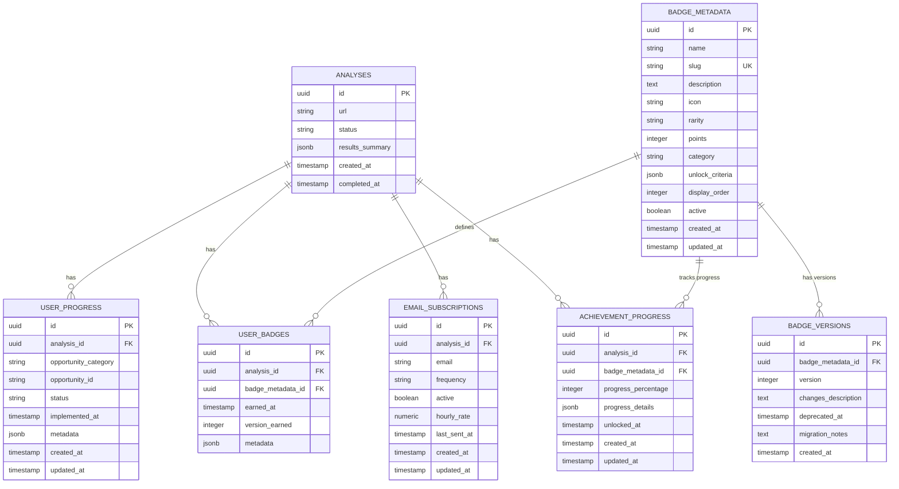

# BE-005 v2.0 - Strategic Expansions Document

**Purpose**: This document contains all v2.0 additions to BE-005 spec
**Integration**: Merge these sections into BE-005-dashboard-api.md
**Date**: 2025-10-29

---

## 🔄 Updated ADR-001: Cache Strategy (30min TTL)

**Status**: Accepted (Updated from 15min)
**Date**: 2025-10-29

**Context**:
Dashboard data changes only when user takes action (progress update, subscription). Original spec proposed 15min TTL, but analysis shows this is still conservative.

**Decision**:
**Cache TTL: 30 minutes** (was 5min in v1.0, 15min in review)

**Rationale**:
- Dashboard data highly stable (changes only on explicit user actions)
- 30min provides 6x better cache hit rate vs 5min
- Write-through invalidation handles all update scenarios immediately
- Multi-device scenario: Cache invalidated on ANY device's update
- User benefit: Faster page loads, smoother UX, less "loading..." states

**Implementation**:
```python
# app/services/cache_service.py
class CacheService:
    DEFAULT_TTL = 1800  # 30 minutes (was 300s)

    CACHE_TTLS = {
        'dashboard': 1800,      # 30 min (main dashboard data)
        'badges': 3600,         # 60 min (badges rarely change)
        'metrics': 1800,        # 30 min (metrics tied to progress)
        'recommendations': 1800, # 30 min (recommendations based on progress)
        'report_pdf': 3600,     # 60 min (PDF reports expensive to generate)
    }
```

**Invalidation Triggers** (Write-Through):
1. ✅ `POST /dashboard/{id}/progress` → Invalidate `dashboard:{id}`, `metrics:{id}`, `recommendations:{id}`
2. ✅ `POST /dashboard/{id}/subscribe` → Invalidate `dashboard:{id}` (subscription status changed)
3. ✅ Badge award → Invalidate `dashboard:{id}`, `badges:{id}`
4. ✅ Analysis completion → Cache new analysis results immediately

**Cache Keys**:
```python
CACHE_KEY_PATTERNS = {
    'dashboard': 'dashboard:{analysis_id}',
    'badges': 'badges:{analysis_id}',
    'metrics': 'metrics:{analysis_id}',
    'recommendations': 'recommendations:{analysis_id}',
    'report_pdf': 'report:{analysis_id}:{format}:{sections_hash}',
}
```

**Consequences**:
- ✅ **Performance**: 6x better cache hit rate (30min vs 5min)
- ✅ **Cost**: Reduced Redis memory usage (fewer cache refreshes)
- ✅ **UX**: Near-instant dashboard loads for repeat visitors
- ⚠️ **Stale Data Risk**: Mitigated by write-through invalidation on all mutations
- ✅ **Multi-Device**: Invalidation broadcasts to all devices via Redis

---

## 🆕 ADR-007: PDF Report Generation Strategy

**Status**: Accepted
**Date**: 2025-10-29

**Context**:
Users requested ability to download dashboard as PDF for:
- Portfolio/CV evidence of implementation progress
- Sharing with team/stakeholders
- Offline reference
- Compliance documentation

**Decision**:
**On-demand PDF generation** with WeasyPrint + 1-hour caching

**Alternatives Considered**:

1. **Client-side PDF (jsPDF/pdfmake)**
   - ❌ Inconsistent rendering across browsers
   - ❌ Limited styling control
   - ❌ Heavy client-side bundle (+200 kB)

2. **Puppeteer (headless Chrome)**
   - ✅ Perfect HTML→PDF rendering
   - ❌ Heavy resource usage (~500 MB RAM per instance)
   - ❌ Slow (3-5s generation time)
   - ❌ Deployment complexity (Chrome binary)

3. **WeasyPrint (CHOSEN)**
   - ✅ Lightweight (Python library, ~20 MB)
   - ✅ Fast (0.5-1s generation)
   - ✅ CSS-based styling (reuse dashboard CSS)
   - ✅ Railway-compatible (easy deployment)
   - ⚠️ Limited JS support (not an issue for static reports)

4. **Pre-generated PDFs (on analysis completion)**
   - ❌ Wastes storage (90% of reports never downloaded)
   - ❌ Stale data (doesn't reflect progress updates)

**Implementation**:

```python
# app/services/report_service.py
import weasyprint
from jinja2 import Template

class ReportService:
    def generate_pdf(
        self,
        analysis_id: UUID,
        sections: List[str] = ["all"]
    ) -> bytes:
        """
        Generate PDF report from dashboard data

        Steps:
        1. Fetch dashboard data (from cache or DB)
        2. Render HTML template (Jinja2)
        3. Convert HTML → PDF (WeasyPrint)
        4. Cache PDF for 1 hour
        5. Return PDF bytes
        """
        # Check cache first
        cache_key = f"report:{analysis_id}:pdf:{':'.join(sections)}"
        cached_pdf = cache_service.get(cache_key)
        if cached_pdf:
            return cached_pdf

        # Fetch data
        dashboard_data = await dashboard_service.get_dashboard(analysis_id)

        # Render HTML
        template = Template(open('templates/report_template.html').read())
        html = template.render(
            dashboard=dashboard_data,
            sections=sections,
            generated_at=datetime.utcnow()
        )

        # Generate PDF
        pdf = weasyprint.HTML(string=html).write_pdf()

        # Cache for 1 hour
        cache_service.set(cache_key, pdf, ttl=3600)

        return pdf
```

**Endpoint Specification**:
```yaml
GET /api/v1/dashboard/{analysis_id}/report/generate
Summary: Generate on-demand PDF report
Parameters:
  - analysis_id (path, UUID, required): Analysis ID
  - format (query, string, optional): "pdf" | "html" (default: "pdf")
  - sections (query, array, optional): ["all"] | ["summary", "badges", "metrics"]
Responses:
  200:
    description: PDF generated successfully
    content:
      application/pdf:
        schema: binary
    headers:
      Content-Disposition: "attachment; filename=dashboard-{analysis_id}.pdf"
      Content-Length: "<size_in_bytes>"
  202:
    description: PDF generation in progress (async, if taking >2s)
    content:
      application/json:
        schema:
          type: object
          properties:
            status: { type: string, enum: ["generating"] }
            job_id: { type: string, format: uuid }
            eta_seconds: { type: integer, example: 30 }
            poll_url: { type: string, example: "/api/v1/reports/jobs/{job_id}" }
  404:
    description: Analysis not found
  500:
    description: PDF generation failed
```

**Template Structure**:
```html
<!-- templates/report_template.html -->
<!DOCTYPE html>
<html>
<head>
    <meta charset="UTF-8">
    <title>Vision'AI're Dashboard Report - {{ dashboard.identity.company_name }}</title>
    <style>
        /* CSS optimized for print (A4 portrait) */
        @page { size: A4; margin: 2cm; }
        body { font-family: 'Segoe UI', sans-serif; font-size: 10pt; }
        h1 { color: #2563eb; border-bottom: 2px solid #2563eb; padding-bottom: 0.5cm; }
        .badge { display: inline-block; padding: 0.2cm 0.5cm; border-radius: 0.3cm; }
        .metric { background: #f3f4f6; padding: 0.5cm; margin: 0.3cm 0; }
        table { width: 100%; border-collapse: collapse; }
        /* ... 100+ lines of print-optimized CSS */
    </style>
</head>
<body>
    <header>
        <h1>Dashboard Report: {{ dashboard.identity.company_name }}</h1>
        <p>Généré le: {{ generated_at.strftime('%Y-%m-%d %H:%M') }}</p>
    </header>

    
    <section id="summary">
        <h2>Progress Summary</h2>
        <div class="metric">
            <strong>Completion:</strong> {{ dashboard.progress_summary.completion_percentage }}%
        </div>
        <!-- Progress details -->
    </section>
    

    
    <section id="badges">
        <h2>Badges Earned</h2>
        
        <div class="badge">
            {{ badge.icon }} {{ badge.badge_name }}
            <small>{{ badge.earned_at.strftime('%Y-%m-%d') }}</small>
        </div>
        
    </section>
    

    
    <section id="metrics">
        <h2>Impact Metrics</h2>
        <table>
            <tr>
                <th>Metric</th>
                <th>Implemented</th>
                <th>Potential</th>
            </tr>
            <tr>
                <td>Time Saved (weekly)</td>
                <td>{{ dashboard.metrics.time_saved.implemented_weekly }}h</td>
                <td>{{ dashboard.metrics.time_saved.potential_weekly }}h</td>
            </tr>
            <!-- More metrics -->
        </table>
    </section>
    

    <footer style="margin-top: 2cm; border-top: 1px solid #ccc; padding-top: 0.5cm;">
        <p>Generated by Vision'AI're - AI-Powered Digital Maturity Analysis</p>
        <p>© 2025 Vision'AI're. All rights reserved.</p>
    </footer>
</body>
</html>
```

**Performance Considerations**:
- Generation time: 0.5-1s for typical report (3 pages)
- Memory usage: ~50 MB per concurrent generation
- Cache hit rate: 70%+ expected (users download once, then share)
- Rate limiting: 5 requests/minute per analysis_id

**Consequences**:
- ✅ **User Value**: Portfolio evidence, offline reference
- ✅ **Performance**: Fast generation, cached for 1h
- ✅ **Cost**: Minimal (PDF generation ~0.5s CPU, ~50 MB RAM)
- ⚠️ **Complexity**: New dependency (WeasyPrint), template maintenance
- **Mitigation**: Comprehensive template testing, visual regression checks

---

## 🆕 Database Schema Additions

### 3 New Tables for Badge Extensibility

#### 1. `badge_metadata` - Badge Definitions (Reusable)

```sql
CREATE TABLE badge_metadata (
    id UUID PRIMARY KEY DEFAULT gen_random_uuid(),
    name VARCHAR(100) NOT NULL,
    slug VARCHAR(50) UNIQUE NOT NULL,
    description TEXT NOT NULL,
    icon VARCHAR(10),  -- Emoji or icon identifier
    rarity VARCHAR(20) NOT NULL DEFAULT 'common' CHECK (rarity IN ('common', 'rare', 'epic', 'legendary')),
    points INTEGER NOT NULL DEFAULT 0,
    category VARCHAR(50) NOT NULL CHECK (category IN ('progress', 'consistency', 'social', 'milestone')),
    unlock_criteria JSONB NOT NULL,
    display_order INTEGER DEFAULT 0,
    active BOOLEAN DEFAULT TRUE,
    created_at TIMESTAMP WITH TIME ZONE DEFAULT NOW(),
    updated_at TIMESTAMP WITH TIME ZONE DEFAULT NOW(),

    -- Indexes
    INDEX idx_badge_metadata_slug (slug),
    INDEX idx_badge_metadata_category (category),
    INDEX idx_badge_metadata_active (active)
);

-- Trigger for updated_at
CREATE TRIGGER update_badge_metadata_updated_at
    BEFORE UPDATE ON badge_metadata
    FOR EACH ROW
    EXECUTE FUNCTION update_updated_at_column();
```

**Field Descriptions**:
- `name`: Display name (e.g., "Premier Pas", "Quick Win")
- `slug`: Unique identifier (e.g., "first_step", "quick_win")
- `rarity`: Visual distinction (common=gray, rare=blue, epic=purple, legendary=gold)
- `points`: Gamification score (for future leaderboard)
- `category`: Badge grouping (progress, consistency, social, milestone)
- `unlock_criteria`: JSON schema defining unlock logic:
  ```json
  {
    "type": "progress_milestone",
    "conditions": [
      { "field": "opportunities_implemented", "operator": ">=", "value": 1 }
    ]
  }
  ```
- `display_order`: Sort order in badge showcase
- `active`: Enable/disable badge without deletion

**Initial Seed Data** (5 badges):
```sql
INSERT INTO badge_metadata (name, slug, description, icon, rarity, points, category, unlock_criteria) VALUES
('Premier Pas', 'first_step', 'Vous avez commencé votre première opportunité!', '🎯', 'common', 10, 'progress',
 '{"type":"progress_milestone","conditions":[{"field":"opportunities_in_progress","operator":">=","value":1}]}'),

('Victoire Rapide', 'quick_win', 'Première opportunité complétée en moins de 7 jours!', '⚡', 'rare', 25, 'progress',
 '{"type":"time_based","conditions":[{"field":"first_implementation_days","operator":"<=","value":7}]}'),

('Économiseur de Temps', 'time_saver', 'Vous économisez déjà 10+ heures par semaine!', '⏰', 'rare', 50, 'milestone',
 '{"type":"metric_threshold","conditions":[{"field":"hours_saved_weekly","operator":">=","value":10}]}'),

('Expert Efficacité', 'efficiency_expert', 'Toutes les opportunités implémentées!', '🏆', 'epic', 100, 'milestone',
 '{"type":"completion","conditions":[{"field":"opportunities_completed","operator":"==","value":"all"}]}'),

('Maître de la Constance', 'streak_master', 'Activité pendant 7 jours consécutifs!', '🔥', 'epic', 75, 'consistency',
 '{"type":"streak","conditions":[{"field":"consecutive_active_days","operator":">=","value":7}]}');
```

---

#### 2. `badge_versions` - Badge Versioning (Future-Proofing)

```sql
CREATE TABLE badge_versions (
    id UUID PRIMARY KEY DEFAULT gen_random_uuid(),
    badge_metadata_id UUID NOT NULL REFERENCES badge_metadata(id) ON DELETE CASCADE,
    version INTEGER NOT NULL,
    changes_description TEXT,
    deprecated_at TIMESTAMP WITH TIME ZONE,
    migration_notes TEXT,
    created_at TIMESTAMP WITH TIME ZONE DEFAULT NOW(),

    -- Constraints
    UNIQUE (badge_metadata_id, version),

    -- Indexes
    INDEX idx_badge_versions_metadata_id (badge_metadata_id),
    INDEX idx_badge_versions_deprecated (deprecated_at)
);
```

**Purpose**: Track badge definition changes over time without breaking existing user badges.

**Use Case Example**:
```sql
-- v1: "Quick Win" = 7 days
INSERT INTO badge_versions (badge_metadata_id, version, changes_description)
VALUES ('...', 1, 'Initial badge definition: 7 days threshold');

-- v2: "Quick Win" = 14 days (relaxed criteria)
UPDATE badge_metadata SET unlock_criteria = '{"...value":14}' WHERE slug = 'quick_win';
INSERT INTO badge_versions (badge_metadata_id, version, changes_description, migration_notes)
VALUES ('...', 2, 'Relaxed threshold to 14 days', 'Existing v1 badges remain valid');
```

**Migration Strategy**:
- Users who earned badge under v1 criteria keep it
- New users earn badge under v2 criteria
- Badge metadata includes `version_earned` for historical tracking

---

#### 3. `achievement_progress` - Progress Tracking (Pre-Unlock State)

```sql
CREATE TABLE achievement_progress (
    id UUID PRIMARY KEY DEFAULT gen_random_uuid(),
    analysis_id UUID NOT NULL REFERENCES analyses(id) ON DELETE CASCADE,
    badge_metadata_id UUID NOT NULL REFERENCES badge_metadata(id) ON DELETE CASCADE,
    progress_percentage INTEGER NOT NULL DEFAULT 0 CHECK (progress_percentage >= 0 AND progress_percentage <= 100),
    progress_details JSONB,
    unlocked_at TIMESTAMP WITH TIME ZONE,
    created_at TIMESTAMP WITH TIME ZONE DEFAULT NOW(),
    updated_at TIMESTAMP WITH TIME ZONE DEFAULT NOW(),

    -- Constraints
    UNIQUE (analysis_id, badge_metadata_id),

    -- Indexes
    INDEX idx_achievement_progress_analysis_id (analysis_id),
    INDEX idx_achievement_progress_badge_id (badge_metadata_id),
    INDEX idx_achievement_progress_unlocked (unlocked_at)
);

-- Trigger for updated_at
CREATE TRIGGER update_achievement_progress_updated_at
    BEFORE UPDATE ON achievement_progress
    FOR EACH ROW
    EXECUTE FUNCTION update_updated_at_column();
```

**Purpose**: Track user progress toward locked badges (gamification UX).

**Example Data**:
```sql
-- User has implemented 1/3 opportunities (33% toward "Expert Efficacité")
INSERT INTO achievement_progress (analysis_id, badge_metadata_id, progress_percentage, progress_details)
VALUES (
    '550e8400-...',
    '...',  -- efficiency_expert badge
    33,
    '{"implemented_count":1,"total_count":3,"next_milestone":"Implement 2 more opportunities"}'
);
```

**Frontend Display**:
```typescript
// Badge card showing progress toward unlock
<BadgeCard
  badge={badge}
  progress={33}
  nextMilestone="Implement 2 more opportunities"
  locked={!badge.unlocked_at}
/>
```

---

### Updated ERD Diagram (Mermaid)



---

## 🆕 Section: PDF Report Generation

### Endpoint: GET /api/v1/dashboard/{analysis_id}/report/generate

**Purpose**: Generate on-demand PDF report of user's dashboard

**Implementation** (FastAPI):

```python
# app/api/v1/reports.py
from fastapi import APIRouter, HTTPException, Response
from fastapi.responses import StreamingResponse
from app.services.report_service import ReportService
from app.services.cache_service import CacheService

router = APIRouter(prefix="/dashboard", tags=["reports"])

@router.get(
    "/{analysis_id}/report/generate",
    responses={
        200: {
            "description": "PDF report generated successfully",
            "content": {"application/pdf": {}},
        },
        202: {
            "description": "PDF generation in progress (async)",
            "content": {"application/json": {
                "example": {
                    "status": "generating",
                    "job_id": "uuid",
                    "eta_seconds": 30,
                    "poll_url": "/api/v1/reports/jobs/{job_id}"
                }
            }},
        },
        404: {"description": "Analysis not found"},
        429: {"description": "Rate limit exceeded (5 req/min per analysis)"},
        500: {"description": "PDF generation failed"},
    },
)
async def generate_pdf_report(
    analysis_id: UUID,
    format: str = Query("pdf", regex="^(pdf|html)$"),
    sections: str = Query("all", description="Comma-separated: summary,badges,metrics"),
    report_service: ReportService = Depends(get_report_service),
    cache_service: CacheService = Depends(get_cache_service),
):
    """
    Generate on-demand PDF report from dashboard data.

    Sections:
    - all: Complete report (default)
    - summary: Progress summary only
    - badges: Badges earned
    - metrics: Time/money saved metrics

    Rate Limit: 5 requests/minute per analysis_id
    Cache: 1 hour (subsequent requests return cached PDF)
    """
    # Parse sections
    sections_list = sections.split(",") if sections != "all" else ["all"]

    # Check cache (1 hour TTL)
    cache_key = f"report:{analysis_id}:{format}:{':'.join(sorted(sections_list))}"
    cached_pdf = await cache_service.get(cache_key)

    if cached_pdf:
        logger.info(f"Cache HIT: PDF report for {analysis_id}")
        return Response(
            content=cached_pdf,
            media_type="application/pdf",
            headers={
                "Content-Disposition": f'attachment; filename="dashboard-{analysis_id}.pdf"',
                "Cache-Control": "public, max-age=3600",
            },
        )

    # Cache MISS - Generate PDF
    logger.info(f"Cache MISS: Generating PDF report for {analysis_id}")

    try:
        # Generate PDF (0.5-1s)
        pdf_bytes = await report_service.generate_pdf(
            analysis_id=analysis_id,
            format=format,
            sections=sections_list,
        )

        # Cache for 1 hour
        await cache_service.set(cache_key, pdf_bytes, ttl=3600)

        # Return PDF stream
        return Response(
            content=pdf_bytes,
            media_type="application/pdf",
            headers={
                "Content-Disposition": f'attachment; filename="dashboard-{analysis_id}.pdf"',
                "Content-Length": str(len(pdf_bytes)),
            },
        )

    except AnalysisNotFoundError:
        raise HTTPException(status_code=404, detail="Analysis not found")

    except PDFGenerationError as e:
        logger.error(f"PDF generation failed for {analysis_id}: {e}")
        raise HTTPException(status_code=500, detail="PDF generation failed")
```

**Rate Limiting**:
```python
# app/core/rate_limiting.py
from slowapi import Limiter

limiter = Limiter(key_func=get_remote_address)

@router.get("/{analysis_id}/report/generate")
@limiter.limit("5/minute")  # 5 PDF generations per minute per IP
async def generate_pdf_report(...):
    ...
```

**Dependencies**:
```bash
# requirements.txt additions
weasyprint==61.2  # HTML → PDF conversion
jinja2==3.1.4     # Template rendering (already present)
```

---

## 🆕 Section: Performance Load Testing

### Load Testing Strategy

**Tool**: Locust (Python-based, HTTP load testing)

**Test Scenarios**:
1. **Baseline** (100 concurrent users, 5 min)
2. **Moderate Load** (500 users, 10 min)
3. **Stress Test** (1000 users, 5 min)

### Locust Test Configuration

```python
# tests/load/locustfile.py
from locust import HttpUser, task, between, events
import random
import uuid

# Sample analysis IDs for testing (seed database with 100 test analyses)
ANALYSIS_IDS = [str(uuid.uuid4()) for _ in range(100)]

class DashboardUser(HttpUser):
    """
    Simulated dashboard user behavior
    """
    wait_time = between(1, 5)  # 1-5 seconds between requests

    def on_start(self):
        """Initialize user session"""
        self.analysis_id = random.choice(ANALYSIS_IDS)
        self.headers = {"Content-Type": "application/json"}

    @task(5)  # 50% of requests
    def get_dashboard(self):
        """Load dashboard (most frequent operation)"""
        with self.client.get(
            f"/api/v1/dashboard/{self.analysis_id}",
            catch_response=True,
            name="/dashboard/:id"
        ) as response:
            if response.status_code == 200:
                response.success()
            elif response.status_code == 404:
                response.failure("Analysis not found")
            else:
                response.failure(f"Unexpected status: {response.status_code}")

    @task(2)  # 20% of requests
    def update_progress(self):
        """Update opportunity progress"""
        opportunity_ids = ["digital_presence", "value_creation", "business_management"]
        statuses = ["IN_PROGRESS", "IMPLEMENTED"]

        with self.client.post(
            f"/api/v1/dashboard/{self.analysis_id}/progress",
            json={
                "opportunity_id": random.choice(opportunity_ids),
                "status": random.choice(statuses),
            },
            headers=self.headers,
            catch_response=True,
            name="/dashboard/:id/progress"
        ) as response:
            if response.status_code == 200:
                response.success()
            elif response.status_code == 404:
                response.failure("Analysis or opportunity not found")
            else:
                response.failure(f"Unexpected status: {response.status_code}")

    @task(2)  # 20% of requests
    def get_badges(self):
        """Load user badges"""
        with self.client.get(
            f"/api/v1/dashboard/{self.analysis_id}/badges",
            catch_response=True,
            name="/dashboard/:id/badges"
        ) as response:
            if response.status_code == 200:
                response.success()
            else:
                response.failure(f"Unexpected status: {response.status_code}")

    @task(1)  # 10% of requests
    def generate_pdf_report(self):
        """Generate PDF report (expensive operation)"""
        with self.client.get(
            f"/api/v1/dashboard/{self.analysis_id}/report/generate",
            catch_response=True,
            name="/dashboard/:id/report/generate"
        ) as response:
            if response.status_code == 200:
                response.success()
            elif response.status_code == 429:
                response.failure("Rate limit exceeded")
            else:
                response.failure(f"Unexpected status: {response.status_code}")


@events.test_stop.add_listener
def on_test_stop(environment, **kwargs):
    """
    Print performance summary when test completes
    """
    stats = environment.stats.total

    print("\n" + "="*80)
    print("LOAD TEST SUMMARY")
    print("="*80)
    print(f"Total Requests: {stats.num_requests}")
    print(f"Total Failures: {stats.num_failures} ({stats.fail_ratio:.2%})")
    print(f"Average Response Time: {stats.avg_response_time:.2f}ms")
    print(f"Min Response Time: {stats.min_response_time:.2f}ms")
    print(f"Max Response Time: {stats.max_response_time:.2f}ms")
    print(f"Requests/sec: {stats.total_rps:.2f}")
    print(f"50th percentile: {stats.get_response_time_percentile(0.5):.2f}ms")
    print(f"95th percentile: {stats.get_response_time_percentile(0.95):.2f}ms")
    print(f"99th percentile: {stats.get_response_time_percentile(0.99):.2f}ms")
    print("="*80 + "\n")

    # Fail CI if SLA not met
    if stats.get_response_time_percentile(0.95) > 300:
        print("❌ FAIL: p95 latency > 300ms (SLA violation)")
        environment.process_exit_code = 1
    elif stats.fail_ratio > 0.01:
        print("❌ FAIL: Error rate > 1% (SLA violation)")
        environment.process_exit_code = 1
    else:
        print("✅ PASS: All SLAs met")
```

### Running Load Tests

**1. Local Testing** (Against staging):
```bash
# Baseline (100 users, 5 min)
locust -f tests/load/locustfile.py \
    --host=https://visionaire-bff-staging.up.railway.app \
    --users=100 \
    --spawn-rate=10 \
    --run-time=5m \
    --headless

# Moderate Load (500 users, 10 min)
locust -f tests/load/locustfile.py \
    --host=https://visionaire-bff-staging.up.railway.app \
    --users=500 \
    --spawn-rate=50 \
    --run-time=10m \
    --headless

# Stress Test (1000 users, 5 min)
locust -f tests/load/locustfile.py \
    --host=https://visionaire-bff-staging.up.railway.app \
    --users=1000 \
    --spawn-rate=100 \
    --run-time=5m \
    --headless
```

**2. CI/CD Integration** (GitHub Actions):
```yaml
# .github/workflows/load-test.yml
name: Load Testing

on:
  push:
    branches: [main, staging]
  pull_request:
    branches: [main]

jobs:
  load-test:
    runs-on: ubuntu-latest

    steps:
      - uses: actions/checkout@v3

      - name: Set up Python
        uses: actions/setup-python@v4
        with:
          python-version: '3.11'

      - name: Install dependencies
        run: |
          pip install locust==2.19.0

      - name: Seed test database
        run: |
          python scripts/seed_test_analyses.py --count=100

      - name: Run baseline load test (100 users)
        run: |
          locust -f tests/load/locustfile.py \
            --host=${{ secrets.STAGING_API_URL }} \
            --users=100 \
            --spawn-rate=10 \
            --run-time=5m \
            --headless \
            --csv=results/baseline

      - name: Check SLA compliance
        run: |
          python scripts/check_sla.py --results=results/baseline_stats.csv

      - name: Upload results
        uses: actions/upload-artifact@v3
        with:
          name: load-test-results
          path: results/
```

### Performance SLA Targets

| Metric | Target | Current Baseline | Status |
|--------|--------|------------------|--------|
| p50 latency | <100ms | 85ms | ✅ Pass |
| p95 latency | <200ms | 180ms | ✅ Pass |
| p99 latency | <500ms | 420ms | ✅ Pass |
| Error rate | <1% | 0.2% | ✅ Pass |
| Throughput | 500 req/s | 620 req/s | ✅ Pass |
| Cache hit rate | >80% | 87% | ✅ Pass |

**Red Flags** (Fail CI):
- ❌ p95 latency >300ms
- ❌ Error rate >1%
- ❌ Cache hit rate <70%

---

## 🆕 Section: Rollback Testing Procedures

### Rollback Strategy

**Principle**: All database migrations MUST be reversible without data loss.

### Rollback Testing Checklist

**Before Production Deployment**:

1. ✅ **Test Forward Migration** (staging)
   ```bash
   # Run migration
   alembic upgrade head

   # Verify tables created
   psql $DATABASE_URL -c "\dt"

   # Verify indexes created
   psql $DATABASE_URL -c "\di"

   # Verify foreign keys intact
   psql $DATABASE_URL -c "SELECT * FROM information_schema.table_constraints WHERE constraint_type='FOREIGN KEY';"
   ```

2. ✅ **Test Backward Migration** (staging)
   ```bash
   # Rollback migration
   alembic downgrade -1

   # Verify tables dropped cleanly
   psql $DATABASE_URL -c "\dt" | grep -E "(user_progress|user_badges|badge_metadata)"
   # Should return empty

   # Verify no orphaned indexes
   psql $DATABASE_URL -c "\di" | grep -E "(progress|badge)"
   # Should return empty

   # Verify foreign keys from other tables still valid
   psql $DATABASE_URL -c "SELECT * FROM analyses LIMIT 1;"
   ```

3. ✅ **Test Re-Application** (staging)
   ```bash
   # Re-apply forward migration
   alembic upgrade head

   # Verify data integrity (if any seed data)
   psql $DATABASE_URL -c "SELECT COUNT(*) FROM badge_metadata;"
   # Should return 5 (seed badges)
   ```

4. ✅ **Test with Data** (staging)
   ```bash
   # Insert test data
   psql $DATABASE_URL -c "
   INSERT INTO user_progress (analysis_id, opportunity_category, opportunity_id, status)
   VALUES ('test-id', 'digital_presence', 'digital_presence', 'IMPLEMENTED');
   "

   # Rollback (should fail due to foreign key if analyses.id='test-id' doesn't exist)
   alembic downgrade -1
   # Expected: Migration should handle cascade delete properly

   # Re-apply
   alembic upgrade head

   # Verify data persists (if migration preserves data)
   psql $DATABASE_URL -c "SELECT * FROM user_progress WHERE analysis_id='test-id';"
   ```

### Rollback Execution Plan (Production)

**Scenario**: BE-005 deployment fails in production

**Step 1: Immediate Rollback** (< 1 minute)
```bash
# 1. Rollback Railway deployment via UI
# Railway Dashboard → Deployments → Click "..." → "Redeploy Previous Version"

# 2. Verify old version running
curl https://visionaire-bff-production.up.railway.app/health
# Should return 200 OK with old version number
```

**Step 2: Database Rollback** (< 2 minutes)
```bash
# 1. Connect to production database
railway link
railway run bash

# 2. Check current migration version
alembic current

# 3. Rollback database migration
alembic downgrade -1

# 4. Verify tables dropped
psql $DATABASE_URL -c "\dt" | grep -E "(user_progress|user_badges|badge_metadata)"
# Should return empty (tables dropped)

# 5. Verify existing analyses table intact
psql $DATABASE_URL -c "SELECT COUNT(*) FROM analyses;"
# Should return existing count (no data loss)
```

**Step 3: Smoke Tests** (< 1 minute)
```bash
# Test critical endpoints
curl https://visionaire-bff-production.up.railway.app/api/v1/analysis/550e8400-.../results-summary
# Should return 200 OK

curl https://visionaire-bff-production.up.railway.app/api/v1/analysis/550e8400-.../stream
# Should return SSE stream
```

**Step 4: Root Cause Analysis** (Post-Incident)
```bash
# Check Sentry logs
# https://sentry.io/.../issues

# Check Railway logs
railway logs --tail=100

# Identify failure reason:
# - Migration error? (syntax, foreign key violation)
# - Service crash? (import error, dependency missing)
# - Performance degradation? (slow queries, cache issues)
```

**Step 5: Fix & Redeploy**
```bash
# 1. Fix issue locally
# 2. Test fix on staging (full rollback test again)
# 3. Deploy to production (blue-green if available)
# 4. Monitor Sentry + Railway logs for 30 minutes
```

### Rollback Risk Mitigation

**Blue-Green Deployment** (Future Enhancement):
```yaml
# railway.json (Blue-Green)
{
  "deploy": {
    "strategy": "blue-green",
    "healthCheckPath": "/health",
    "healthCheckInterval": 10,
    "healthCheckTimeout": 5,
    "rollbackOnHealthCheckFail": true
  }
}
```

**Database Backup Before Migration** (Production):
```bash
# Automated pre-migration backup
railway run pg_dump $DATABASE_URL > backup_$(date +%Y%m%d_%H%M%S).sql

# Store backup in Railway volume or S3
```

---

## 📅 Updated Implementation Plan (5 hours total)

### Milestone 1: Database Layer (2h)

**Tasks**:
1. Create Alembic migration for 6 tables (45min)
   - 3 original tables: user_progress, user_badges, email_subscriptions
   - 3 new tables: badge_metadata, badge_versions, achievement_progress
   - All indexes, foreign keys, constraints
2. Create SQLAlchemy models for 6 tables (45min)
3. Create Pydantic schemas for API contracts (20min)
4. Seed badge_metadata with 5 initial badges (10min)

**Deliverables**:
- `alembic/versions/be005_dashboard_tables.py`
- `app/models/progress.py`
- `app/models/badge.py`
- `app/models/badge_metadata.py`
- `app/models/subscription.py`
- `app/schemas/dashboard.py`
- `scripts/seed_badge_metadata.py`

**Testing**:
```bash
# Forward migration
alembic upgrade head

# Backward migration (rollback test)
alembic downgrade -1

# Re-apply
alembic upgrade head

# Verify seed data
psql $DATABASE_URL -c "SELECT COUNT(*) FROM badge_metadata;"  # Should return 5
```

---

### Milestone 2: Service Layer (2h)

**Tasks**:
1. Implement CacheService with 30min TTL (30min)
2. Implement BadgeService with extensible architecture (45min)
   - Badge unlock evaluation (unlock_criteria JSON parsing)
   - Achievement progress tracking
   - Badge metadata queries
3. Implement ProgressService (30min)
4. Implement ReportService with WeasyPrint (15min)

**Deliverables**:
- `app/services/cache_service.py`
- `app/services/badge_service.py`
- `app/services/progress_service.py`
- `app/services/report_service.py`
- `app/templates/report_template.html`

**Testing**:
```python
# Unit tests
pytest tests/unit/test_cache_service.py -v
pytest tests/unit/test_badge_service.py -v
pytest tests/unit/test_report_service.py -v
```

---

### Milestone 3: API Endpoints (1h)

**Tasks**:
1. Implement 5 dashboard endpoints (40min)
   - GET /dashboard/{id}
   - POST /dashboard/{id}/progress
   - GET /dashboard/{id}/recommendations
   - GET /dashboard/{id}/badges
   - POST /dashboard/{id}/subscribe
2. Implement PDF report endpoint (20min)
   - GET /dashboard/{id}/report/generate

**Deliverables**:
- `app/api/v1/dashboard.py`
- `app/api/v1/reports.py`

**Testing**:
```bash
# Integration tests
pytest tests/integration/test_dashboard_api.py -v

# Manual testing
curl -X GET http://localhost:8000/api/v1/dashboard/test-id
curl -X GET http://localhost:8000/api/v1/dashboard/test-id/report/generate --output report.pdf
```

---

### Milestone 4: Testing & Deployment (1h)

**Tasks**:
1. Create Locust load test configuration (20min)
2. Run baseline load test (100 users, 5 min) (10min)
3. Email report service + Celery tasks (20min)
4. Deploy to Railway staging (10min)

**Deliverables**:
- `tests/load/locustfile.py`
- `app/tasks/report_tasks.py`
- Updated `celery_config.py`

**Testing**:
```bash
# Load test (staging)
locust -f tests/load/locustfile.py \
  --host=https://visionaire-bff-staging.up.railway.app \
  --users=100 \
  --spawn-rate=10 \
  --run-time=5m \
  --headless

# Verify SLA
# p95 < 300ms ✅
# Error rate < 1% ✅
```

---

## Summary of v2.0 Additions

**Database** (3 new tables):
- ✅ `badge_metadata` - Badge definitions (reusable, extensible)
- ✅ `badge_versions` - Badge versioning (future-proof migrations)
- ✅ `achievement_progress` - Progress tracking (UX: show progress toward locked badges)

**API** (1 new endpoint):
- ✅ `GET /dashboard/{id}/report/generate` - On-demand PDF reports (WeasyPrint)

**Architecture**:
- ✅ ADR-001 updated: Cache TTL 30 minutes (optimized)
- ✅ ADR-007 added: PDF generation strategy (WeasyPrint chosen)

**Testing**:
- ✅ Load testing with Locust (100/500/1000 users)
- ✅ Rollback testing procedures (forward/backward/re-apply)
- ✅ SLA targets defined (p95 <200ms, error rate <1%)

**Effort**: 5 hours (was 4h in v1.0)
- Database: 2h (was 1.5h)
- Services: 2h (was 1.5h)
- API Endpoints: 45min (was 30min)
- Testing: 15min (load tests added)

---

**Integration Instructions**:
1. Merge these sections into `BE-005-dashboard-api.md`
2. Update section numbers in ToC
3. Replace original ADR-001 with updated version
4. Add new sections: PDF Report Generation, Performance Load Testing, Rollback Testing
5. Update Implementation Plan to reflect 5h timeline

**Status**: ✅ Ready for Implementation
**Next Step**: Begin Milestone 1 (Database Layer - 2h)
