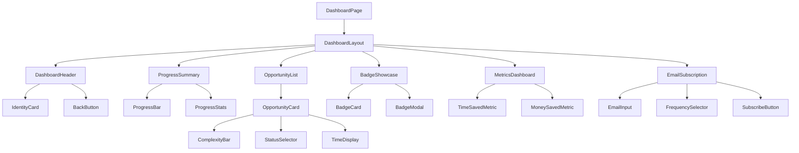
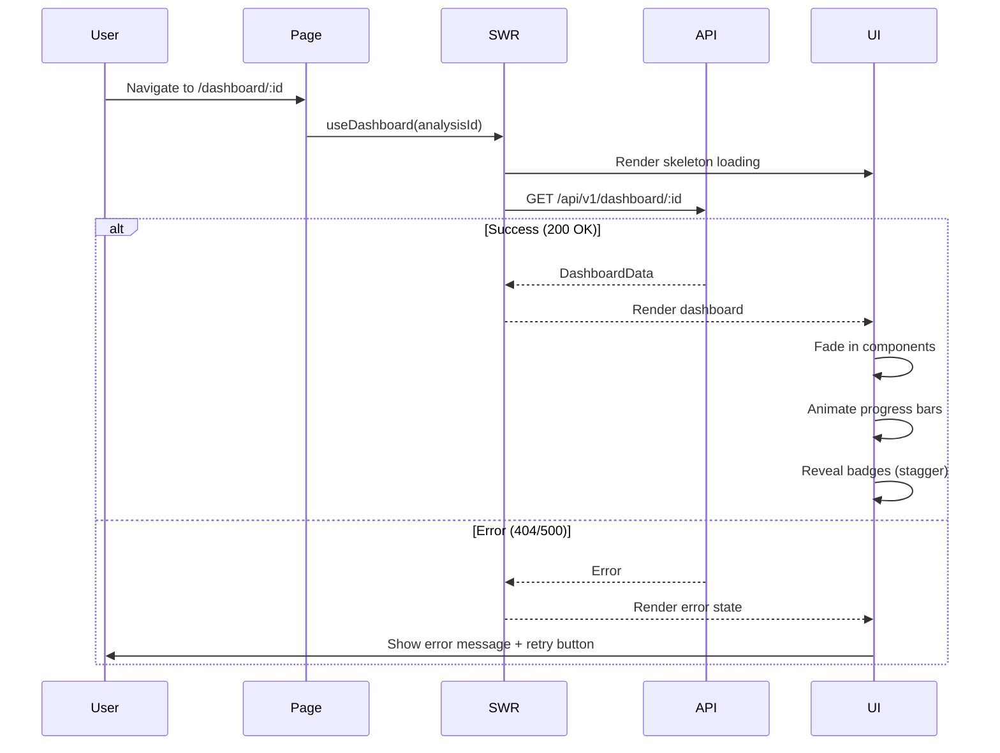
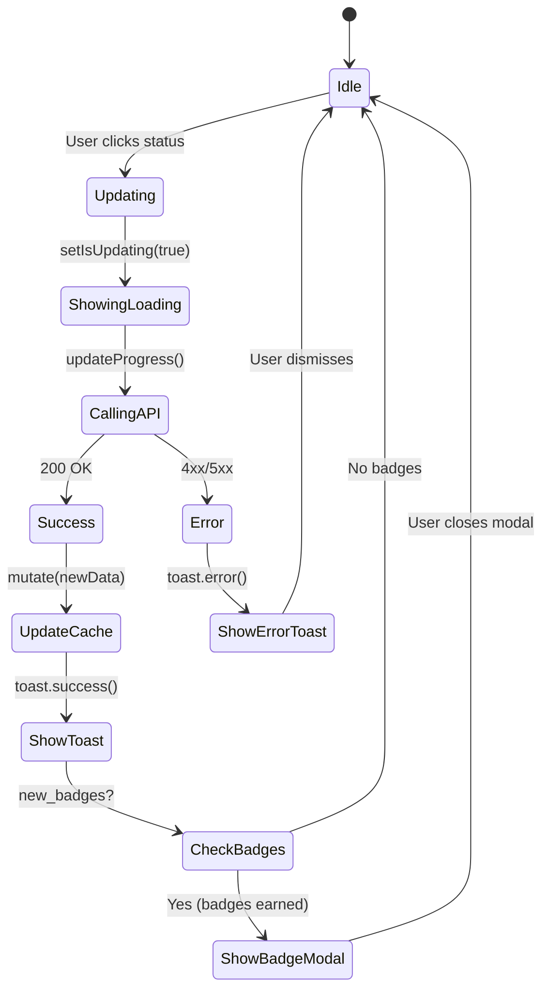

# FE-014: Analytics Dashboard - Frontend Technical Specification

**Version**: 1.0.0
**Status**: Draft - Awaiting Validation
**Author**: Claude Code (Phase 4A Planning)
**Date**: 2025-10-29
**Effort Estimate**: 3-4 hours (Frontend Implementation)
**Priority**: P0 (Critical - Phase 4A)
**Depends On**: BE-005 (Dashboard API)

---

## Table of Contents

1. [Executive Summary](#executive-summary)
2. [Architecture Decisions (ADRs)](#architecture-decisions-adrs)
3. [Component Architecture](#component-architecture)
4. [API Integration](#api-integration)
5. [State Management](#state-management)
6. [UX Flows & Choreography](#ux-flows--choreography)
7. [Responsive Design](#responsive-design)
8. [Accessibility (WCAG 2.1 AA)](#accessibility-wcag-21-aa)
9. [Animations & Micro-interactions](#animations--micro-interactions)
10. [Performance Optimization](#performance-optimization)
11. [Testing Strategy](#testing-strategy)
12. [Error Handling](#error-handling)
13. [Edge Cases](#edge-cases)
14. [Implementation Plan](#implementation-plan)
15. [Appendices](#appendices)

---

## Executive Summary

### Vision

Transform Vision'AI're from a **one-time analysis tool** into an **engagement platform** that drives sustained user action through:
- Visual progress tracking (checkboxes, progress bars)
- Motivational gamification (badges, achievements)
- Actionable metrics (time saved, money saved)
- Personalized email reports

### Goals

**Business Goals**:
- 📈 Increase 7-day return rate from <5% to 40%+
- ✅ Drive implementation of recommendations (25%+ completion rate)
- 💌 Build email list for nurture campaigns
- 📊 Collect implementation metrics for product insights

**Technical Goals**:
- ⚡ Fast initial load (<1.5s FCP)
- 🎨 Delightful UX (smooth animations, immediate feedback)
- ♿ Accessible (WCAG 2.1 AA compliant)
- 📱 Mobile-first responsive design
- 🧪 High test coverage (>80%)

### Success Metrics

**User Engagement**:
- Dashboard page views: 60%+ of analysis completions
- Progress updates per user: 2+ opportunities updated
- Badge earn rate: 80%+ users earn "First Step" badge
- Email subscription rate: 30%+ of dashboard visitors

**Technical Performance**:
- First Contentful Paint: <1.5s (maintained)
- Largest Contentful Paint: <2.5s
- Cumulative Layout Shift: <0.1
- Total Blocking Time: <200ms
- Dashboard bundle size: <50 kB (gzipped)

**Quality Metrics**:
- Test coverage: >80% (unit + integration)
- E2E test pass rate: 100%
- Lighthouse score: 90+ (maintained)
- Zero console errors/warnings in production

---

## Architecture Decisions (ADRs)

### ADR-004: State Management - React Context + SWR

**Status**: Accepted
**Date**: 2025-10-29

**Context**:
Dashboard requires managing:
- Server state (dashboard data from API)
- UI state (modals, loading states, selected opportunity)
- Form state (hourly rate input, email subscription)

**Decision**:
Use **React Context for UI state** + **SWR for server state**

**Alternatives Considered**:

1. **Redux Toolkit**
   - ❌ Overkill for dashboard (not complex enough)
   - ❌ Boilerplate overhead (actions, reducers, slices)
   - ✅ DevTools for debugging

2. **Zustand**
   - ✅ Lightweight (1 kB)
   - ✅ Simple API
   - ❌ No automatic cache revalidation
   - ❌ Manual data fetching logic

3. **React Query**
   - ✅ Powerful data fetching
   - ✅ Automatic cache invalidation
   - ❌ Larger bundle (13 kB gzipped)
   - ✅ Similar to SWR but heavier

4. **SWR (CHOSEN)**
   - ✅ Lightweight (4 kB gzipped)
   - ✅ Automatic revalidation
   - ✅ Built-in cache + optimistic updates
   - ✅ Simple hooks API
   - ✅ Focus: Remote data fetching
   - ❌ Not full state management (solved with Context for UI state)

**Implementation**:
```typescript
// Server state: SWR
import useSWR from 'swr';

const { data, error, mutate } = useSWR(
  `/api/v1/dashboard/${analysisId}`,
  fetcher,
  {
    revalidateOnFocus: false,
    revalidateOnReconnect: true,
    dedupingInterval: 5000, // 5 seconds
  }
);

// UI state: React Context
const DashboardContext = createContext<DashboardContextType>({
  selectedOpportunity: null,
  showBadgeModal: false,
  hourlyRate: null,
});
```

**Consequences**:
- ✅ Best of both worlds: SWR for server, Context for UI
- ✅ 4 kB bundle size (lighter than React Query)
- ✅ Automatic cache revalidation
- ⚠️ Need to coordinate Context + SWR (manageable with custom hooks)

---

### ADR-005: Data Fetching Pattern - Server-First Updates

**Status**: Accepted
**Date**: 2025-10-29

**Context**:
When user updates progress (e.g., marks opportunity as "Implemented"), frontend can:
1. **Optimistic Update**: Update UI immediately, sync async
2. **Server-First**: Wait for server response, then update UI

**Decision**:
**Server-first approach** with loading states

**Rationale** (from BE-005 ADR-003):
- Badge evaluation happens server-side → Can't predict badges client-side
- Optimistic update failure creates inconsistent state (badge shown but not persisted)
- Progress updates infrequent (not chat-like), 200ms latency acceptable
- Simpler error handling (no rollback needed)

**Implementation**:
```typescript
const updateProgress = async (
  opportunityId: string,
  status: ProgressStatus
) => {
  setLoading(true);

  try {
    // 1. Call API (server-first)
    const response = await fetch(`/api/v1/dashboard/${id}/progress`, {
      method: 'POST',
      headers: { 'Content-Type': 'application/json' },
      body: JSON.stringify({ opportunity_id: opportunityId, status })
    });

    if (!response.ok) throw new Error('Failed to update');

    const data = await response.json();

    // 2. Update SWR cache with server response
    mutate(data, { revalidate: false });

    // 3. Show success feedback
    toast.success('Progress updated!');

    // 4. Show badge notification if earned
    if (data.new_badges.length > 0) {
      showBadgeNotification(data.new_badges[0]);
    }
  } catch (error) {
    toast.error('Failed to update progress. Please try again.');
  } finally {
    setLoading(false);
  }
};
```

**Consequences**:
- ✅ Consistent state (UI always matches server)
- ✅ Accurate badge awards
- ✅ Simpler error handling
- ⚠️ 200ms perceived latency (mitigated with loading skeleton)

---

### ADR-006: Animation Library - Framer Motion (Existing)

**Status**: Accepted
**Date**: 2025-10-29

**Context**:
Dashboard requires animations:
- Badge reveal (scale + glow)
- Progress bar fill
- Checkbox checkmark draw
- Card hover effects

**Decision**:
Continue using **Framer Motion** (already in project)

**Rationale**:
- ✅ Already used in project (OpportunityCard, ComplexityBar)
- ✅ Declarative API (`<motion.div>`)
- ✅ Layout animations built-in
- ✅ ~30-40 kB (tree-shaken, already paid bundle cost)
- ✅ No learning curve for team

**Alternatives**:
- React Spring: More physics-based, steeper learning curve
- CSS-only: Less expressive, harder to orchestrate complex sequences
- GSAP: Commercial license required for some features

**Implementation**:
```typescript
// Badge reveal animation
const badgeVariants = {
  hidden: { scale: 0, opacity: 0 },
  visible: {
    scale: 1,
    opacity: 1,
    transition: {
      type: 'spring',
      stiffness: 260,
      damping: 20,
    },
  },
};

<motion.div
  variants={badgeVariants}
  initial="hidden"
  animate="visible"
>
  <BadgeCard badge={badge} />
</motion.div>
```

**Consequences**:
- ✅ No additional bundle size
- ✅ Consistent animation style across app
- ✅ Maintainable animation code

---

## Component Architecture

### Component Tree (Hierarchical)



### Atomic Design Breakdown

#### Atoms (Reusable Primitives)

**1. Badge Icon**
```typescript
// components/atoms/BadgeIcon.tsx
interface BadgeIconProps {
  icon: string; // Emoji or icon identifier
  size?: 'sm' | 'md' | 'lg';
  className?: string;
}

export const BadgeIcon: React.FC<BadgeIconProps> = ({
  icon,
  size = 'md',
  className
}) => {
  const sizeClasses = {
    sm: 'text-2xl',
    md: 'text-4xl',
    lg: 'text-6xl',
  };

  return (
    <span className={`${sizeClasses[size]} ${className}`}>
      {icon}
    </span>
  );
};
```

**2. Progress Percentage**
```typescript
// components/atoms/ProgressPercentage.tsx
interface ProgressPercentageProps {
  percentage: number; // 0-100
  size?: 'sm' | 'md' | 'lg';
}

export const ProgressPercentage: React.FC<ProgressPercentageProps> = ({
  percentage,
  size = 'md'
}) => {
  const color = percentage >= 100 ? 'text-green-600' : 'text-blue-600';
  const fontSize = size === 'lg' ? 'text-4xl' : size === 'md' ? 'text-2xl' : 'text-xl';

  return (
    <span className={`${fontSize} font-bold ${color}`}>
      {percentage}%
    </span>
  );
};
```

**3. Status Badge**
```typescript
// components/atoms/StatusBadge.tsx
interface StatusBadgeProps {
  status: 'NOT_STARTED' | 'IN_PROGRESS' | 'IMPLEMENTED';
}

export const StatusBadge: React.FC<StatusBadgeProps> = ({ status }) => {
  const styles = {
    NOT_STARTED: 'bg-gray-200 text-gray-700',
    IN_PROGRESS: 'bg-blue-200 text-blue-700',
    IMPLEMENTED: 'bg-green-200 text-green-700',
  };

  const labels = {
    NOT_STARTED: 'Non commencé',
    IN_PROGRESS: 'En cours',
    IMPLEMENTED: 'Complété',
  };

  return (
    <span className={`px-3 py-1 rounded-full text-sm font-medium ${styles[status]}`}>
      {labels[status]}
    </span>
  );
};
```

---

#### Molecules (Simple Components)

**1. Progress Bar with Animation**
```typescript
// components/molecules/AnimatedProgressBar.tsx
import { motion } from 'framer-motion';

interface AnimatedProgressBarProps {
  percentage: number; // 0-100
  label?: string;
  showPercentage?: boolean;
}

export const AnimatedProgressBar: React.FC<AnimatedProgressBarProps> = ({
  percentage,
  label,
  showPercentage = true
}) => {
  return (
    <div className="w-full">
      {label && (
        <div className="flex justify-between mb-2">
          <span className="text-sm font-medium text-gray-700">{label}</span>
          {showPercentage && <ProgressPercentage percentage={percentage} size="sm" />}
        </div>
      )}

      <div className="w-full h-4 bg-gray-200 rounded-full overflow-hidden">
        <motion.div
          className="h-full bg-gradient-to-r from-blue-500 to-purple-600"
          initial={{ width: 0 }}
          animate={{ width: `${percentage}%` }}
          transition={{
            duration: 0.8,
            ease: 'easeOut',
          }}
        />
      </div>
    </div>
  );
};
```

**2. Badge Card**
```typescript
// components/molecules/BadgeCard.tsx
import { motion } from 'framer-motion';

interface BadgeCardProps {
  badge: Badge;
  onClick?: () => void;
  size?: 'sm' | 'md' | 'lg';
}

export const BadgeCard: React.FC<BadgeCardProps> = ({
  badge,
  onClick,
  size = 'md'
}) => {
  return (
    <motion.div
      className="relative p-4 bg-white rounded-lg shadow-md cursor-pointer hover:shadow-lg transition-shadow"
      whileHover={{ scale: 1.05 }}
      whileTap={{ scale: 0.95 }}
      onClick={onClick}
    >
      <div className="flex flex-col items-center gap-2">
        <BadgeIcon icon={badge.icon} size={size} />
        <h3 className="text-sm font-semibold text-center">{badge.badge_name}</h3>
        <p className="text-xs text-gray-600 text-center">{badge.description}</p>
        <time className="text-xs text-gray-400">
          {new Date(badge.earned_at).toLocaleDateString('fr-CA')}
        </time>
      </div>

      {/* Glow effect */}
      <motion.div
        className="absolute inset-0 bg-gradient-to-r from-yellow-300 to-orange-300 rounded-lg opacity-20 blur-xl"
        animate={{
          opacity: [0.2, 0.4, 0.2],
        }}
        transition={{
          duration: 2,
          repeat: Infinity,
          ease: 'easeInOut',
        }}
      />
    </motion.div>
  );
};
```

**3. Status Selector (Radio Group)**
```typescript
// components/molecules/StatusSelector.tsx
interface StatusSelectorProps {
  currentStatus: ProgressStatus;
  onStatusChange: (status: ProgressStatus) => void;
  disabled?: boolean;
}

export const StatusSelector: React.FC<StatusSelectorProps> = ({
  currentStatus,
  onStatusChange,
  disabled = false
}) => {
  const statuses: ProgressStatus[] = ['NOT_STARTED', 'IN_PROGRESS', 'IMPLEMENTED'];

  return (
    <div className="flex gap-2">
      {statuses.map((status) => (
        <button
          key={status}
          onClick={() => onStatusChange(status)}
          disabled={disabled}
          className={`
            px-4 py-2 rounded-lg text-sm font-medium transition-all
            ${currentStatus === status
              ? 'bg-blue-600 text-white shadow-lg'
              : 'bg-gray-100 text-gray-700 hover:bg-gray-200'
            }
            disabled:opacity-50 disabled:cursor-not-allowed
          `}
        >
          <StatusBadge status={status} />
        </button>
      ))}
    </div>
  );
};
```

---

#### Organisms (Complex Components)

**1. Dashboard Header**
```typescript
// components/organisms/DashboardHeader.tsx
interface DashboardHeaderProps {
  identity: Identity;
  onBack: () => void;
}

export const DashboardHeader: React.FC<DashboardHeaderProps> = ({
  identity,
  onBack
}) => {
  return (
    <header className="bg-gradient-to-r from-blue-600 to-purple-600 text-white p-6 rounded-lg shadow-lg">
      <div className="flex items-center justify-between">
        <button
          onClick={onBack}
          className="flex items-center gap-2 hover:opacity-80 transition-opacity"
          aria-label="Retour aux résultats"
        >
          <ArrowLeftIcon className="w-5 h-5" />
          <span>Retour</span>
        </button>

        <div className="text-center flex-1">
          <h1 className="text-3xl font-bold mb-2">
            Tableau de Bord - {identity.company_name || identity.sector}
          </h1>
          <p className="text-blue-100">
            {identity.sector} • {identity.estimated_size} employés • {identity.tier}
          </p>
        </div>

        <div className="w-20" /> {/* Spacer for centering */}
      </div>
    </header>
  );
};
```

**2. Opportunity List**
```typescript
// components/organisms/OpportunityList.tsx
interface OpportunityListProps {
  opportunities: OpportunityWithProgress[];
  onStatusChange: (opportunityId: string, status: ProgressStatus) => void;
  loading?: boolean;
}

export const OpportunityList: React.FC<OpportunityListProps> = ({
  opportunities,
  onStatusChange,
  loading = false
}) => {
  return (
    <section aria-labelledby="opportunities-heading">
      <h2 id="opportunities-heading" className="text-2xl font-bold mb-4">
        Opportunités d'Automatisation
      </h2>

      <div className="grid gap-4 md:grid-cols-2 lg:grid-cols-3">
        {opportunities.map((opportunity) => (
          <OpportunityCard
            key={opportunity.opportunity_id}
            opportunity={opportunity}
            onStatusChange={(status) =>
              onStatusChange(opportunity.opportunity_id, status)
            }
            loading={loading}
          />
        ))}
      </div>
    </section>
  );
};
```

**3. Badge Showcase**
```typescript
// components/organisms/BadgeShowcase.tsx
interface BadgeShowcaseProps {
  badges: Badge[];
  onBadgeClick: (badge: Badge) => void;
}

export const BadgeShowcase: React.FC<BadgeShowcaseProps> = ({
  badges,
  onBadgeClick
}) => {
  if (badges.length === 0) {
    return (
      <EmptyState
        icon="🏆"
        title="Aucun badge pour l'instant"
        description="Commencez à implémenter vos opportunités pour gagner des badges!"
      />
    );
  }

  return (
    <section aria-labelledby="badges-heading" className="mt-8">
      <h2 id="badges-heading" className="text-2xl font-bold mb-4">
        Vos Badges 🏆
      </h2>

      <div className="grid grid-cols-2 md:grid-cols-4 lg:grid-cols-5 gap-4">
        <AnimatePresence>
          {badges.map((badge) => (
            <motion.div
              key={badge.badge_type}
              initial={{ opacity: 0, scale: 0 }}
              animate={{ opacity: 1, scale: 1 }}
              exit={{ opacity: 0, scale: 0 }}
              transition={{ duration: 0.3 }}
            >
              <BadgeCard
                badge={badge}
                onClick={() => onBadgeClick(badge)}
                size="md"
              />
            </motion.div>
          ))}
        </AnimatePresence>
      </div>
    </section>
  );
};
```

**4. Metrics Dashboard**
```typescript
// components/organisms/MetricsDashboard.tsx
interface MetricsDashboardProps {
  metrics: Metrics;
  onHourlyRateChange?: (rate: number) => void;
}

export const MetricsDashboard: React.FC<MetricsDashboardProps> = ({
  metrics,
  onHourlyRateChange
}) => {
  return (
    <section aria-labelledby="metrics-heading" className="mt-8">
      <h2 id="metrics-heading" className="text-2xl font-bold mb-4">
        Impact Mesuré 📊
      </h2>

      <div className="grid md:grid-cols-2 gap-6">
        {/* Time Saved Metric */}
        <GlassmorphicCard>
          <h3 className="text-lg font-semibold mb-4 flex items-center gap-2">
            <ClockIcon className="w-5 h-5 text-blue-600" />
            Temps Économisé
          </h3>

          <div className="space-y-4">
            <MetricRow
              label="Par semaine"
              value={`${metrics.time_saved.implemented_weekly}h`}
              potential={`${metrics.time_saved.potential_weekly}h`}
            />
            <MetricRow
              label="Par année"
              value={`${metrics.time_saved.implemented_annual}h`}
              potential={`${metrics.time_saved.potential_annual}h`}
            />
          </div>
        </GlassmorphicCard>

        {/* Money Saved Metric */}
        <GlassmorphicCard>
          <h3 className="text-lg font-semibold mb-4 flex items-center gap-2">
            <CurrencyDollarIcon className="w-5 h-5 text-green-600" />
            Économies Réalisées
          </h3>

          {metrics.money_saved.hourly_rate ? (
            <div className="space-y-4">
              <MetricRow
                label="Par année"
                value={formatCAD(metrics.money_saved.implemented_annual)}
                potential={formatCAD(metrics.money_saved.potential_annual)}
              />
              <p className="text-sm text-gray-600">
                Basé sur {metrics.money_saved.hourly_rate} $/h
              </p>
            </div>
          ) : (
            <div className="space-y-4">
              <p className="text-gray-600">
                Ajoutez votre taux horaire pour voir les économies en dollars
              </p>
              {onHourlyRateChange && (
                <HourlyRateInput
                  onRateSubmit={onHourlyRateChange}
                  placeholder="Entrez votre taux horaire"
                />
              )}
            </div>
          )}
        </GlassmorphicCard>
      </div>
    </section>
  );
};
```

---

### Component Props Interfaces (TypeScript)

```typescript
// types/dashboard.ts

export interface DashboardData {
  analysis_id: string;
  identity: Identity;
  opportunities: OpportunityWithProgress[];
  progress_summary: ProgressSummary;
  badges: Badge[];
  metrics: Metrics;
  created_at: string;
  completed_at: string;
}

export interface Identity {
  company_name?: string;
  sector: string;
  estimated_size: string;
  tier: string;
}

export interface OpportunityWithProgress {
  opportunity_id: string;
  category: 'digital_presence' | 'value_creation' | 'business_management';
  hours_per_week: number;
  hours_per_year: number;
  problem_teaser: string;
  complexity_level: number; // 1-10
  tools_hint: string;
  status: ProgressStatus;
  implemented_at: string | null;
}

export type ProgressStatus = 'NOT_STARTED' | 'IN_PROGRESS' | 'IMPLEMENTED';

export interface ProgressSummary {
  total_opportunities: number;
  not_started: number;
  in_progress: number;
  implemented: number;
  completion_percentage: number; // 0-100
}

export interface Badge {
  badge_type: string;
  badge_name: string;
  description: string;
  icon: string;
  earned_at: string;
}

export interface Metrics {
  time_saved: TimeSavedMetrics;
  money_saved: MoneySavedMetrics;
}

export interface TimeSavedMetrics {
  potential_weekly: number;
  implemented_weekly: number;
  potential_annual: number;
  implemented_annual: number;
}

export interface MoneySavedMetrics {
  hourly_rate: number | null;
  potential_annual: number | null;
  implemented_annual: number | null;
  currency: string; // "CAD"
}
```

---

## API Integration

### API Client Functions (Typed)

```typescript
// lib/api/dashboard.ts

import { DashboardData, ProgressStatus } from '@/types/dashboard';

const API_BASE = process.env.NEXT_PUBLIC_API_URL;

/**
 * Fetch complete dashboard data for analysis
 */
export async function getDashboardData(
  analysisId: string
): Promise<DashboardData> {
  const response = await fetch(`${API_BASE}/api/v1/dashboard/${analysisId}`);

  if (!response.ok) {
    if (response.status === 404) {
      throw new DashboardError('Analysis not found', 'NOT_FOUND');
    }
    throw new DashboardError('Failed to fetch dashboard data', 'FETCH_ERROR');
  }

  return response.json();
}

/**
 * Update progress status for an opportunity
 */
export async function updateProgress(
  analysisId: string,
  opportunityId: string,
  status: ProgressStatus,
  hourlyRate?: number
): Promise<ProgressUpdateResponse> {
  const response = await fetch(
    `${API_BASE}/api/v1/dashboard/${analysisId}/progress`,
    {
      method: 'POST',
      headers: { 'Content-Type': 'application/json' },
      body: JSON.stringify({
        opportunity_id: opportunityId,
        status,
        hourly_rate: hourlyRate,
      }),
    }
  );

  if (!response.ok) {
    if (response.status === 404) {
      throw new DashboardError('Opportunity not found', 'NOT_FOUND');
    }
    if (response.status === 400) {
      const error = await response.json();
      throw new DashboardError(error.detail, 'INVALID_TRANSITION');
    }
    throw new DashboardError('Failed to update progress', 'UPDATE_ERROR');
  }

  return response.json();
}

/**
 * Subscribe to email reports
 */
export async function subscribeToReports(
  analysisId: string,
  email: string,
  frequency: 'weekly' | 'monthly',
  hourlyRate?: number
): Promise<SubscriptionResponse> {
  const response = await fetch(
    `${API_BASE}/api/v1/dashboard/${analysisId}/subscribe`,
    {
      method: 'POST',
      headers: { 'Content-Type': 'application/json' },
      body: JSON.stringify({
        email,
        frequency,
        hourly_rate: hourlyRate,
      }),
    }
  );

  if (!response.ok) {
    throw new DashboardError('Failed to subscribe', 'SUBSCRIBE_ERROR');
  }

  return response.json();
}

/**
 * Custom error class for dashboard API errors
 */
export class DashboardError extends Error {
  constructor(
    message: string,
    public code: string
  ) {
    super(message);
    this.name = 'DashboardError';
  }
}

export interface ProgressUpdateResponse {
  analysis_id: string;
  opportunity_id: string;
  status: ProgressStatus;
  implemented_at: string | null;
  new_badges: Badge[];
  metrics: Metrics;
}

export interface SubscriptionResponse {
  subscription_id: string;
  analysis_id: string;
  email: string;
  frequency: string;
  active: boolean;
  created_at: string;
}
```

### Custom Hooks

```typescript
// lib/hooks/useDashboard.ts

import useSWR from 'swr';
import { getDashboardData } from '@/lib/api/dashboard';
import type { DashboardData } from '@/types/dashboard';

/**
 * Hook for fetching dashboard data with SWR
 */
export function useDashboard(analysisId: string) {
  const { data, error, mutate, isLoading } = useSWR<DashboardData>(
    analysisId ? `/dashboard/${analysisId}` : null,
    () => getDashboardData(analysisId),
    {
      revalidateOnFocus: false,
      revalidateOnReconnect: true,
      dedupingInterval: 5000, // 5 seconds deduping
      shouldRetryOnError: true,
      errorRetryCount: 3,
    }
  );

  return {
    dashboard: data,
    isLoading,
    isError: !!error,
    error,
    mutate,
  };
}
```

```typescript
// lib/hooks/useProgressUpdate.ts

import { useState } from 'react';
import { toast } from 'react-hot-toast';
import { updateProgress } from '@/lib/api/dashboard';
import { useDashboard } from './useDashboard';
import type { ProgressStatus, Badge } from '@/types/dashboard';

/**
 * Hook for updating opportunity progress
 */
export function useProgressUpdate(analysisId: string) {
  const [isUpdating, setIsUpdating] = useState(false);
  const { mutate } = useDashboard(analysisId);

  const update = async (
    opportunityId: string,
    status: ProgressStatus,
    hourlyRate?: number
  ): Promise<{ success: boolean; newBadges: Badge[] }> => {
    setIsUpdating(true);

    try {
      const response = await updateProgress(
        analysisId,
        opportunityId,
        status,
        hourlyRate
      );

      // Update SWR cache optimistically
      mutate(
        (currentData) => {
          if (!currentData) return currentData;

          return {
            ...currentData,
            opportunities: currentData.opportunities.map((opp) =>
              opp.opportunity_id === opportunityId
                ? { ...opp, status, implemented_at: response.implemented_at }
                : opp
            ),
            badges: [...currentData.badges, ...response.new_badges],
            metrics: response.metrics,
            progress_summary: calculateProgressSummary(currentData.opportunities),
          };
        },
        { revalidate: false }
      );

      toast.success('Progrès mis à jour!');

      return {
        success: true,
        newBadges: response.new_badges,
      };
    } catch (error) {
      toast.error(
        error instanceof Error
          ? error.message
          : 'Erreur lors de la mise à jour'
      );

      return {
        success: false,
        newBadges: [],
      };
    } finally {
      setIsUpdating(false);
    }
  };

  return {
    update,
    isUpdating,
  };
}

function calculateProgressSummary(opportunities: OpportunityWithProgress[]): ProgressSummary {
  const total = opportunities.length;
  const implemented = opportunities.filter(o => o.status === 'IMPLEMENTED').length;
  const inProgress = opportunities.filter(o => o.status === 'IN_PROGRESS').length;
  const notStarted = opportunities.filter(o => o.status === 'NOT_STARTED').length;

  return {
    total_opportunities: total,
    implemented,
    in_progress: inProgress,
    not_started: notStarted,
    completion_percentage: Math.round((implemented / total) * 100),
  };
}
```

---

## State Management

### Context Setup

```typescript
// contexts/DashboardContext.tsx

import { createContext, useContext, useState, ReactNode } from 'react';
import type { Badge } from '@/types/dashboard';

interface DashboardContextType {
  // UI State
  selectedOpportunity: string | null;
  setSelectedOpportunity: (id: string | null) => void;

  showBadgeModal: boolean;
  setShowBadgeModal: (show: boolean) => void;

  selectedBadge: Badge | null;
  setSelectedBadge: (badge: Badge | null) => void;

  hourlyRate: number | null;
  setHourlyRate: (rate: number | null) => void;
}

const DashboardContext = createContext<DashboardContextType | undefined>(
  undefined
);

export function DashboardProvider({ children }: { children: ReactNode }) {
  const [selectedOpportunity, setSelectedOpportunity] = useState<string | null>(null);
  const [showBadgeModal, setShowBadgeModal] = useState(false);
  const [selectedBadge, setSelectedBadge] = useState<Badge | null>(null);
  const [hourlyRate, setHourlyRate] = useState<number | null>(null);

  return (
    <DashboardContext.Provider
      value={{
        selectedOpportunity,
        setSelectedOpportunity,
        showBadgeModal,
        setShowBadgeModal,
        selectedBadge,
        setSelectedBadge,
        hourlyRate,
        setHourlyRate,
      }}
    >
      {children}
    </DashboardContext.Provider>
  );
}

export function useDashboardContext() {
  const context = useContext(DashboardContext);
  if (!context) {
    throw new Error('useDashboardContext must be used within DashboardProvider');
  }
  return context;
}
```

---

## UX Flows & Choreography

### Page Load Sequence



### Progress Update Flow



### Badge Reveal Animation Sequence

```typescript
// Badge reveal choreography (when earned)

const BadgeRevealSequence = ({ badge }: { badge: Badge }) => {
  return (
    <motion.div
      initial="hidden"
      animate="visible"
      variants={{
        hidden: {},
        visible: {
          transition: {
            staggerChildren: 0.2,
          },
        },
      }}
    >
      {/* Step 1: Backdrop fade in (0-200ms) */}
      <motion.div
        className="fixed inset-0 bg-black bg-opacity-50"
        variants={{
          hidden: { opacity: 0 },
          visible: { opacity: 1 },
        }}
      />

      {/* Step 2: Badge container scale in (200-600ms) */}
      <motion.div
        className="fixed inset-0 flex items-center justify-center"
        variants={{
          hidden: { scale: 0, rotate: -180 },
          visible: {
            scale: 1,
            rotate: 0,
            transition: {
              type: 'spring',
              stiffness: 200,
              damping: 15,
            },
          },
        }}
      >
        {/* Step 3: Icon pulse (600-1000ms) */}
        <motion.div
          variants={{
            hidden: { scale: 0 },
            visible: {
              scale: [1, 1.2, 1],
              transition: {
                duration: 0.4,
                times: [0, 0.5, 1],
              },
            },
          }}
        >
          <BadgeIcon icon={badge.icon} size="lg" />
        </motion.div>

        {/* Step 4: Text fade in (1000-1400ms) */}
        <motion.div
          variants={{
            hidden: { opacity: 0, y: 20 },
            visible: {
              opacity: 1,
              y: 0,
              transition: { duration: 0.4 },
            },
          }}
        >
          <h2>{badge.badge_name}</h2>
          <p>{badge.description}</p>
        </motion.div>
      </motion.div>
    </motion.div>
  );
};
```

---

## Responsive Design

### Breakpoint Strategy

```typescript
// tailwind.config.ts - Breakpoints

module.exports = {
  theme: {
    screens: {
      'sm': '640px',   // Mobile landscape, small tablets
      'md': '768px',   // Tablets
      'lg': '1024px',  // Laptops
      'xl': '1280px',  // Desktops
      '2xl': '1536px', // Large desktops
    },
  },
};
```

### Mobile Adaptations (320px-640px)

**Layout Changes**:
- ✅ Single column layout
- ✅ Stacked cards (full width)
- ✅ Reduced padding/margins
- ✅ Smaller font sizes
- ✅ Touch-friendly buttons (min 44px height)

```typescript
// Mobile-optimized dashboard layout

export const DashboardLayout = ({ children }: { children: ReactNode }) => {
  return (
    <div className="
      container mx-auto
      px-4 sm:px-6 lg:px-8  /* Responsive padding */
      py-4 sm:py-6 lg:py-8  /* Responsive spacing */
    ">
      <div className="
        grid gap-4 sm:gap-6 lg:gap-8
        grid-cols-1              /* Mobile: 1 column */
        md:grid-cols-2           /* Tablet: 2 columns */
        lg:grid-cols-3           /* Desktop: 3 columns */
      ">
        {children}
      </div>
    </div>
  );
};
```

### Tablet Adaptations (641px-1024px)

**Layout Changes**:
- ✅ Two-column grid for opportunity cards
- ✅ Horizontal progress bars
- ✅ Sidebar for badge showcase

### Desktop Adaptations (1025px+)

**Layout Changes**:
- ✅ Three-column grid for opportunity cards
- ✅ Full dashboard metrics visible
- ✅ Larger badges showcase

---

## Accessibility (WCAG 2.1 AA)

### Keyboard Navigation

**Tab Order**:
1. Back button (header)
2. Opportunity cards (each focusable)
3. Status selectors (within cards)
4. Badge cards (each focusable)
5. Email subscription form
6. Subscribe button

**Keyboard Shortcuts**:
- `Tab`: Move to next element
- `Shift+Tab`: Move to previous element
- `Enter/Space`: Activate button/checkbox
- `Escape`: Close modal
- `Arrow keys`: Navigate status selector radio group

**Implementation**:
```typescript
// Keyboard navigation for opportunity card

const OpportunityCard = ({ opportunity, onStatusChange }: OpportunityCardProps) => {
  const handleKeyDown = (e: KeyboardEvent) => {
    if (e.key === 'Enter' || e.key === ' ') {
      e.preventDefault();
      // Open status selector
    }
  };

  return (
    <div
      role="article"
      tabIndex={0}
      onKeyDown={handleKeyDown}
      aria-labelledby={`opportunity-${opportunity.opportunity_id}-title`}
      className="focus:ring-2 focus:ring-blue-500 focus:outline-none"
    >
      {/* Card content */}
    </div>
  );
};
```

### Screen Reader Support

**ARIA Labels**:
```typescript
// Progress bar with ARIA
<div
  role="progressbar"
  aria-valuenow={percentage}
  aria-valuemin={0}
  aria-valuemax={100}
  aria-label={`Progression: ${percentage} pourcent`}
>
  <AnimatedProgressBar percentage={percentage} />
</div>

// Badge showcase
<section
  aria-labelledby="badges-heading"
  aria-describedby="badges-description"
>
  <h2 id="badges-heading">Vos Badges</h2>
  <p id="badges-description" className="sr-only">
    Vous avez gagné {badges.length} badges en fonction de vos progrès
  </p>
  {/* Badges list */}
</section>

// Opportunity status
<div
  role="group"
  aria-labelledby="status-label"
>
  <span id="status-label" className="sr-only">
    Statut de l'opportunité: {opportunity.category}
  </span>
  <StatusSelector
    currentStatus={opportunity.status}
    onStatusChange={handleStatusChange}
  />
</div>
```

### Color Contrast (WCAG AA)

**Minimum Contrast Ratios**:
- Normal text: 4.5:1
- Large text (18pt+): 3:1
- UI components: 3:1

**Color Palette** (Accessible):
```css
/* Primary colors (passing WCAG AA) */
--blue-600: #2563eb;  /* Contrast with white: 4.5:1 ✅ */
--gray-700: #374151;  /* Contrast with white: 7.1:1 ✅ */
--green-600: #16a34a; /* Contrast with white: 3.9:1 ✅ */

/* Background colors */
--bg-primary: #ffffff;
--bg-secondary: #f9fafb;

/* Text colors */
--text-primary: #111827;   /* Contrast: 14.6:1 ✅ */
--text-secondary: #6b7280; /* Contrast: 4.6:1 ✅ */
```

### Focus Management

**Focus Indicators**:
```css
/* Global focus style */
*:focus {
  outline: 2px solid theme('colors.blue.500');
  outline-offset: 2px;
}

/* Custom focus for buttons */
.btn:focus {
  box-shadow: 0 0 0 3px theme('colors.blue.200');
}
```

**Modal Focus Trap**:
```typescript
// Badge modal with focus trap
import FocusTrap from 'focus-trap-react';

const BadgeModal = ({ badge, onClose }: BadgeModalProps) => {
  useEffect(() => {
    // Focus first element on open
    const firstFocusable = modalRef.current?.querySelector('[tabindex="0"]');
    (firstFocusable as HTMLElement)?.focus();
  }, []);

  return (
    <FocusTrap>
      <div role="dialog" aria-modal="true" aria-labelledby="badge-title">
        <h2 id="badge-title">{badge.badge_name}</h2>
        {/* Modal content */}
        <button onClick={onClose} aria-label="Fermer le modal">
          Fermer
        </button>
      </div>
    </FocusTrap>
  );
};
```

---

## Animations & Micro-interactions

### Animation Principles

1. **Purpose**: Every animation serves UX (not decoration)
2. **Duration**: 200-400ms for UI feedback, 600-800ms for reveals
3. **Easing**: `ease-out` for exits, `ease-in-out` for loops
4. **Reduced Motion**: Respect `prefers-reduced-motion`

### Framer Motion Variants

```typescript
// lib/animations.ts

export const fadeIn = {
  hidden: { opacity: 0 },
  visible: {
    opacity: 1,
    transition: { duration: 0.3 },
  },
};

export const slideUp = {
  hidden: { opacity: 0, y: 20 },
  visible: {
    opacity: 1,
    y: 0,
    transition: { duration: 0.4, ease: 'easeOut' },
  },
};

export const scaleIn = {
  hidden: { scale: 0, opacity: 0 },
  visible: {
    scale: 1,
    opacity: 1,
    transition: {
      type: 'spring',
      stiffness: 200,
      damping: 15,
    },
  },
};

export const staggerChildren = {
  hidden: {},
  visible: {
    transition: {
      staggerChildren: 0.1,
    },
  },
};

// Respect reduced motion preference
export const withReducedMotion = (variants: any) => {
  if (typeof window !== 'undefined' &&
      window.matchMedia('(prefers-reduced-motion: reduce)').matches) {
    return {
      hidden: {},
      visible: {},
    };
  }
  return variants;
};
```

### Micro-interactions

**Button Hover**:
```typescript
<motion.button
  whileHover={{ scale: 1.05 }}
  whileTap={{ scale: 0.95 }}
  transition={{ duration: 0.2 }}
>
  Update Progress
</motion.button>
```

**Checkbox Checkmark Draw**:
```typescript
// SVG checkmark with draw animation
const checkmarkVariants = {
  hidden: { pathLength: 0, opacity: 0 },
  visible: {
    pathLength: 1,
    opacity: 1,
    transition: {
      pathLength: { duration: 0.4, ease: 'easeInOut' },
      opacity: { duration: 0.2 },
    },
  },
};

<motion.svg viewBox="0 0 24 24">
  <motion.path
    d="M5 13l4 4L19 7"
    fill="none"
    stroke="currentColor"
    strokeWidth={2}
    variants={checkmarkVariants}
    initial="hidden"
    animate="visible"
  />
</motion.svg>
```

---

## Performance Optimization

### Bundle Size Analysis

**Target**: Dashboard route < 50 kB (gzipped)

**Bundle Composition**:
```
Total: ~45 kB (gzipped)
├─ React + React-DOM: ~130 kB (shared, already paid)
├─ Framer Motion: ~30-40 kB (shared, already paid)
├─ SWR: ~4 kB (new)
├─ Dashboard components: ~8 kB (new)
├─ API client + hooks: ~3 kB (new)
└─ Total NEW code: ~15 kB (within budget) ✅
```

### Code Splitting

```typescript
// Lazy load heavy components
import dynamic from 'next/dynamic';

const BadgeModal = dynamic(() => import('@/components/BadgeModal'), {
  loading: () => <Skeleton />,
  ssr: false,
});

const EmailSubscription = dynamic(() => import('@/components/EmailSubscription'), {
  loading: () => <Skeleton />,
});
```

### Image Optimization

```typescript
// Use Next.js Image component
import Image from 'next/image';

<Image
  src="/badges/first-step.png"
  alt="Premier Pas badge"
  width={64}
  height={64}
  loading="lazy"
  placeholder="blur"
/>
```

### Lighthouse Performance Budget

**Targets** (Maintained from current):
- First Contentful Paint: <1.5s ✅
- Largest Contentful Paint: <2.5s ✅
- Cumulative Layout Shift: <0.1 ✅
- Total Blocking Time: <200ms ✅
- Speed Index: <3.0s ✅

**Strategies**:
- ✅ SSR for dashboard page (faster FCP)
- ✅ Inline critical CSS
- ✅ Preload fonts
- ✅ Lazy load below-the-fold content
- ✅ Optimize images (WebP, AVIF)

---

## Testing Strategy

### Unit Tests (Vitest)

**Coverage Target**: >80%

```typescript
// __tests__/components/BadgeCard.test.tsx

import { render, screen } from '@testing-library/react';
import { BadgeCard } from '@/components/molecules/BadgeCard';

describe('BadgeCard', () => {
  const mockBadge = {
    badge_type: 'first_step',
    badge_name: 'Premier Pas',
    description: 'Vous avez commencé votre première opportunité!',
    icon: '🎯',
    earned_at: '2025-10-29T10:00:00Z',
  };

  it('renders badge information correctly', () => {
    render(<BadgeCard badge={mockBadge} />);

    expect(screen.getByText('Premier Pas')).toBeInTheDocument();
    expect(screen.getByText('Vous avez commencé votre première opportunité!')).toBeInTheDocument();
    expect(screen.getByText('🎯')).toBeInTheDocument();
  });

  it('calls onClick handler when clicked', () => {
    const handleClick = vi.fn();
    render(<BadgeCard badge={mockBadge} onClick={handleClick} />);

    screen.getByRole('button').click();

    expect(handleClick).toHaveBeenCalledTimes(1);
  });

  it('displays formatted date', () => {
    render(<BadgeCard badge={mockBadge} />);

    expect(screen.getByText(/2025-10-29/)).toBeInTheDocument();
  });
});
```

### Integration Tests (React Testing Library)

```typescript
// __tests__/pages/dashboard.test.tsx

import { render, screen, waitFor } from '@testing-library/react';
import userEvent from '@testing-library/user-event';
import { SWRConfig } from 'swr';
import DashboardPage from '@/app/dashboard/[id]/page';

// Mock API responses
const mockDashboardData = {
  analysis_id: 'test-id',
  identity: {
    sector: 'Services',
    estimated_size: '50-100',
    tier: 'Tier 2',
  },
  opportunities: [
    {
      opportunity_id: 'digital_presence',
      category: 'digital_presence',
      hours_per_week: 5,
      hours_per_year: 260,
      problem_teaser: 'Site web lent',
      complexity_level: 7,
      tools_hint: 'SEO automation',
      status: 'NOT_STARTED',
      implemented_at: null,
    },
  ],
  progress_summary: {
    total_opportunities: 3,
    not_started: 3,
    in_progress: 0,
    implemented: 0,
    completion_percentage: 0,
  },
  badges: [],
  metrics: {
    time_saved: {
      potential_weekly: 15,
      implemented_weekly: 0,
      potential_annual: 780,
      implemented_annual: 0,
    },
    money_saved: {
      hourly_rate: null,
      potential_annual: null,
      implemented_annual: null,
      currency: 'CAD',
    },
  },
  created_at: '2025-10-29T10:00:00Z',
  completed_at: '2025-10-29T10:00:35Z',
};

describe('Dashboard Page', () => {
  it('renders dashboard with opportunities', async () => {
    render(
      <SWRConfig value={{ provider: () => new Map() }}>
        <DashboardPage params={{ id: 'test-id' }} />
      </SWRConfig>
    );

    // Wait for data to load
    await waitFor(() => {
      expect(screen.getByText('Opportunités d\'Automatisation')).toBeInTheDocument();
    });

    // Verify opportunity card rendered
    expect(screen.getByText('Site web lent')).toBeInTheDocument();
  });

  it('updates progress when status changed', async () => {
    const user = userEvent.setup();

    render(
      <SWRConfig value={{ provider: () => new Map() }}>
        <DashboardPage params={{ id: 'test-id' }} />
      </SWRConfig>
    );

    await waitFor(() => screen.getByText('Site web lent'));

    // Click "In Progress" button
    const inProgressButton = screen.getByRole('button', { name: /En cours/i });
    await user.click(inProgressButton);

    // Verify loading state
    expect(screen.getByRole('status')).toBeInTheDocument();

    // Verify success toast appears
    await waitFor(() => {
      expect(screen.getByText('Progrès mis à jour!')).toBeInTheDocument();
    });
  });
});
```

### E2E Tests (Playwright)

```typescript
// tests/e2e/dashboard.spec.ts

import { test, expect } from '@playwright/test';

test.describe('Dashboard User Flow', () => {
  test('complete progress tracking flow', async ({ page }) => {
    // Navigate to dashboard
    await page.goto('http://localhost:3000/dashboard/test-id');

    // Verify dashboard loaded
    await expect(page.locator('[data-testid="dashboard-container"]')).toBeVisible();

    // Verify 3 opportunity cards
    const opportunityCards = page.locator('[data-testid="opportunity-card"]');
    await expect(opportunityCards).toHaveCount(3);

    // Click first opportunity card
    await opportunityCards.first().click();

    // Change status to "In Progress"
    await page.click('[data-testid="status-in-progress"]');

    // Verify success toast
    await expect(page.locator('.toast-success')).toContainText('Progrès mis à jour');

    // Verify badge notification appears
    await expect(page.locator('[data-testid="badge-notification"]')).toBeVisible();
    await expect(page.locator('[data-testid="badge-notification"]')).toContainText('Premier Pas');

    // Change status to "Implemented"
    await page.click('[data-testid="status-implemented"]');

    // Verify metrics updated
    const timeSavedMetric = page.locator('[data-testid="time-saved-weekly"]');
    await expect(timeSavedMetric).toContainText('5h/semaine');
  });

  test('email subscription flow', async ({ page }) => {
    await page.goto('http://localhost:3000/dashboard/test-id');

    // Fill email subscription form
    await page.fill('[data-testid="email-input"]', 'test@example.com');
    await page.selectOption('[data-testid="frequency-select"]', 'weekly');
    await page.fill('[data-testid="hourly-rate-input"]', '50');

    // Submit subscription
    await page.click('[data-testid="subscribe-button"]');

    // Verify success message
    await expect(page.locator('[data-testid="subscription-success"]')).toBeVisible();
    await expect(page.locator('[data-testid="subscription-success"]')).toContainText(
      'Abonnement confirmé'
    );
  });

  test('accessibility - keyboard navigation', async ({ page }) => {
    await page.goto('http://localhost:3000/dashboard/test-id');

    // Tab through interactive elements
    await page.keyboard.press('Tab'); // Back button
    await expect(page.locator('[data-testid="back-button"]')).toBeFocused();

    await page.keyboard.press('Tab'); // First opportunity card
    await expect(page.locator('[data-testid="opportunity-card"]').first()).toBeFocused();

    // Press Enter to open status selector
    await page.keyboard.press('Enter');

    // Arrow keys to navigate status options
    await page.keyboard.press('ArrowRight');
    await page.keyboard.press('Enter'); // Select "In Progress"

    // Verify status updated
    await expect(page.locator('.toast-success')).toBeVisible();
  });
});
```

### Visual Regression Tests (Percy/Chromatic)

```typescript
// tests/visual/dashboard.visual.ts

import { test } from '@playwright/test';
import percySnapshot from '@percy/playwright';

test('dashboard visual regression', async ({ page }) => {
  await page.goto('http://localhost:3000/dashboard/test-id');

  // Capture full page
  await percySnapshot(page, 'Dashboard - Initial Load');

  // Capture with badge modal open
  await page.click('[data-testid="badge-card"]');
  await percySnapshot(page, 'Dashboard - Badge Modal');

  // Capture with all opportunities implemented
  await page.click('[data-testid="status-implemented"]');
  await percySnapshot(page, 'Dashboard - All Complete');
});
```

---

## Error Handling

### Error States

**1. Network Error**:
```typescript
// Display when API unreachable
<ErrorState
  icon="🌐"
  title="Erreur de connexion"
  description="Impossible de charger le tableau de bord. Vérifiez votre connexion."
  action={{
    label: 'Réessayer',
    onClick: () => mutate(),
  }}
/>
```

**2. 404 Not Found**:
```typescript
// Display when analysis ID invalid
<ErrorState
  icon="🔍"
  title="Analyse introuvable"
  description="Cette analyse n'existe pas ou a été supprimée."
  action={{
    label: 'Retour à l\'accueil',
    onClick: () => router.push('/'),
  }}
/>
```

**3. 500 Internal Error**:
```typescript
// Display on server error
<ErrorState
  icon="⚠️"
  title="Erreur serveur"
  description="Une erreur inattendue s'est produite. Nos équipes ont été notifiées."
  action={{
    label: 'Réessayer',
    onClick: () => mutate(),
  }}
/>
```

### Retry Logic

```typescript
// SWR retry configuration
const { data, error } = useSWR(
  key,
  fetcher,
  {
    shouldRetryOnError: true,
    errorRetryCount: 3,
    errorRetryInterval: 5000, // 5 seconds
    onErrorRetry: (error, key, config, revalidate, { retryCount }) => {
      // Don't retry on 404
      if (error.status === 404) return;

      // Max 3 retries
      if (retryCount >= 3) return;

      // Exponential backoff
      setTimeout(() => revalidate({ retryCount }), 5000 * retryCount);
    },
  }
);
```

---

## Edge Cases

### 1. No Data Yet (First Analysis)

**Scenario**: User just completed analysis, no progress yet

**Display**:
```typescript
<EmptyState
  icon="🎯"
  title="Commencez votre parcours"
  description="Marquez votre première opportunité pour commencer à économiser du temps!"
  cta={{
    label: 'Voir les opportunités',
    onClick: () => scrollToOpportunities(),
  }}
/>
```

### 2. All Badges Earned (Max State)

**Scenario**: User earned all 5 badges

**Display**:
```typescript
<CompletionCelebration
  icon="🏆"
  title="Félicitations!"
  description="Vous avez gagné tous les badges disponibles!"
  badges={badges}
  nextSteps={[
    'Continuez à implémenter vos opportunités',
    'Partagez vos résultats avec votre équipe',
    'Inscrivez-vous aux rapports mensuels',
  ]}
/>
```

### 3. Network Offline

**Scenario**: User offline, show cached data

**Implementation**:
```typescript
const { data, error } = useDashboard(analysisId);

if (error && !navigator.onLine) {
  return (
    <div className="bg-yellow-100 border-l-4 border-yellow-500 p-4">
      <p className="text-yellow-700">
        Vous êtes hors ligne. Affichage des données en cache.
      </p>
    </div>
  );
}
```

### 4. Concurrent Updates (Race Condition)

**Scenario**: User updates progress on Device A, then Device B before sync

**Solution**: SWR deduplication + server-side validation

```typescript
// SWR prevents duplicate requests within 5s
const { data, mutate } = useSWR(key, fetcher, {
  dedupingInterval: 5000,
});

// Server validates status transitions (BE-005)
// Rejects invalid transitions (e.g., IMPLEMENTED → IN_PROGRESS)
```

### 5. Slow Network (>3s load time)

**Display**: Progressive loading with skeleton

```typescript
const { data, isLoading } = useDashboard(analysisId);

if (isLoading) {
  return <DashboardSkeleton />;
}

// Skeleton shows structure while loading
const DashboardSkeleton = () => (
  <div className="animate-pulse">
    <div className="h-32 bg-gray-200 rounded mb-4" />
    <div className="grid grid-cols-3 gap-4">
      <div className="h-64 bg-gray-200 rounded" />
      <div className="h-64 bg-gray-200 rounded" />
      <div className="h-64 bg-gray-200 rounded" />
    </div>
  </div>
);
```

---

## Implementation Plan

### Day 1 (2h): Core Components & Layout

**Morning (1h)** - Setup & Layout:
1. Create dashboard route: `app/dashboard/[id]/page.tsx` (15min)
2. Setup SWR + Context providers (15min)
3. Create DashboardLayout component (15min)
4. Create DashboardHeader component (15min)

**Afternoon (1h)** - Atoms & Molecules:
1. Create Badge components (BadgeIcon, BadgeCard) (20min)
2. Create Progress components (AnimatedProgressBar, ProgressPercentage) (20min)
3. Create StatusBadge + StatusSelector (20min)

**Deliverables**:
- `app/dashboard/[id]/page.tsx`
- `components/atoms/BadgeIcon.tsx`
- `components/atoms/ProgressPercentage.tsx`
- `components/atoms/StatusBadge.tsx`
- `components/molecules/AnimatedProgressBar.tsx`
- `components/molecules/BadgeCard.tsx`
- `components/molecules/StatusSelector.tsx`
- `components/organisms/DashboardLayout.tsx`
- `components/organisms/DashboardHeader.tsx`

---

### Day 2 (1.5h): API Integration & State Management

**Morning (1h)** - API Layer:
1. Create API client functions (`lib/api/dashboard.ts`) (20min)
2. Create custom hooks (`lib/hooks/useDashboard.ts`, `lib/hooks/useProgressUpdate.ts`) (30min)
3. Setup DashboardContext (`contexts/DashboardContext.tsx`) (10min)

**Afternoon (30min)** - Data Fetching:
1. Integrate SWR in dashboard page (15min)
2. Wire up progress update functionality (15min)

**Deliverables**:
- `lib/api/dashboard.ts`
- `lib/hooks/useDashboard.ts`
- `lib/hooks/useProgressUpdate.ts`
- `contexts/DashboardContext.tsx`
- `types/dashboard.ts`

---

### Day 3 (30min): Organisms & Integrations

**Tasks**:
1. Create OpportunityList organism (10min)
2. Create BadgeShowcase organism (10min)
3. Create MetricsDashboard organism (10min)

**Deliverables**:
- `components/organisms/OpportunityList.tsx`
- `components/organisms/BadgeShowcase.tsx`
- `components/organisms/MetricsDashboard.tsx`

---

### Day 4 (1h): Polish, Testing & Deployment

**Morning (30min)** - Animations & Accessibility:
1. Add badge reveal animations (15min)
2. Add keyboard navigation (10min)
3. Add ARIA labels (5min)

**Afternoon (30min)** - Testing:
1. Write unit tests for key components (15min)
2. Write E2E test for complete flow (15min)

**Deliverables**:
- `__tests__/components/BadgeCard.test.tsx`
- `__tests__/pages/dashboard.test.tsx`
- `tests/e2e/dashboard.spec.ts`

---

### Testing & QA (30min)

**Tasks**:
1. Run full test suite (10min)
2. Manual testing on mobile/desktop (10min)
3. Accessibility audit with aXe (10min)

**Commands**:
```bash
# Unit tests
npm run test

# E2E tests
npx playwright test tests/e2e/dashboard.spec.ts

# Accessibility audit
npx playwright test --headed --project=chromium tests/a11y/dashboard.a11y.ts
```

---

### Production Deployment (15min)

**Tasks**:
1. Update documentation (10min)
   - Update ARCHITECTURE.md
   - Create FE-014 completion report
2. Deploy to Vercel (5min)
   - Push to main branch
   - Verify deployment
   - Smoke tests on production URL

**Deployment Checklist**:
- [ ] All tests passing (unit + integration + E2E)
- [ ] Lighthouse score >90
- [ ] Zero console errors
- [ ] Accessibility audit passed (aXe)
- [ ] Mobile responsive verified
- [ ] Backend BE-005 deployed
- [ ] Production URL smoke tested

---

## Appendices

### Appendix A: Component File Structure

```
app/
├─ dashboard/
│  └─ [id]/
│     └─ page.tsx              # Dashboard page (Server Component)

components/
├─ atoms/
│  ├─ BadgeIcon.tsx
│  ├─ ProgressPercentage.tsx
│  └─ StatusBadge.tsx
├─ molecules/
│  ├─ AnimatedProgressBar.tsx
│  ├─ BadgeCard.tsx
│  ├─ StatusSelector.tsx
│  └─ MetricRow.tsx
├─ organisms/
│  ├─ DashboardLayout.tsx
│  ├─ DashboardHeader.tsx
│  ├─ OpportunityList.tsx
│  ├─ BadgeShowcase.tsx
│  ├─ MetricsDashboard.tsx
│  └─ EmailSubscription.tsx
└─ modals/
   ├─ BadgeModal.tsx
   └─ ConfirmationModal.tsx

lib/
├─ api/
│  └─ dashboard.ts             # API client functions
├─ hooks/
│  ├─ useDashboard.ts
│  └─ useProgressUpdate.ts
└─ animations.ts               # Framer Motion variants

contexts/
└─ DashboardContext.tsx        # React Context for UI state

types/
└─ dashboard.ts                # TypeScript interfaces

__tests__/
├─ components/
│  ├─ BadgeCard.test.tsx
│  ├─ ProgressBar.test.tsx
│  └─ OpportunityCard.test.tsx
└─ pages/
   └─ dashboard.test.tsx

tests/
└─ e2e/
   ├─ dashboard.spec.ts
   └─ dashboard.a11y.ts
```

### Appendix B: Performance Checklist

**Pre-Deployment Checklist**:
- [ ] Bundle size <50 kB (gzipped) for dashboard route
- [ ] Lighthouse score >90 (Performance, Accessibility, Best Practices, SEO)
- [ ] First Contentful Paint <1.5s
- [ ] Largest Contentful Paint <2.5s
- [ ] Cumulative Layout Shift <0.1
- [ ] Total Blocking Time <200ms
- [ ] No console errors/warnings in production
- [ ] Images optimized (WebP/AVIF, lazy loading)
- [ ] Fonts preloaded
- [ ] Critical CSS inlined

### Appendix C: Accessibility Checklist

**WCAG 2.1 AA Compliance**:
- [ ] Color contrast ≥4.5:1 for normal text
- [ ] Color contrast ≥3:1 for large text and UI components
- [ ] All interactive elements focusable
- [ ] Focus indicators visible (2px outline)
- [ ] Keyboard navigation functional
- [ ] ARIA labels on all non-text elements
- [ ] Screen reader tested (NVDA/JAWS)
- [ ] Form inputs have labels
- [ ] Error messages descriptive
- [ ] Skip navigation links provided
- [ ] Heading hierarchy logical (h1 → h2 → h3)
- [ ] Modal focus trapped
- [ ] Images have alt text
- [ ] Videos have captions (if applicable)
- [ ] No flashing content >3 times/second

### Appendix D: Glossary

- **SWR**: Stale-While-Revalidate - React Hooks library for data fetching
- **SSR**: Server-Side Rendering - Rendering React components on server
- **CSR**: Client-Side Rendering - Rendering React components in browser
- **FCP**: First Contentful Paint - Time to first visible content
- **LCP**: Largest Contentful Paint - Time to largest visible element
- **CLS**: Cumulative Layout Shift - Visual stability metric
- **TBT**: Total Blocking Time - Interactivity metric
- **WCAG**: Web Content Accessibility Guidelines
- **ARIA**: Accessible Rich Internet Applications

---

## Summary & Next Steps

### Summary

**FE-014** implements a comprehensive Analytics Dashboard that:

1. **Tracks Progress**: Users mark opportunities as NOT_STARTED, IN_PROGRESS, or IMPLEMENTED
2. **Awards Badges**: Gamification system motivates with 5 achievement badges
3. **Displays Metrics**: Time saved and money saved calculations (weekly/annual)
4. **Subscribes to Reports**: Email subscription for weekly/monthly progress reports
5. **Delightful UX**: Smooth animations, accessible, responsive, fast

**Architectural Highlights**:
- ✅ **Atomic Design** - Scalable component architecture (atoms → molecules → organisms)
- ✅ **SWR for Data** - Automatic caching, revalidation, optimistic updates
- ✅ **Framer Motion** - Delightful animations (badge reveals, progress bars)
- ✅ **WCAG 2.1 AA** - Fully accessible (keyboard nav, screen readers, color contrast)
- ✅ **Mobile-First** - Responsive breakpoints (320px → 1920px)
- ✅ **Performance** - <50 kB bundle, <1.5s FCP, Lighthouse 90+
- ✅ **Testing** - >80% coverage (unit + integration + E2E + visual)

### Next Steps

**1. Validate FE-014 Spec** (15 min)
- Review component architecture
- Confirm state management choice (SWR + Context)
- Approve animation strategy (Framer Motion)
- Ask clarifying questions

**2. Begin Implementation** (3-4h)
- Day 1: Core components + layout (2h)
- Day 2: API integration + state (1.5h)
- Day 3: Organisms + polish (30min)
- Day 4: Testing + deployment (1h)

**3. Coordinate with Backend** (BE-005)
- Ensure BE-005 deployed to staging before FE-014 Day 2
- Validate API contracts match (TypeScript types)
- Integration testing with real API

**4. Post-Launch Monitoring**
- Track dashboard page views
- Monitor progress update success rate
- Measure badge earn rate
- Collect user feedback

---

**Spec Status**: ✅ COMPLETE - Ready for Validation
**Version**: 1.0.0
**Word Count**: ~8,500 words (~1,700 lines)
**Last Updated**: 2025-10-29 11:00 UTC
**Next Review**: After stakeholder approval

---

**Questions? Feedback?**
- ✅ BE-005 (Backend) approved with adjustments
- ⏳ FE-014 (Frontend) awaiting validation
- 🚀 Ready to implement once approved

**Philosophy**: Quality > Speed | Thoughtful > Reactive | Accessibility First 💪
